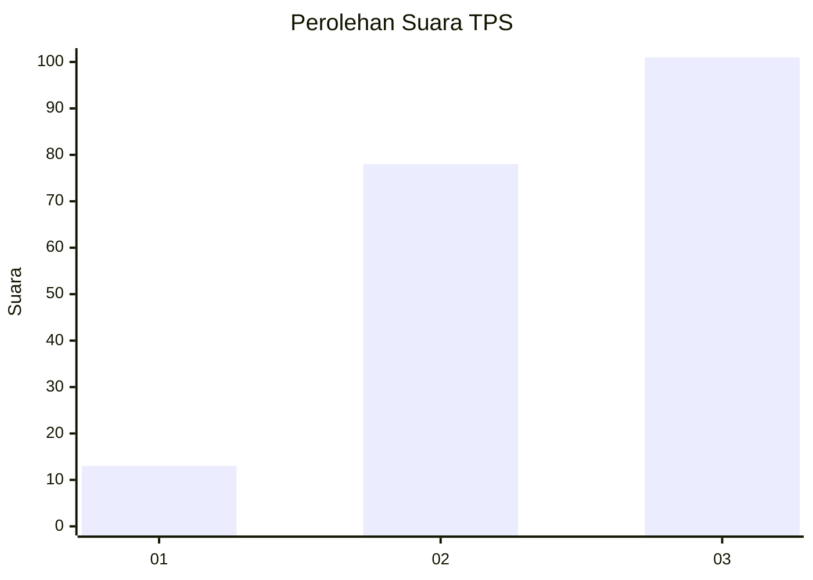
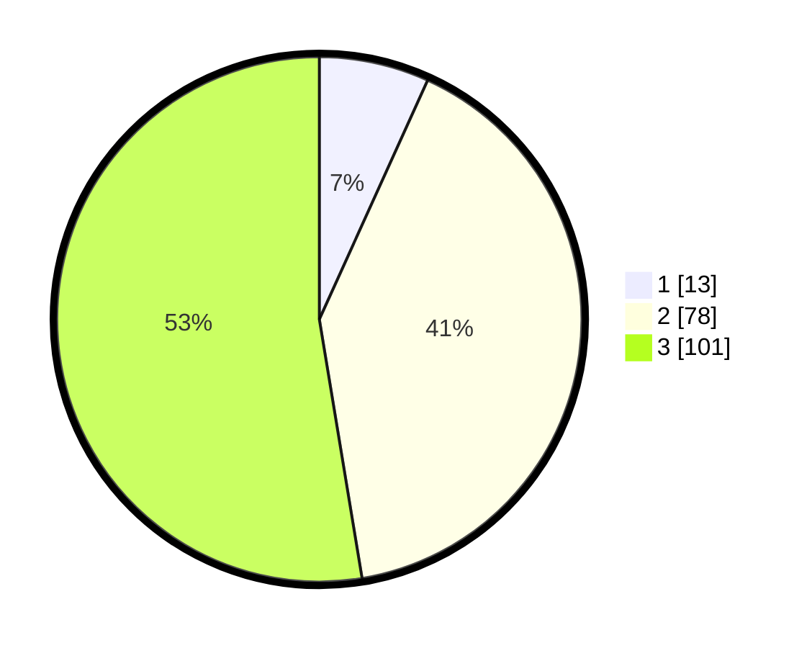

# Hasil

## Grafik

## Tabel

| No. | Nama Paslon    | Suara | Suara (raw) | Persentase |
|:--- |:-------------- | -----:| -----------:| ----------:|
| 1   | ANIES MUHAIMIN | 13    | [13][p-1]   | 6,77       |
| 2   | PRABOWO GIBRAN | 78    | [78][p-2]   | 40,63      |
| 3   | GANJAR MAHFUD  | 101   | [101][p-3]  | 52,60      |

[p-1]: https://github.com/gigit-pemilu/pemilu-2024-33-jawa-tengah/blob/main/pilpres/hitung-suara/sub/33-jawa-tengah/sub/02-banyumas/sub/14-ajibarang/sub/2006-kalibenda/sub/007-tps/sub/paslon-1.txt
[p-2]: https://github.com/gigit-pemilu/pemilu-2024-33-jawa-tengah/blob/main/pilpres/hitung-suara/sub/33-jawa-tengah/sub/02-banyumas/sub/14-ajibarang/sub/2006-kalibenda/sub/007-tps/sub/paslon-2.txt
[p-3]: https://github.com/gigit-pemilu/pemilu-2024-33-jawa-tengah/blob/main/pilpres/hitung-suara/sub/33-jawa-tengah/sub/02-banyumas/sub/14-ajibarang/sub/2006-kalibenda/sub/007-tps/sub/paslon-3.txt

## Foto C Plano

https://sirekap-obj-formc.kpu.go.id/67ad/pemilu/ppwp/33/02/14/20/06/3302142006007-20240215-021904--206f5539-6c2d-4c43-af9b-e75c5e6b23cd.jpg

https://sirekap-obj-formc.kpu.go.id/67ad/pemilu/ppwp/33/02/14/20/06/3302142006007-20240215-022509--ecb3d753-fd80-4fcd-ac4f-d9193c41abb0.jpg

https://sirekap-obj-formc.kpu.go.id/67ad/pemilu/ppwp/33/02/14/20/06/3302142006007-20240215-201702--0d9d27c5-cd7f-47fc-8488-ab9e2cf6b801.jpg

## Metadata

| Key        | Value               |
| ---------- | ------------------- |
| Time Stamp | 2024-02-15 20:30:46 |

