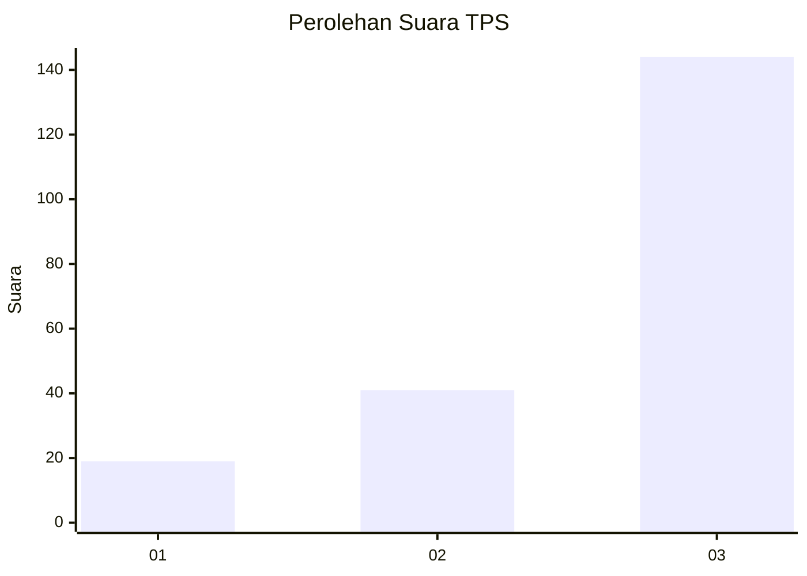
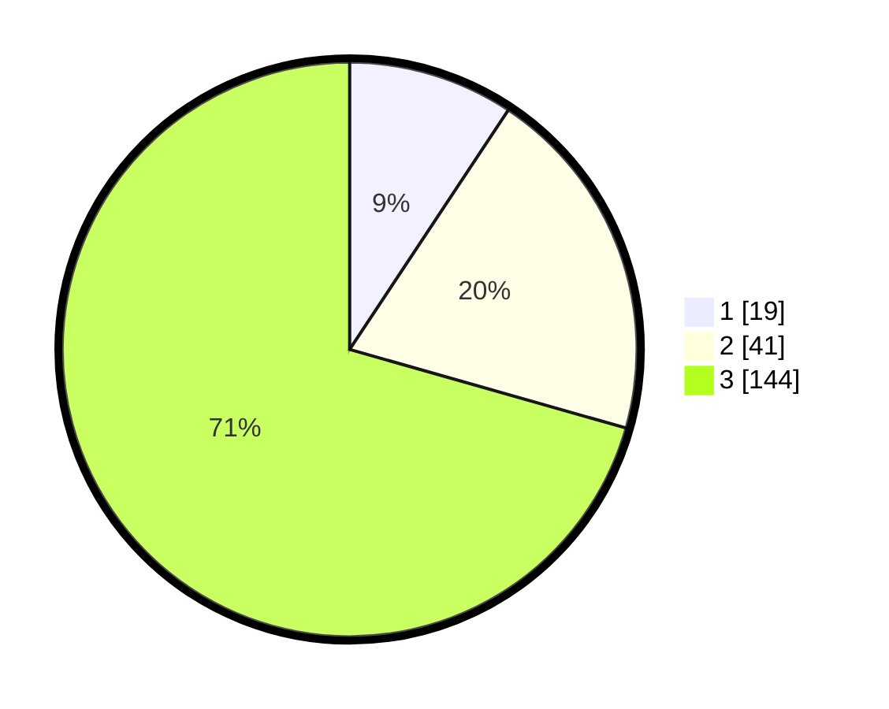

# Hasil

## Grafik

## Tabel

| No. | Nama Paslon    | Suara | Suara (raw) | Persentase |
|:--- |:-------------- | -----:| -----------:| ----------:|
| 1   | ANIES MUHAIMIN | 19    | [19][p-1]   | 9,31       |
| 2   | PRABOWO GIBRAN | 41    | [41][p-2]   | 20,10      |
| 3   | GANJAR MAHFUD  | 144   | [144][p-3]  | 70,59      |

[p-1]: https://github.com/gigit-pemilu/pemilu-2024-33-jawa-tengah/blob/main/pilpres/hitung-suara/sub/33-jawa-tengah/sub/02-banyumas/sub/14-ajibarang/sub/2006-kalibenda/sub/008-tps/sub/paslon-1.txt
[p-2]: https://github.com/gigit-pemilu/pemilu-2024-33-jawa-tengah/blob/main/pilpres/hitung-suara/sub/33-jawa-tengah/sub/02-banyumas/sub/14-ajibarang/sub/2006-kalibenda/sub/008-tps/sub/paslon-2.txt
[p-3]: https://github.com/gigit-pemilu/pemilu-2024-33-jawa-tengah/blob/main/pilpres/hitung-suara/sub/33-jawa-tengah/sub/02-banyumas/sub/14-ajibarang/sub/2006-kalibenda/sub/008-tps/sub/paslon-3.txt

## Foto C Plano

https://sirekap-obj-formc.kpu.go.id/acdd/pemilu/ppwp/33/02/14/20/06/3302142006008-20240214-225513--f3b8e795-0efb-44bb-8ae8-3414d58ef699.jpg

https://sirekap-obj-formc.kpu.go.id/acdd/pemilu/ppwp/33/02/14/20/06/3302142006008-20240214-225526--8a7041fe-1522-4e8d-8106-5167a1cf3f5d.jpg

https://sirekap-obj-formc.kpu.go.id/acdd/pemilu/ppwp/33/02/14/20/06/3302142006008-20240214-225537--d3fa7e19-d12e-4518-8083-64a0d6ed25ed.jpg

## Metadata

| Key        | Value               |
| ---------- | ------------------- |
| Time Stamp | 2024-02-24 22:31:28 |

