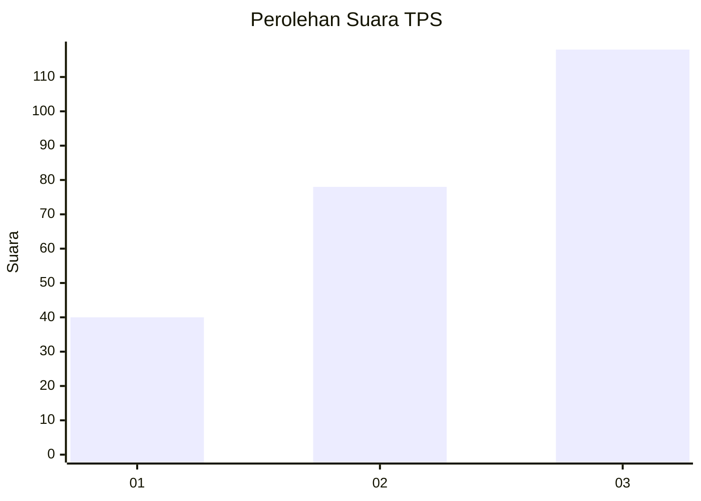
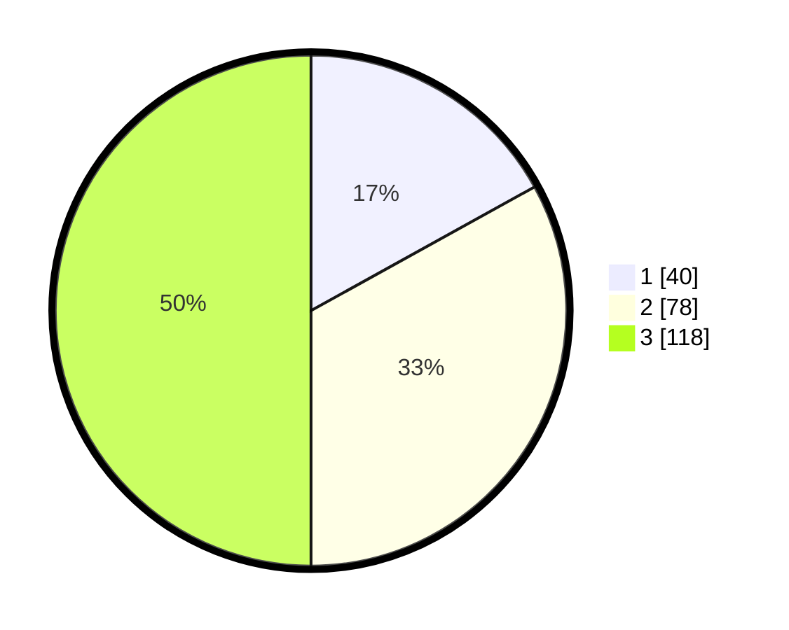

# Hasil

## Grafik

## Tabel

| No. | Nama Paslon    | Suara | Suara (raw) | Persentase |
|:--- |:-------------- | -----:| -----------:| ----------:|
| 1   | ANIES MUHAIMIN | 40    | [40][p-1]   | 16,95      |
| 2   | PRABOWO GIBRAN | 78    | [78][p-2]   | 33,05      |
| 3   | GANJAR MAHFUD  | 118   | [118][p-3]  | 50,00      |

[p-1]: https://github.com/gigit-pemilu/pemilu-2024/blob/main/pilpres/hitung-suara/sub/33-jawa-tengah/sub/02-banyumas/sub/14-ajibarang/sub/2007-pancurendang/sub/001-tps/sub/paslon-1.txt
[p-2]: https://github.com/gigit-pemilu/pemilu-2024/blob/main/pilpres/hitung-suara/sub/33-jawa-tengah/sub/02-banyumas/sub/14-ajibarang/sub/2007-pancurendang/sub/001-tps/sub/paslon-2.txt
[p-3]: https://github.com/gigit-pemilu/pemilu-2024/blob/main/pilpres/hitung-suara/sub/33-jawa-tengah/sub/02-banyumas/sub/14-ajibarang/sub/2007-pancurendang/sub/001-tps/sub/paslon-3.txt

## Foto C Plano

https://sirekap-obj-formc.kpu.go.id/05f4/pemilu/ppwp/33/02/14/20/07/3302142007001-20240215-003438--1365eb3e-2e77-49f1-bc06-193d12252bff.jpg

https://sirekap-obj-formc.kpu.go.id/05f4/pemilu/ppwp/33/02/14/20/07/3302142007001-20240215-003758--dd4e8f02-4612-4c07-9b00-04ae479a6c09.jpg

https://sirekap-obj-formc.kpu.go.id/05f4/pemilu/ppwp/33/02/14/20/07/3302142007001-20240215-004452--7fd9b731-4ce9-4d0d-ae3c-79f983bfac92.jpg

## Metadata

| Key        | Value               |
| ---------- | ------------------- |
| Time Stamp | 2024-02-24 22:31:28 |

