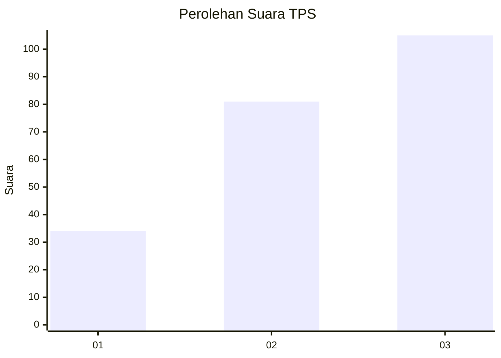
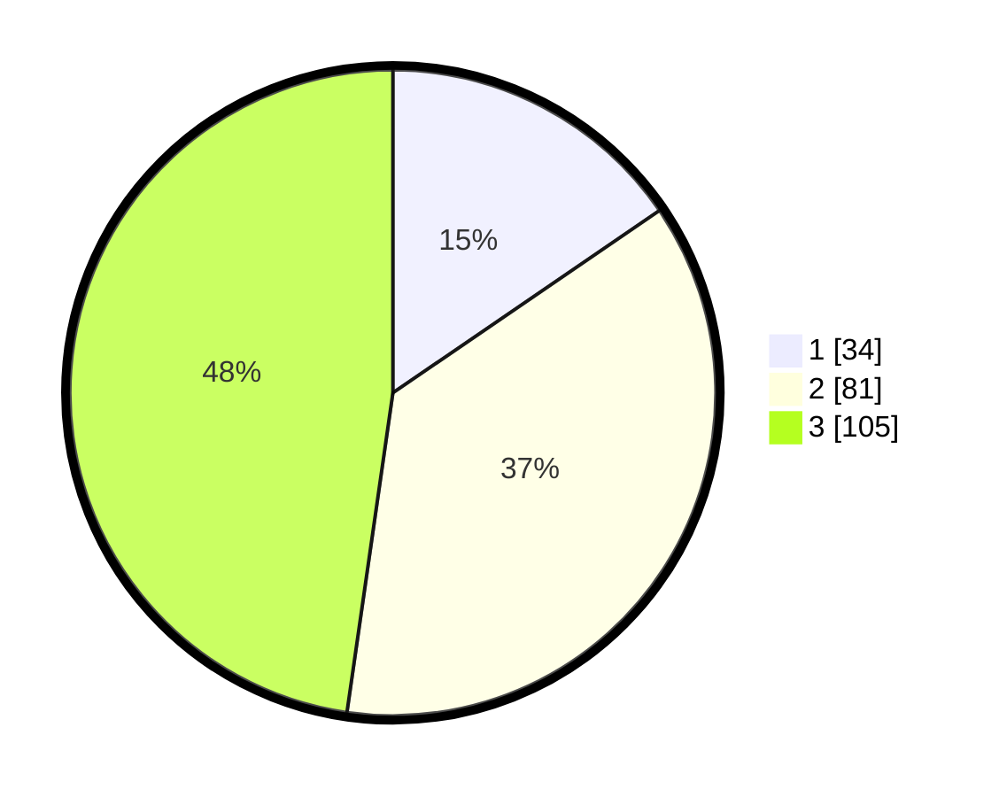

# Hasil

## Grafik

## Tabel

| No. | Nama Paslon    | Suara | Suara (raw) | Persentase |
|:--- |:-------------- | -----:| -----------:| ----------:|
| 1   | ANIES MUHAIMIN | 34    | [34][p-1]   | 15,45      |
| 2   | PRABOWO GIBRAN | 81    | [81][p-2]   | 36,82      |
| 3   | GANJAR MAHFUD  | 105   | [105][p-3]  | 47,73      |

[p-1]: https://github.com/gigit-pemilu/pemilu-2024-33-jawa-tengah/blob/main/pilpres/hitung-suara/sub/33-jawa-tengah/sub/02-banyumas/sub/14-ajibarang/sub/2007-pancurendang/sub/002-tps/sub/paslon-1.txt
[p-2]: https://github.com/gigit-pemilu/pemilu-2024-33-jawa-tengah/blob/main/pilpres/hitung-suara/sub/33-jawa-tengah/sub/02-banyumas/sub/14-ajibarang/sub/2007-pancurendang/sub/002-tps/sub/paslon-2.txt
[p-3]: https://github.com/gigit-pemilu/pemilu-2024-33-jawa-tengah/blob/main/pilpres/hitung-suara/sub/33-jawa-tengah/sub/02-banyumas/sub/14-ajibarang/sub/2007-pancurendang/sub/002-tps/sub/paslon-3.txt

## Foto C Plano

https://sirekap-obj-formc.kpu.go.id/a0f3/pemilu/ppwp/33/02/14/20/07/3302142007002-20240215-213836--46639121-bbab-45d6-b5e1-26ddb3e5a84f.jpg

https://sirekap-obj-formc.kpu.go.id/a0f3/pemilu/ppwp/33/02/14/20/07/3302142007002-20240215-213859--0a5c4598-7252-4bd3-bf81-e5f53f7c04da.jpg

https://sirekap-obj-formc.kpu.go.id/a0f3/pemilu/ppwp/33/02/14/20/07/3302142007002-20240215-214214--b6ab4064-f1d8-4534-bcc3-a69d3704bd0d.jpg

## Metadata

| Key        | Value               |
| ---------- | ------------------- |
| Time Stamp | 2024-02-25 15:00:00 |

