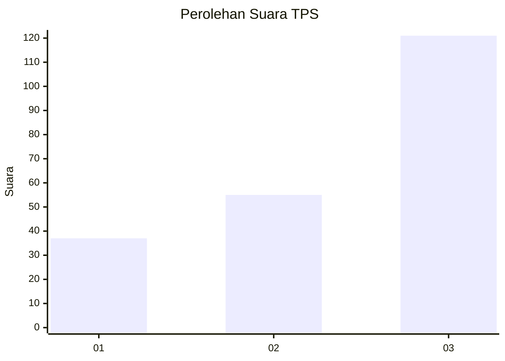
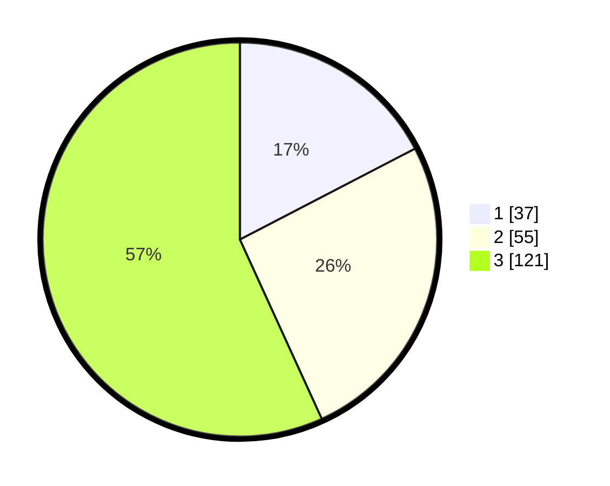

# Hasil

## Grafik

## Tabel

| No. | Nama Paslon    | Suara | Suara (raw) | Persentase |
|:--- |:-------------- | -----:| -----------:| ----------:|
| 1   | ANIES MUHAIMIN | 37    | [37][p-1]   | 17,37      |
| 2   | PRABOWO GIBRAN | 55    | [55][p-2]   | 25,82      |
| 3   | GANJAR MAHFUD  | 121   | [121][p-3]  | 56,81      |

[p-1]: https://github.com/gigit-pemilu/pemilu-2024-33-jawa-tengah/blob/main/pilpres/hitung-suara/sub/33-jawa-tengah/sub/02-banyumas/sub/14-ajibarang/sub/2007-pancurendang/sub/006-tps/sub/paslon-1.txt
[p-2]: https://github.com/gigit-pemilu/pemilu-2024-33-jawa-tengah/blob/main/pilpres/hitung-suara/sub/33-jawa-tengah/sub/02-banyumas/sub/14-ajibarang/sub/2007-pancurendang/sub/006-tps/sub/paslon-2.txt
[p-3]: https://github.com/gigit-pemilu/pemilu-2024-33-jawa-tengah/blob/main/pilpres/hitung-suara/sub/33-jawa-tengah/sub/02-banyumas/sub/14-ajibarang/sub/2007-pancurendang/sub/006-tps/sub/paslon-3.txt

## Foto C Plano

https://sirekap-obj-formc.kpu.go.id/7f1a/pemilu/ppwp/33/02/14/20/07/3302142007006-20240215-001836--23f6f760-eb04-40ff-a47e-8950850af61c.jpg

https://sirekap-obj-formc.kpu.go.id/7f1a/pemilu/ppwp/33/02/14/20/07/3302142007006-20240215-002019--3ab6c877-5de2-42af-8c22-584495becc40.jpg

https://sirekap-obj-formc.kpu.go.id/7f1a/pemilu/ppwp/33/02/14/20/07/3302142007006-20240215-014739--f901f479-bf9c-4822-bdf3-129b9de185d5.jpg

## Metadata

| Key        | Value               |
| ---------- | ------------------- |
| Time Stamp | 2024-02-24 22:31:28 |

