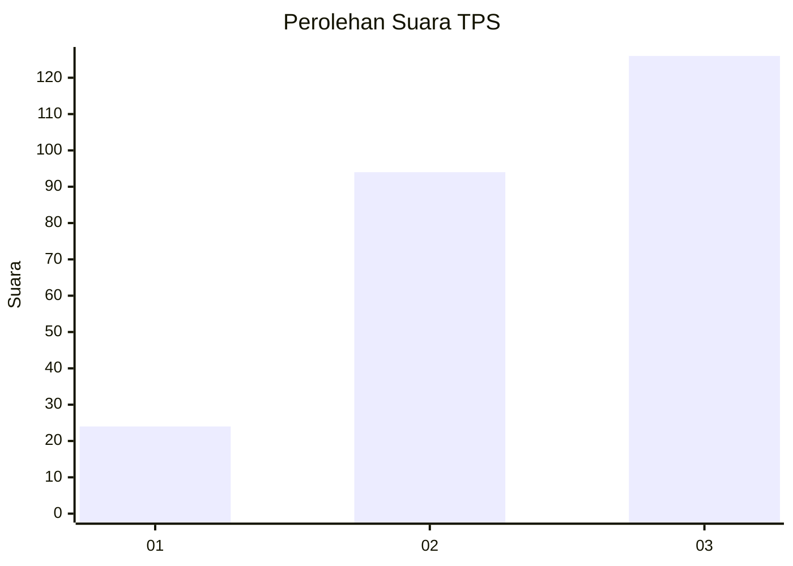
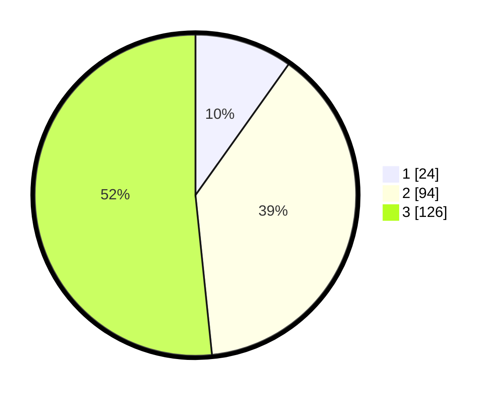

# Hasil

## Grafik

## Tabel

| No. | Nama Paslon    | Suara | Suara (raw) | Persentase |
|:--- |:-------------- | -----:| -----------:| ----------:|
| 1   | ANIES MUHAIMIN | 24    | [24][p-1]   | 9,84       |
| 2   | PRABOWO GIBRAN | 94    | [94][p-2]   | 38,52      |
| 3   | GANJAR MAHFUD  | 126   | [126][p-3]  | 51,64      |

[p-1]: https://github.com/gigit-pemilu/pemilu-2024/blob/main/pilpres/hitung-suara/sub/33-jawa-tengah/sub/02-banyumas/sub/14-ajibarang/sub/2007-pancurendang/sub/008-tps/sub/paslon-1.txt
[p-2]: https://github.com/gigit-pemilu/pemilu-2024/blob/main/pilpres/hitung-suara/sub/33-jawa-tengah/sub/02-banyumas/sub/14-ajibarang/sub/2007-pancurendang/sub/008-tps/sub/paslon-2.txt
[p-3]: https://github.com/gigit-pemilu/pemilu-2024/blob/main/pilpres/hitung-suara/sub/33-jawa-tengah/sub/02-banyumas/sub/14-ajibarang/sub/2007-pancurendang/sub/008-tps/sub/paslon-3.txt

## Foto C Plano

https://sirekap-obj-formc.kpu.go.id/b492/pemilu/ppwp/33/02/14/20/07/3302142007008-20240215-031133--6b232845-c7b3-4e5c-8c89-31f33dc98755.jpg

https://sirekap-obj-formc.kpu.go.id/b492/pemilu/ppwp/33/02/14/20/07/3302142007008-20240215-030743--0eb4fe6c-a363-447d-8eec-1973b757072f.jpg

https://sirekap-obj-formc.kpu.go.id/b492/pemilu/ppwp/33/02/14/20/07/3302142007008-20240215-030941--7aec16ec-08a4-43a5-b680-5686e5957fc2.jpg

## Metadata

| Key        | Value               |
| ---------- | ------------------- |
| Time Stamp | 2024-02-25 16:00:00 |

