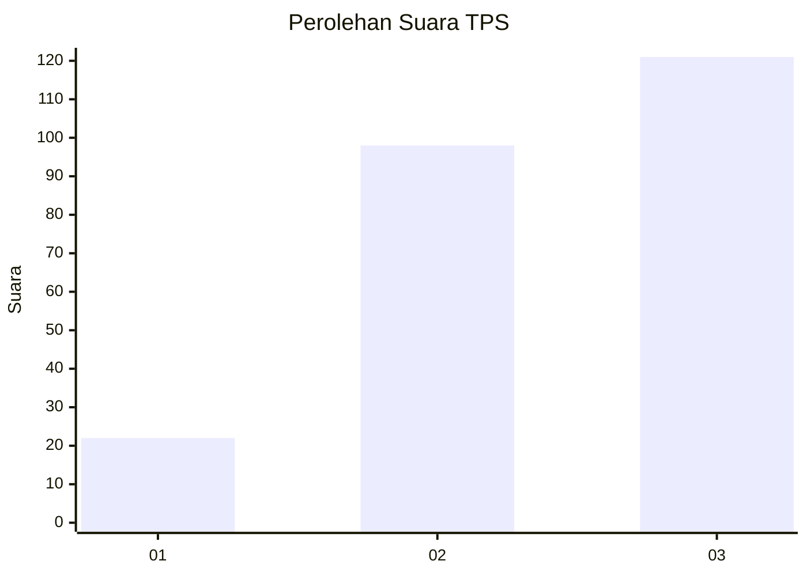
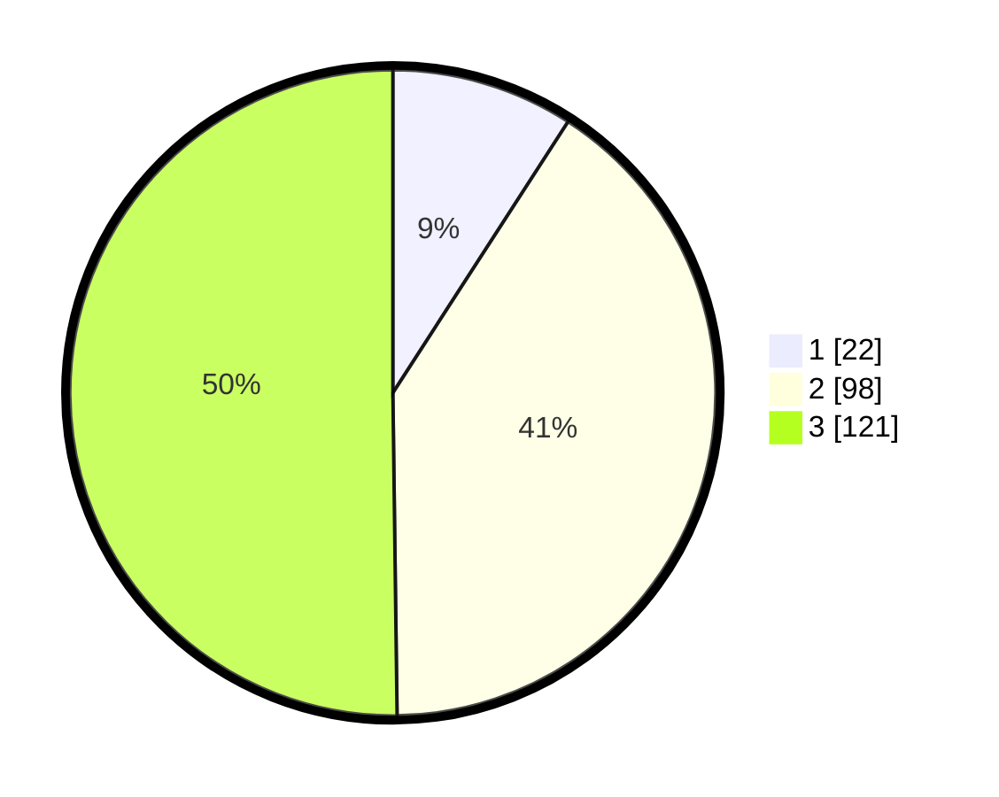

# Hasil

## Grafik

## Tabel

| No. | Nama Paslon    | Suara | Suara (raw) | Persentase |
|:--- |:-------------- | -----:| -----------:| ----------:|
| 1   | ANIES MUHAIMIN | 22    | [22][p-1]   | 9,13       |
| 2   | PRABOWO GIBRAN | 98    | [98][p-2]   | 40,66      |
| 3   | GANJAR MAHFUD  | 121   | [121][p-3]  | 50,21      |

[p-1]: https://github.com/gigit-pemilu/pemilu-2024-33-jawa-tengah/blob/main/pilpres/hitung-suara/sub/33-jawa-tengah/sub/02-banyumas/sub/14-ajibarang/sub/2009-karangbawang/sub/011-tps/sub/paslon-1.txt
[p-2]: https://github.com/gigit-pemilu/pemilu-2024-33-jawa-tengah/blob/main/pilpres/hitung-suara/sub/33-jawa-tengah/sub/02-banyumas/sub/14-ajibarang/sub/2009-karangbawang/sub/011-tps/sub/paslon-2.txt
[p-3]: https://github.com/gigit-pemilu/pemilu-2024-33-jawa-tengah/blob/main/pilpres/hitung-suara/sub/33-jawa-tengah/sub/02-banyumas/sub/14-ajibarang/sub/2009-karangbawang/sub/011-tps/sub/paslon-3.txt

## Foto C Plano

https://sirekap-obj-formc.kpu.go.id/292f/pemilu/ppwp/33/02/14/20/09/3302142009011-20240214-210645--c522d0ff-5d78-410f-9166-f539a6732939.jpg

https://sirekap-obj-formc.kpu.go.id/292f/pemilu/ppwp/33/02/14/20/09/3302142009011-20240214-210834--81723689-c127-46dd-8053-d7467ffbb07d.jpg

https://sirekap-obj-formc.kpu.go.id/292f/pemilu/ppwp/33/02/14/20/09/3302142009011-20240214-210939--1d18a91b-edb1-4bc0-bc02-8c672dd8161d.jpg

## Metadata

| Key        | Value               |
| ---------- | ------------------- |
| Time Stamp | 2024-02-15 04:00:24 |

