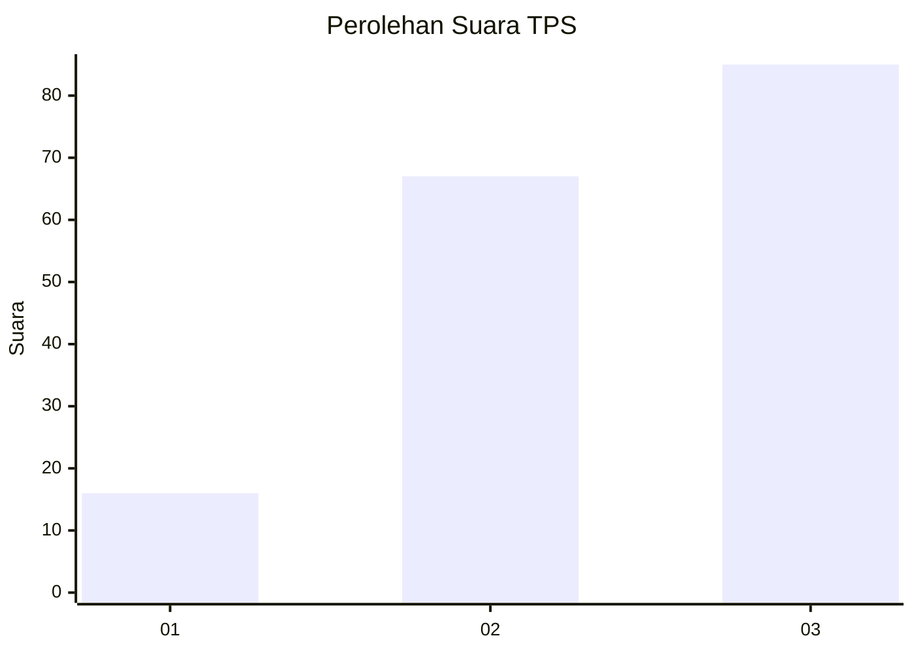
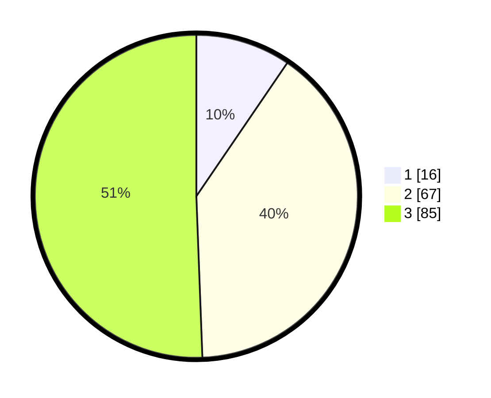

# Hasil

## Grafik

## Tabel

| No. | Nama Paslon    | Suara | Suara (raw) | Persentase |
|:--- |:-------------- | -----:| -----------:| ----------:|
| 1   | ANIES MUHAIMIN | 16    | [16][p-1]   | 9,52       |
| 2   | PRABOWO GIBRAN | 67    | [67][p-2]   | 39,88      |
| 3   | GANJAR MAHFUD  | 85    | [85][p-3]   | 50,60      |

[p-1]: https://github.com/gigit-pemilu/pemilu-2024/blob/main/pilpres/hitung-suara/sub/33-jawa-tengah/sub/02-banyumas/sub/14-ajibarang/sub/2009-karangbawang/sub/018-tps/sub/paslon-1.txt
[p-2]: https://github.com/gigit-pemilu/pemilu-2024/blob/main/pilpres/hitung-suara/sub/33-jawa-tengah/sub/02-banyumas/sub/14-ajibarang/sub/2009-karangbawang/sub/018-tps/sub/paslon-2.txt
[p-3]: https://github.com/gigit-pemilu/pemilu-2024/blob/main/pilpres/hitung-suara/sub/33-jawa-tengah/sub/02-banyumas/sub/14-ajibarang/sub/2009-karangbawang/sub/018-tps/sub/paslon-3.txt

## Foto C Plano

https://sirekap-obj-formc.kpu.go.id/3674/pemilu/ppwp/33/02/14/20/09/3302142009018-20240214-213212--54cbcd90-fbab-4f5b-90c5-80c25d392a0b.jpg

https://sirekap-obj-formc.kpu.go.id/3674/pemilu/ppwp/33/02/14/20/09/3302142009018-20240214-222653--2780e97f-4a0f-4d77-9348-995b935b3a9f.jpg

https://sirekap-obj-formc.kpu.go.id/3674/pemilu/ppwp/33/02/14/20/09/3302142009018-20240215-005218--03fc3eb2-7dca-4084-9ae8-517b474de000.jpg

## Metadata

| Key        | Value               |
| ---------- | ------------------- |
| Time Stamp | 2024-02-25 15:00:00 |

