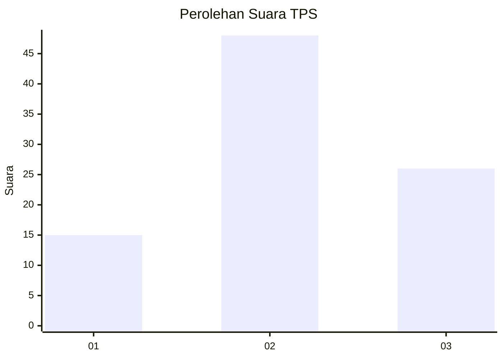
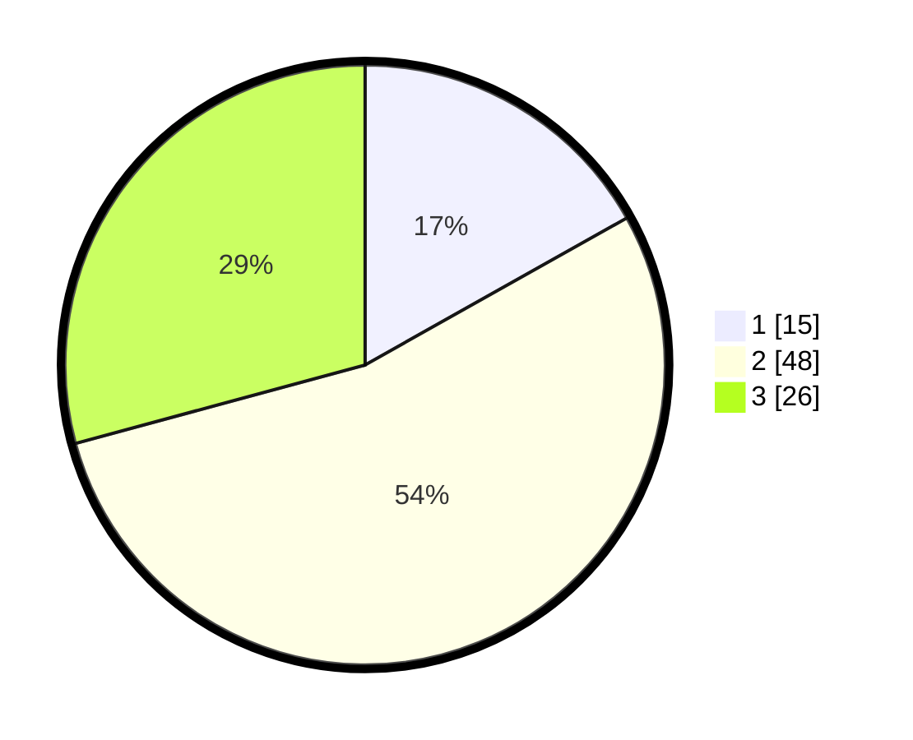

# Hasil

## Grafik

## Tabel

| No. | Nama Paslon    | Suara | Suara (raw) | Persentase |
|:--- |:-------------- | -----:| -----------:| ----------:|
| 1   | ANIES MUHAIMIN | 15    | [15][p-1]   | 16,85      |
| 2   | PRABOWO GIBRAN | 48    | [48][p-2]   | 53,93      |
| 3   | GANJAR MAHFUD  | 26    | [26][p-3]   | 29,21      |

[p-1]: https://github.com/gigit-pemilu/pemilu-2024/blob/main/pilpres/hitung-suara/sub/33-jawa-tengah/sub/02-banyumas/sub/14-ajibarang/sub/2009-karangbawang/sub/020-tps/sub/paslon-1.txt
[p-2]: https://github.com/gigit-pemilu/pemilu-2024/blob/main/pilpres/hitung-suara/sub/33-jawa-tengah/sub/02-banyumas/sub/14-ajibarang/sub/2009-karangbawang/sub/020-tps/sub/paslon-2.txt
[p-3]: https://github.com/gigit-pemilu/pemilu-2024/blob/main/pilpres/hitung-suara/sub/33-jawa-tengah/sub/02-banyumas/sub/14-ajibarang/sub/2009-karangbawang/sub/020-tps/sub/paslon-3.txt

## Foto C Plano

https://sirekap-obj-formc.kpu.go.id/0112/pemilu/ppwp/33/02/14/20/09/3302142009020-20240215-010304--ff20c8ce-6ce6-4d5f-bf45-e710e2ae1412.jpg

https://sirekap-obj-formc.kpu.go.id/0112/pemilu/ppwp/33/02/14/20/09/3302142009020-20240215-012202--fe439495-18fc-4ff0-a45c-6c1c780fcaf6.jpg

https://sirekap-obj-formc.kpu.go.id/0112/pemilu/ppwp/33/02/14/20/09/3302142009020-20240215-011249--83f2d510-9b19-45f5-8d87-a23e2f42e5c5.jpg

## Metadata

| Key        | Value               |
| ---------- | ------------------- |
| Time Stamp | 2024-02-24 22:31:28 |

