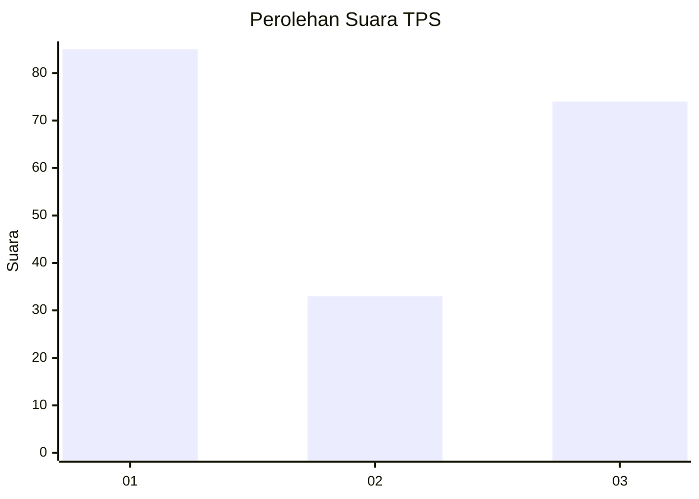
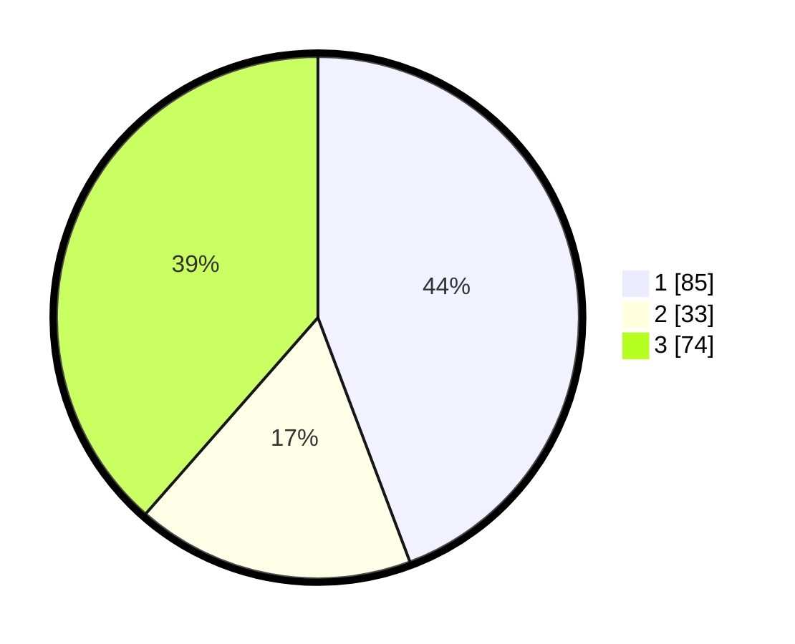

# Hasil

## Grafik

## Tabel

| No. | Nama Paslon    | Suara | Suara (raw) | Persentase |
|:--- |:-------------- | -----:| -----------:| ----------:|
| 1   | ANIES MUHAIMIN | 85    | [85][p-1]   | 44,27      |
| 2   | PRABOWO GIBRAN | 33    | [33][p-2]   | 17,19      |
| 3   | GANJAR MAHFUD  | 74    | [74][p-3]   | 38,54      |

[p-1]: https://github.com/gigit-pemilu/pemilu-2024/blob/main/pilpres/hitung-suara/sub/33-jawa-tengah/sub/02-banyumas/sub/14-ajibarang/sub/2010-kracak/sub/001-tps/sub/paslon-1.txt
[p-2]: https://github.com/gigit-pemilu/pemilu-2024/blob/main/pilpres/hitung-suara/sub/33-jawa-tengah/sub/02-banyumas/sub/14-ajibarang/sub/2010-kracak/sub/001-tps/sub/paslon-2.txt
[p-3]: https://github.com/gigit-pemilu/pemilu-2024/blob/main/pilpres/hitung-suara/sub/33-jawa-tengah/sub/02-banyumas/sub/14-ajibarang/sub/2010-kracak/sub/001-tps/sub/paslon-3.txt

## Foto C Plano

https://sirekap-obj-formc.kpu.go.id/725a/pemilu/ppwp/33/02/14/20/10/3302142010001-20240215-002151--f04e9b01-9b5f-4359-9b77-9a048c04f229.jpg

https://sirekap-obj-formc.kpu.go.id/725a/pemilu/ppwp/33/02/14/20/10/3302142010001-20240215-002743--7afaf33e-1660-4c61-9de3-77951adaa04e.jpg

https://sirekap-obj-formc.kpu.go.id/725a/pemilu/ppwp/33/02/14/20/10/3302142010001-20240214-221932--ee4e90e3-dfe3-4e5e-b100-354b28db90b1.jpg

## Metadata

| Key        | Value               |
| ---------- | ------------------- |
| Time Stamp | 2024-02-17 00:00:00 |

