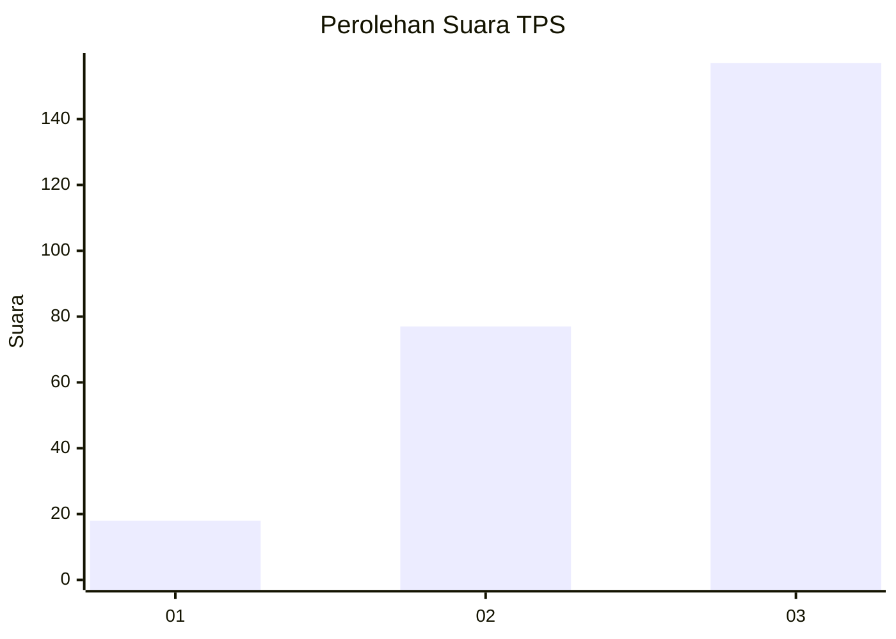
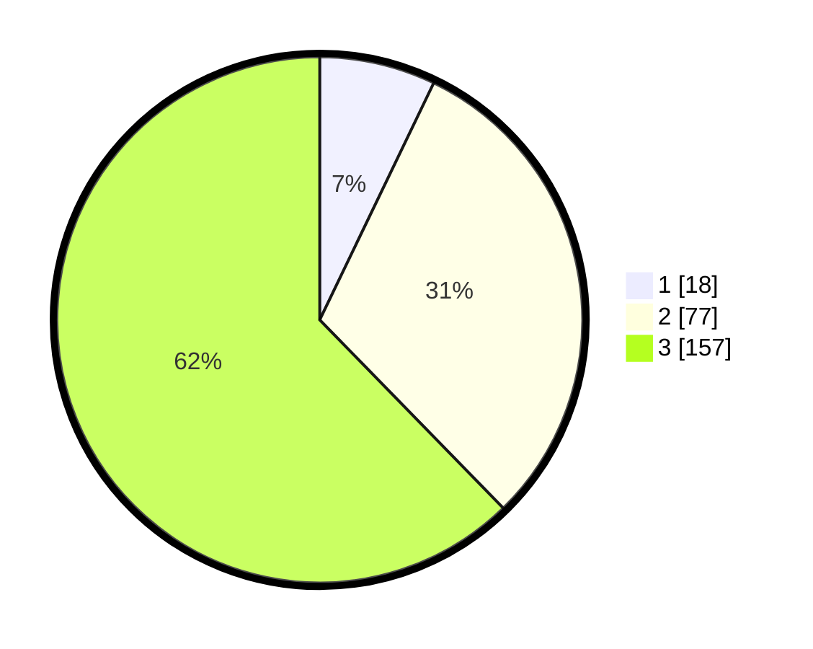

# Hasil

## Grafik

## Tabel

| No. | Nama Paslon    | Suara | Suara (raw) | Persentase |
|:--- |:-------------- | -----:| -----------:| ----------:|
| 1   | ANIES MUHAIMIN | 18    | [18][p-1]   | 7,14       |
| 2   | PRABOWO GIBRAN | 77    | [77][p-2]   | 30,56      |
| 3   | GANJAR MAHFUD  | 157   | [157][p-3]  | 62,30      |

[p-1]: https://github.com/gigit-pemilu/pemilu-2024/blob/main/pilpres/hitung-suara/sub/33-jawa-tengah/sub/02-banyumas/sub/14-ajibarang/sub/2010-kracak/sub/007-tps/sub/paslon-1.txt
[p-2]: https://github.com/gigit-pemilu/pemilu-2024/blob/main/pilpres/hitung-suara/sub/33-jawa-tengah/sub/02-banyumas/sub/14-ajibarang/sub/2010-kracak/sub/007-tps/sub/paslon-2.txt
[p-3]: https://github.com/gigit-pemilu/pemilu-2024/blob/main/pilpres/hitung-suara/sub/33-jawa-tengah/sub/02-banyumas/sub/14-ajibarang/sub/2010-kracak/sub/007-tps/sub/paslon-3.txt

## Foto C Plano

https://sirekap-obj-formc.kpu.go.id/d754/pemilu/ppwp/33/02/14/20/10/3302142010007-20240217-115933--2c876c94-a1bd-4fdf-aeb1-88d397e70551.jpg

https://sirekap-obj-formc.kpu.go.id/d754/pemilu/ppwp/33/02/14/20/10/3302142010007-20240217-120142--ca2ed4f8-30e8-4f5b-b7f5-30453da9dcf7.jpg

https://sirekap-obj-formc.kpu.go.id/d754/pemilu/ppwp/33/02/14/20/10/3302142010007-20240217-120244--eff25e77-7e41-4396-afc7-55f6910820c9.jpg

## Metadata

| Key        | Value               |
| ---------- | ------------------- |
| Time Stamp | 2024-02-25 12:00:00 |

