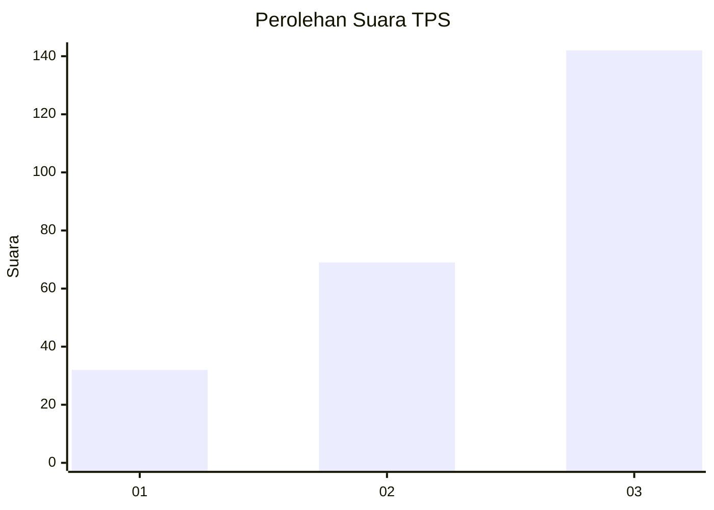
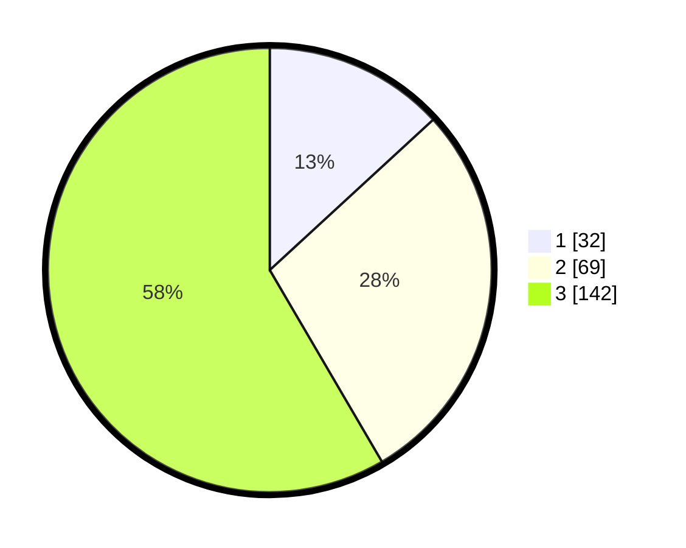

# Hasil

## Grafik

## Tabel

| No. | Nama Paslon    | Suara | Suara (raw) | Persentase |
|:--- |:-------------- | -----:| -----------:| ----------:|
| 1   | ANIES MUHAIMIN | 32    | [32][p-1]   | 13,17      |
| 2   | PRABOWO GIBRAN | 69    | [69][p-2]   | 28,40      |
| 3   | GANJAR MAHFUD  | 142   | [142][p-3]  | 58,44      |

[p-1]: https://github.com/gigit-pemilu/pemilu-2024-33-jawa-tengah/blob/main/pilpres/hitung-suara/sub/33-jawa-tengah/sub/02-banyumas/sub/14-ajibarang/sub/2010-kracak/sub/008-tps/sub/paslon-1.txt
[p-2]: https://github.com/gigit-pemilu/pemilu-2024-33-jawa-tengah/blob/main/pilpres/hitung-suara/sub/33-jawa-tengah/sub/02-banyumas/sub/14-ajibarang/sub/2010-kracak/sub/008-tps/sub/paslon-2.txt
[p-3]: https://github.com/gigit-pemilu/pemilu-2024-33-jawa-tengah/blob/main/pilpres/hitung-suara/sub/33-jawa-tengah/sub/02-banyumas/sub/14-ajibarang/sub/2010-kracak/sub/008-tps/sub/paslon-3.txt

## Foto C Plano

https://sirekap-obj-formc.kpu.go.id/ee0b/pemilu/ppwp/33/02/14/20/10/3302142010008-20240217-120949--deabdebd-b193-480f-8052-ca7fb59ec936.jpg

https://sirekap-obj-formc.kpu.go.id/ee0b/pemilu/ppwp/33/02/14/20/10/3302142010008-20240217-121105--3215aad6-a68d-437d-8dc2-399ea8a9ed7c.jpg

https://sirekap-obj-formc.kpu.go.id/ee0b/pemilu/ppwp/33/02/14/20/10/3302142010008-20240217-121314--6db6c4b7-4b99-424e-98d7-ca17cfb6c8db.jpg

## Metadata

| Key        | Value               |
| ---------- | ------------------- |
| Time Stamp | 2024-02-24 22:31:28 |

