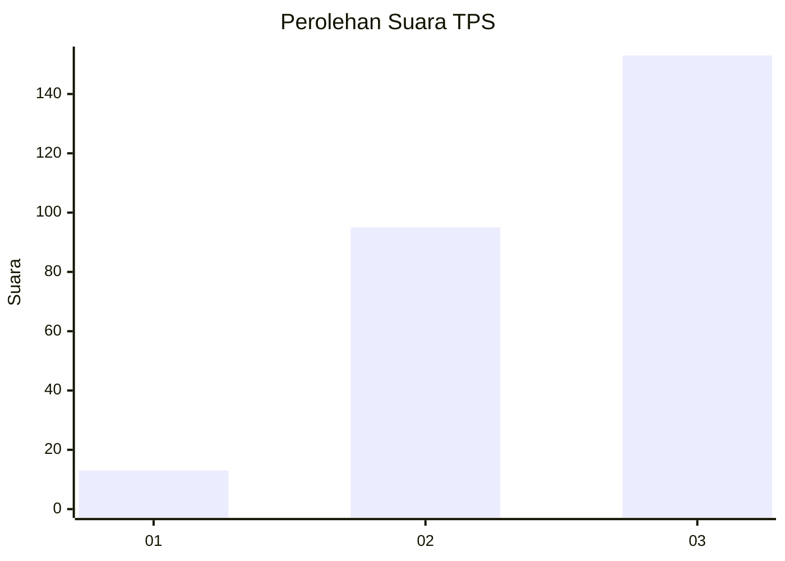
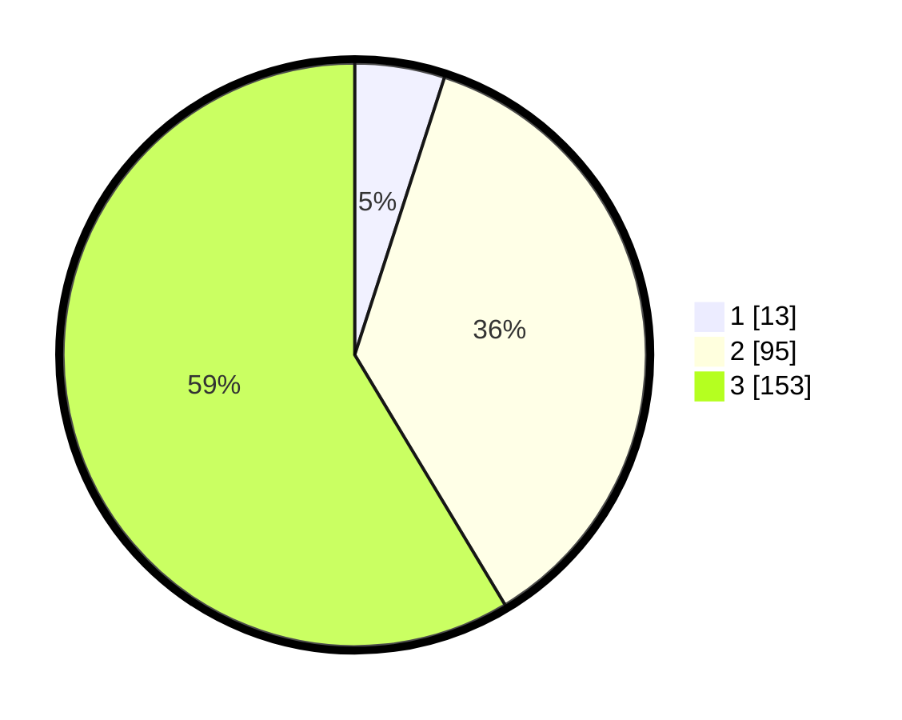

# Hasil

## Grafik

## Tabel

| No. | Nama Paslon    | Suara | Suara (raw) | Persentase |
|:--- |:-------------- | -----:| -----------:| ----------:|
| 1   | ANIES MUHAIMIN | 13    | [13][p-1]   | 4,98       |
| 2   | PRABOWO GIBRAN | 95    | [95][p-2]   | 36,40      |
| 3   | GANJAR MAHFUD  | 153   | [153][p-3]  | 58,62      |

[p-1]: https://github.com/gigit-pemilu/pemilu-2024-33-jawa-tengah/blob/main/pilpres/hitung-suara/sub/33-jawa-tengah/sub/02-banyumas/sub/14-ajibarang/sub/2010-kracak/sub/010-tps/sub/paslon-1.txt
[p-2]: https://github.com/gigit-pemilu/pemilu-2024-33-jawa-tengah/blob/main/pilpres/hitung-suara/sub/33-jawa-tengah/sub/02-banyumas/sub/14-ajibarang/sub/2010-kracak/sub/010-tps/sub/paslon-2.txt
[p-3]: https://github.com/gigit-pemilu/pemilu-2024-33-jawa-tengah/blob/main/pilpres/hitung-suara/sub/33-jawa-tengah/sub/02-banyumas/sub/14-ajibarang/sub/2010-kracak/sub/010-tps/sub/paslon-3.txt

## Foto C Plano

https://sirekap-obj-formc.kpu.go.id/5972/pemilu/ppwp/33/02/14/20/10/3302142010010-20240217-131423--f7604750-ae2d-4188-8cf3-e1a303868855.jpg

https://sirekap-obj-formc.kpu.go.id/5972/pemilu/ppwp/33/02/14/20/10/3302142010010-20240217-131752--ed7c79b1-0525-4b43-9e61-9e0c4ee70a7d.jpg

https://sirekap-obj-formc.kpu.go.id/5972/pemilu/ppwp/33/02/14/20/10/3302142010010-20240217-131844--8d8067f3-6b50-44a4-a8af-880906a11fdb.jpg

## Metadata

| Key        | Value               |
| ---------- | ------------------- |
| Time Stamp | 2024-02-24 22:31:28 |

