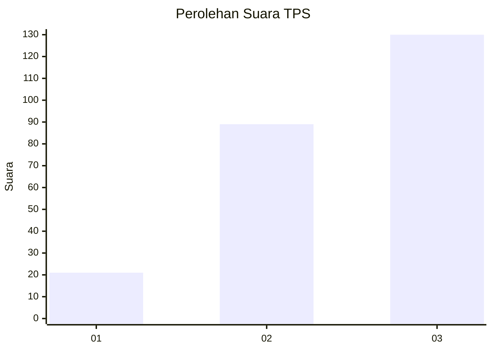
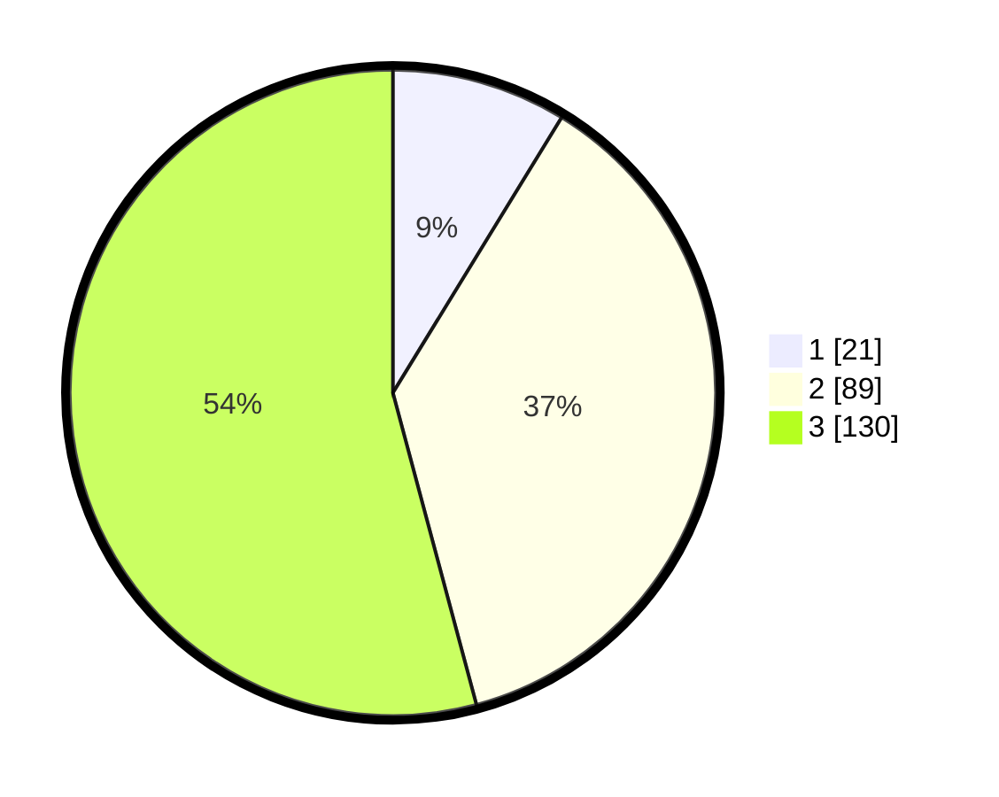

# Hasil

## Grafik

## Tabel

| No. | Nama Paslon    | Suara | Suara (raw) | Persentase |
|:--- |:-------------- | -----:| -----------:| ----------:|
| 1   | ANIES MUHAIMIN | 21    | [21][p-1]   | 8,75       |
| 2   | PRABOWO GIBRAN | 89    | [89][p-2]   | 37,08      |
| 3   | GANJAR MAHFUD  | 130   | [130][p-3]  | 54,17      |

[p-1]: https://github.com/gigit-pemilu/pemilu-2024/blob/main/pilpres/hitung-suara/sub/33-jawa-tengah/sub/02-banyumas/sub/14-ajibarang/sub/2010-kracak/sub/011-tps/sub/paslon-1.txt
[p-2]: https://github.com/gigit-pemilu/pemilu-2024/blob/main/pilpres/hitung-suara/sub/33-jawa-tengah/sub/02-banyumas/sub/14-ajibarang/sub/2010-kracak/sub/011-tps/sub/paslon-2.txt
[p-3]: https://github.com/gigit-pemilu/pemilu-2024/blob/main/pilpres/hitung-suara/sub/33-jawa-tengah/sub/02-banyumas/sub/14-ajibarang/sub/2010-kracak/sub/011-tps/sub/paslon-3.txt

## Foto C Plano

https://sirekap-obj-formc.kpu.go.id/af9b/pemilu/ppwp/33/02/14/20/10/3302142010011-20240215-024301--792a7b2a-9f19-4101-bb6b-b75b78ef8eaa.jpg

https://sirekap-obj-formc.kpu.go.id/af9b/pemilu/ppwp/33/02/14/20/10/3302142010011-20240215-061459--5d4f4d96-a3af-4294-8bb2-05bbe8e9d686.jpg

https://sirekap-obj-formc.kpu.go.id/af9b/pemilu/ppwp/33/02/14/20/10/3302142010011-20240215-061621--ef5cd05f-77df-4f4a-a05a-0dfcdde08b0e.jpg

## Metadata

| Key        | Value               |
| ---------- | ------------------- |
| Time Stamp | 2024-02-17 00:00:00 |

