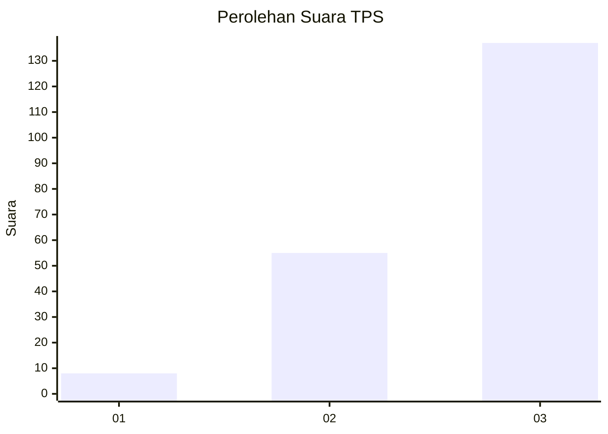
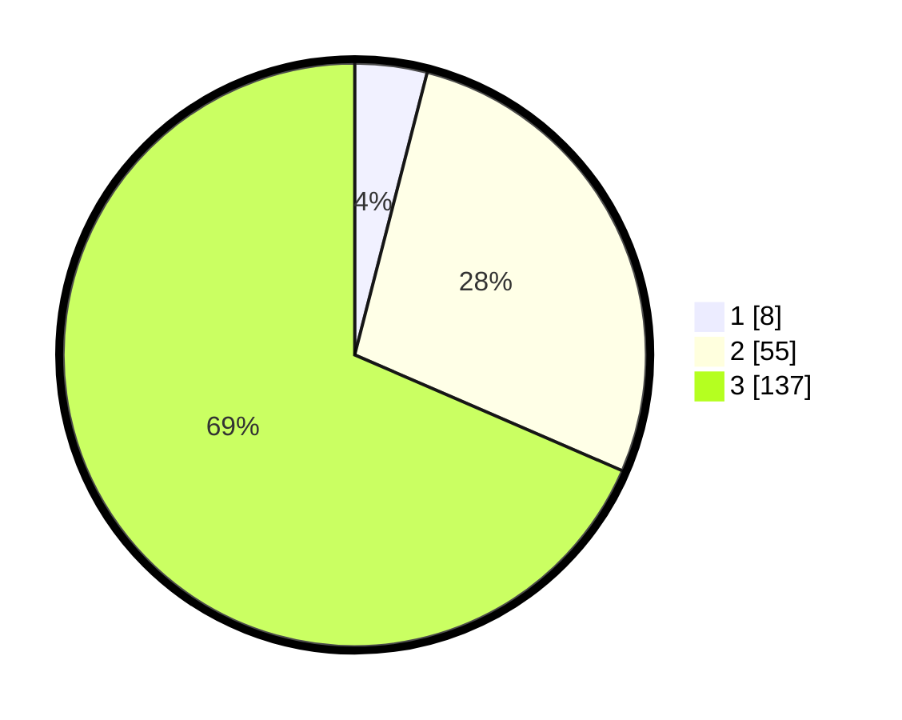

# Hasil

## Grafik

## Tabel

| No. | Nama Paslon    | Suara | Suara (raw) | Persentase |
|:--- |:-------------- | -----:| -----------:| ----------:|
| 1   | ANIES MUHAIMIN | 8     | [8][p-1]    | 4,00       |
| 2   | PRABOWO GIBRAN | 55    | [55][p-2]   | 27,50      |
| 3   | GANJAR MAHFUD  | 137   | [137][p-3]  | 68,50      |

[p-1]: https://github.com/gigit-pemilu/pemilu-2024-33-jawa-tengah/blob/main/pilpres/hitung-suara/sub/33-jawa-tengah/sub/02-banyumas/sub/14-ajibarang/sub/2010-kracak/sub/014-tps/sub/paslon-1.txt
[p-2]: https://github.com/gigit-pemilu/pemilu-2024-33-jawa-tengah/blob/main/pilpres/hitung-suara/sub/33-jawa-tengah/sub/02-banyumas/sub/14-ajibarang/sub/2010-kracak/sub/014-tps/sub/paslon-2.txt
[p-3]: https://github.com/gigit-pemilu/pemilu-2024-33-jawa-tengah/blob/main/pilpres/hitung-suara/sub/33-jawa-tengah/sub/02-banyumas/sub/14-ajibarang/sub/2010-kracak/sub/014-tps/sub/paslon-3.txt

## Foto C Plano

https://sirekap-obj-formc.kpu.go.id/8452/pemilu/ppwp/33/02/14/20/10/3302142010014-20240214-230304--c14adcb0-8ebe-4fe1-ab88-88a7bbf3726b.jpg

https://sirekap-obj-formc.kpu.go.id/8452/pemilu/ppwp/33/02/14/20/10/3302142010014-20240214-233159--ba2ad6db-33f9-4bb5-946e-b6811c13de2f.jpg

https://sirekap-obj-formc.kpu.go.id/8452/pemilu/ppwp/33/02/14/20/10/3302142010014-20240215-055436--7b725fe9-ef17-4989-9d18-ac80cf7b4195.jpg

## Metadata

| Key        | Value               |
| ---------- | ------------------- |
| Time Stamp | 2024-02-17 00:00:00 |

