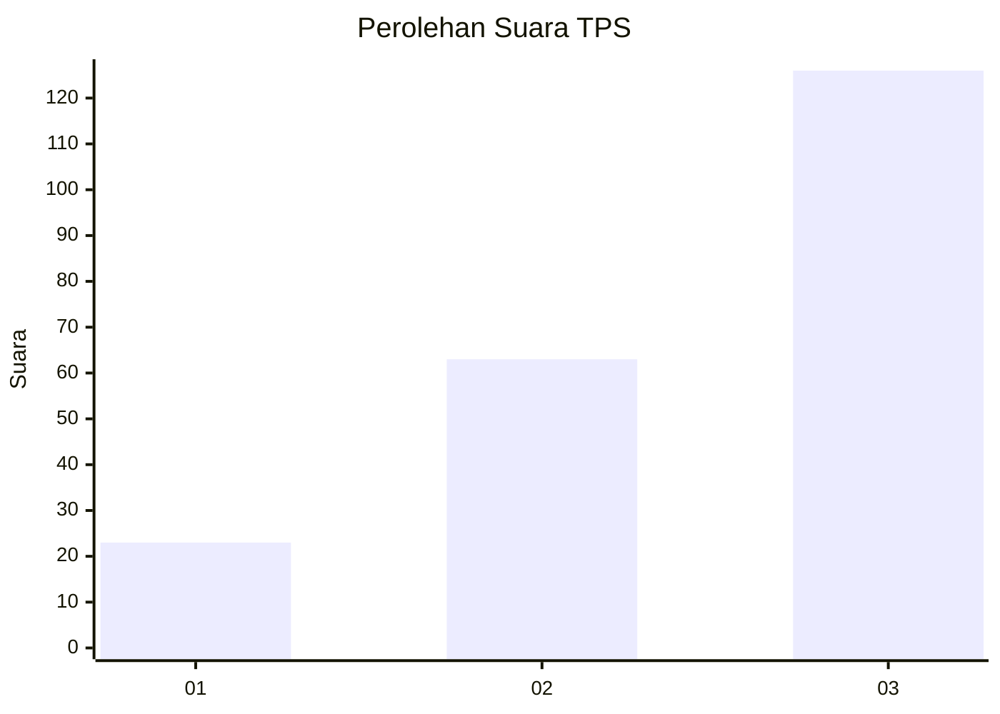
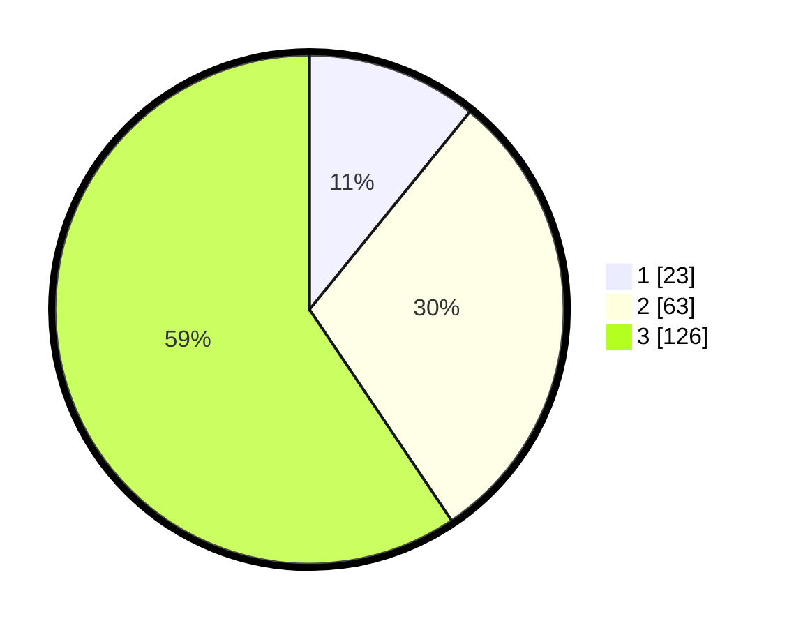

# Hasil

## Grafik

## Tabel

| No. | Nama Paslon    | Suara | Suara (raw) | Persentase |
|:--- |:-------------- | -----:| -----------:| ----------:|
| 1   | ANIES MUHAIMIN | 23    | [23][p-1]   | 10,85      |
| 2   | PRABOWO GIBRAN | 63    | [63][p-2]   | 29,72      |
| 3   | GANJAR MAHFUD  | 126   | [126][p-3]  | 59,43      |

[p-1]: https://github.com/gigit-pemilu/pemilu-2024/blob/main/pilpres/hitung-suara/sub/33-jawa-tengah/sub/02-banyumas/sub/14-ajibarang/sub/2010-kracak/sub/020-tps/sub/paslon-1.txt
[p-2]: https://github.com/gigit-pemilu/pemilu-2024/blob/main/pilpres/hitung-suara/sub/33-jawa-tengah/sub/02-banyumas/sub/14-ajibarang/sub/2010-kracak/sub/020-tps/sub/paslon-2.txt
[p-3]: https://github.com/gigit-pemilu/pemilu-2024/blob/main/pilpres/hitung-suara/sub/33-jawa-tengah/sub/02-banyumas/sub/14-ajibarang/sub/2010-kracak/sub/020-tps/sub/paslon-3.txt

## Foto C Plano

https://sirekap-obj-formc.kpu.go.id/be51/pemilu/ppwp/33/02/14/20/10/3302142010020-20240214-225259--56c03ee7-89ee-4e74-8b4d-862d784310a3.jpg

https://sirekap-obj-formc.kpu.go.id/be51/pemilu/ppwp/33/02/14/20/10/3302142010020-20240214-225405--3ce62226-cb02-4627-8c82-6b9388354eb5.jpg

https://sirekap-obj-formc.kpu.go.id/be51/pemilu/ppwp/33/02/14/20/10/3302142010020-20240214-225556--10c4183e-1720-4075-8911-360332945293.jpg

## Metadata

| Key        | Value               |
| ---------- | ------------------- |
| Time Stamp | 2024-02-17 00:28:35 |

