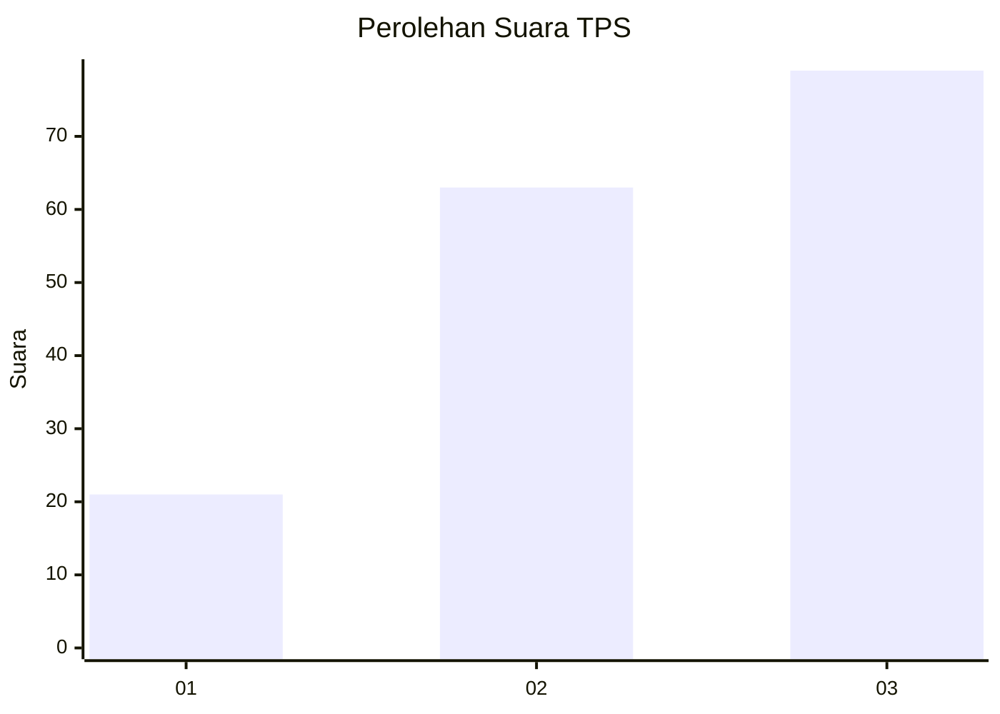
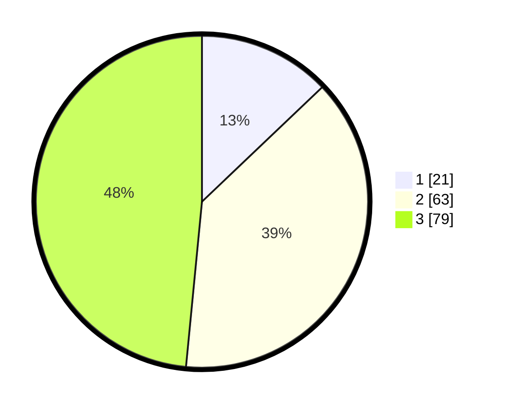

# Hasil

## Grafik

## Tabel

| No. | Nama Paslon    | Suara | Suara (raw) | Persentase |
|:--- |:-------------- | -----:| -----------:| ----------:|
| 1   | ANIES MUHAIMIN | 21    | [21][p-1]   | 12,88      |
| 2   | PRABOWO GIBRAN | 63    | [63][p-2]   | 38,65      |
| 3   | GANJAR MAHFUD  | 79    | [79][p-3]   | 48,47      |

[p-1]: https://github.com/gigit-pemilu/pemilu-2024-33-jawa-tengah/blob/main/pilpres/hitung-suara/sub/33-jawa-tengah/sub/02-banyumas/sub/14-ajibarang/sub/2010-kracak/sub/027-tps/sub/paslon-1.txt
[p-2]: https://github.com/gigit-pemilu/pemilu-2024-33-jawa-tengah/blob/main/pilpres/hitung-suara/sub/33-jawa-tengah/sub/02-banyumas/sub/14-ajibarang/sub/2010-kracak/sub/027-tps/sub/paslon-2.txt
[p-3]: https://github.com/gigit-pemilu/pemilu-2024-33-jawa-tengah/blob/main/pilpres/hitung-suara/sub/33-jawa-tengah/sub/02-banyumas/sub/14-ajibarang/sub/2010-kracak/sub/027-tps/sub/paslon-3.txt

## Foto C Plano

https://sirekap-obj-formc.kpu.go.id/ea73/pemilu/ppwp/33/02/14/20/10/3302142010027-20240214-200755--f18a6670-dae0-43f0-ac03-a955ad27e2e2.jpg

https://sirekap-obj-formc.kpu.go.id/ea73/pemilu/ppwp/33/02/14/20/10/3302142010027-20240214-200920--6581ae7f-f697-47f6-bf54-27631da7dbf0.jpg

https://sirekap-obj-formc.kpu.go.id/ea73/pemilu/ppwp/33/02/14/20/10/3302142010027-20240215-005611--9c22d2bf-b5f8-4e25-8272-e74242aabc48.jpg

## Metadata

| Key        | Value               |
| ---------- | ------------------- |
| Time Stamp | 2024-02-15 07:00:44 |

