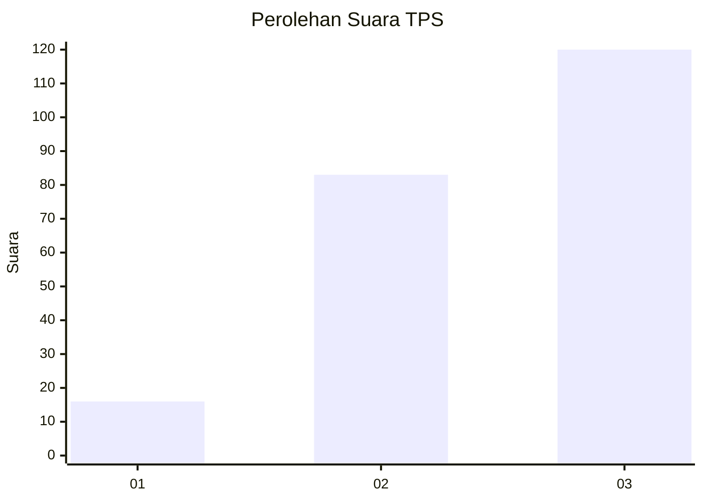
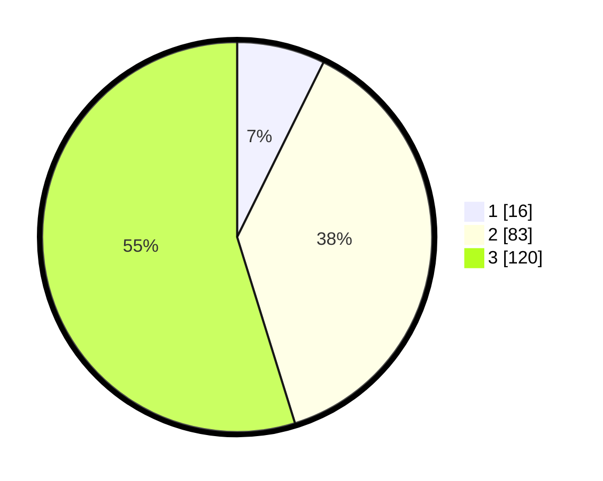

# Hasil

## Grafik

## Tabel

| No. | Nama Paslon    | Suara | Suara (raw) | Persentase |
|:--- |:-------------- | -----:| -----------:| ----------:|
| 1   | ANIES MUHAIMIN | 16    | [16][p-1]   | 7,31       |
| 2   | PRABOWO GIBRAN | 83    | [83][p-2]   | 37,90      |
| 3   | GANJAR MAHFUD  | 120   | [120][p-3]  | 54,79      |

[p-1]: https://github.com/gigit-pemilu/pemilu-2024/blob/main/pilpres/hitung-suara/sub/33-jawa-tengah/sub/02-banyumas/sub/14-ajibarang/sub/2010-kracak/sub/028-tps/sub/paslon-1.txt
[p-2]: https://github.com/gigit-pemilu/pemilu-2024/blob/main/pilpres/hitung-suara/sub/33-jawa-tengah/sub/02-banyumas/sub/14-ajibarang/sub/2010-kracak/sub/028-tps/sub/paslon-2.txt
[p-3]: https://github.com/gigit-pemilu/pemilu-2024/blob/main/pilpres/hitung-suara/sub/33-jawa-tengah/sub/02-banyumas/sub/14-ajibarang/sub/2010-kracak/sub/028-tps/sub/paslon-3.txt

## Foto C Plano

https://sirekap-obj-formc.kpu.go.id/7937/pemilu/ppwp/33/02/14/20/10/3302142010028-20240215-070546--27036aba-f61b-4b63-94be-2a407223cdac.jpg

https://sirekap-obj-formc.kpu.go.id/7937/pemilu/ppwp/33/02/14/20/10/3302142010028-20240215-070651--8c211ac6-78c7-48eb-a9e1-83cefe4a07a1.jpg

https://sirekap-obj-formc.kpu.go.id/7937/pemilu/ppwp/33/02/14/20/10/3302142010028-20240215-070854--d4f306ef-dafb-4394-b53c-dabd1f0ef8ca.jpg

## Metadata

| Key        | Value               |
| ---------- | ------------------- |
| Time Stamp | 2024-02-17 00:00:00 |

