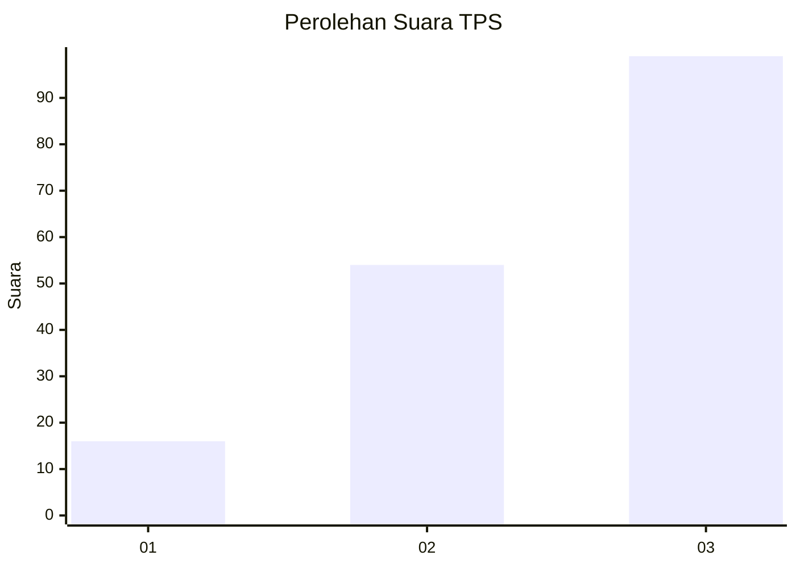
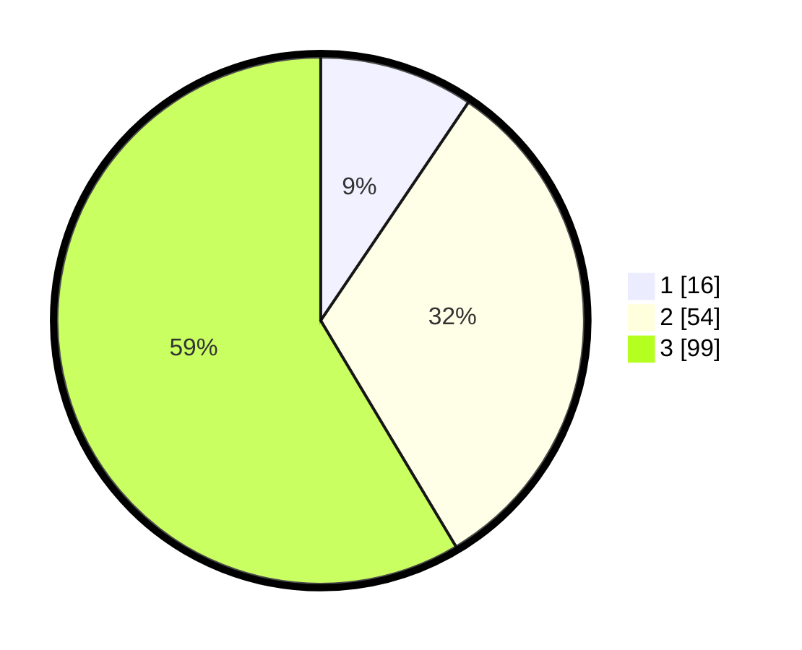

# Hasil

## Grafik

## Tabel

| No. | Nama Paslon    | Suara | Suara (raw) | Persentase |
|:--- |:-------------- | -----:| -----------:| ----------:|
| 1   | ANIES MUHAIMIN | 16    | [16][p-1]   | 9,47       |
| 2   | PRABOWO GIBRAN | 54    | [54][p-2]   | 31,95      |
| 3   | GANJAR MAHFUD  | 99    | [99][p-3]   | 58,58      |

[p-1]: https://github.com/gigit-pemilu/pemilu-2024-33-jawa-tengah/blob/main/pilpres/hitung-suara/sub/33-jawa-tengah/sub/02-banyumas/sub/14-ajibarang/sub/2010-kracak/sub/029-tps/sub/paslon-1.txt
[p-2]: https://github.com/gigit-pemilu/pemilu-2024-33-jawa-tengah/blob/main/pilpres/hitung-suara/sub/33-jawa-tengah/sub/02-banyumas/sub/14-ajibarang/sub/2010-kracak/sub/029-tps/sub/paslon-2.txt
[p-3]: https://github.com/gigit-pemilu/pemilu-2024-33-jawa-tengah/blob/main/pilpres/hitung-suara/sub/33-jawa-tengah/sub/02-banyumas/sub/14-ajibarang/sub/2010-kracak/sub/029-tps/sub/paslon-3.txt

## Foto C Plano

https://sirekap-obj-formc.kpu.go.id/8592/pemilu/ppwp/33/02/14/20/10/3302142010029-20240214-215740--415b2375-c19d-4909-8b3f-8202a3299f67.jpg

https://sirekap-obj-formc.kpu.go.id/8592/pemilu/ppwp/33/02/14/20/10/3302142010029-20240214-215907--3c38d270-fe06-4db1-91f3-3a65e13e5c4a.jpg

https://sirekap-obj-formc.kpu.go.id/8592/pemilu/ppwp/33/02/14/20/10/3302142010029-20240214-210723--472c763f-af9b-4b15-839a-a47660d93c13.jpg

## Metadata

| Key        | Value               |
| ---------- | ------------------- |
| Time Stamp | 2024-02-17 00:00:00 |

