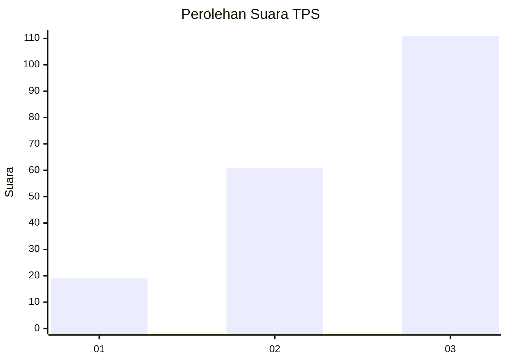
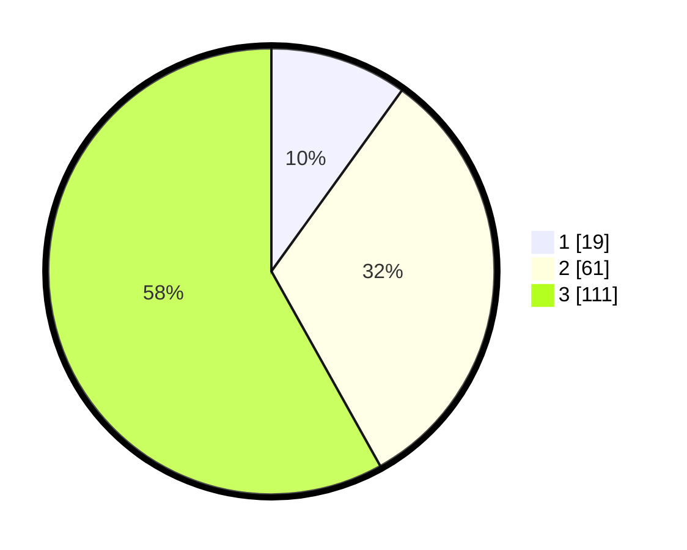

# Hasil

## Grafik

## Tabel

| No. | Nama Paslon    | Suara | Suara (raw) | Persentase |
|:--- |:-------------- | -----:| -----------:| ----------:|
| 1   | ANIES MUHAIMIN | 19    | [19][p-1]   | 9,95       |
| 2   | PRABOWO GIBRAN | 61    | [61][p-2]   | 31,94      |
| 3   | GANJAR MAHFUD  | 111   | [111][p-3]  | 58,12      |

[p-1]: https://github.com/gigit-pemilu/pemilu-2024-33-jawa-tengah/blob/main/pilpres/hitung-suara/sub/33-jawa-tengah/sub/02-banyumas/sub/14-ajibarang/sub/2010-kracak/sub/031-tps/sub/paslon-1.txt
[p-2]: https://github.com/gigit-pemilu/pemilu-2024-33-jawa-tengah/blob/main/pilpres/hitung-suara/sub/33-jawa-tengah/sub/02-banyumas/sub/14-ajibarang/sub/2010-kracak/sub/031-tps/sub/paslon-2.txt
[p-3]: https://github.com/gigit-pemilu/pemilu-2024-33-jawa-tengah/blob/main/pilpres/hitung-suara/sub/33-jawa-tengah/sub/02-banyumas/sub/14-ajibarang/sub/2010-kracak/sub/031-tps/sub/paslon-3.txt

## Foto C Plano

https://sirekap-obj-formc.kpu.go.id/32c1/pemilu/ppwp/33/02/14/20/10/3302142010031-20240215-001432--f27c41f4-c9ae-4f45-89c8-dd450f2537cd.jpg

https://sirekap-obj-formc.kpu.go.id/32c1/pemilu/ppwp/33/02/14/20/10/3302142010031-20240215-001525--b51b3116-e913-406b-881d-fcb34f347109.jpg

https://sirekap-obj-formc.kpu.go.id/32c1/pemilu/ppwp/33/02/14/20/10/3302142010031-20240215-001702--68562760-0cb5-4786-b487-c4b9bbe22322.jpg

## Metadata

| Key        | Value               |
| ---------- | ------------------- |
| Time Stamp | 2024-02-17 00:00:00 |

