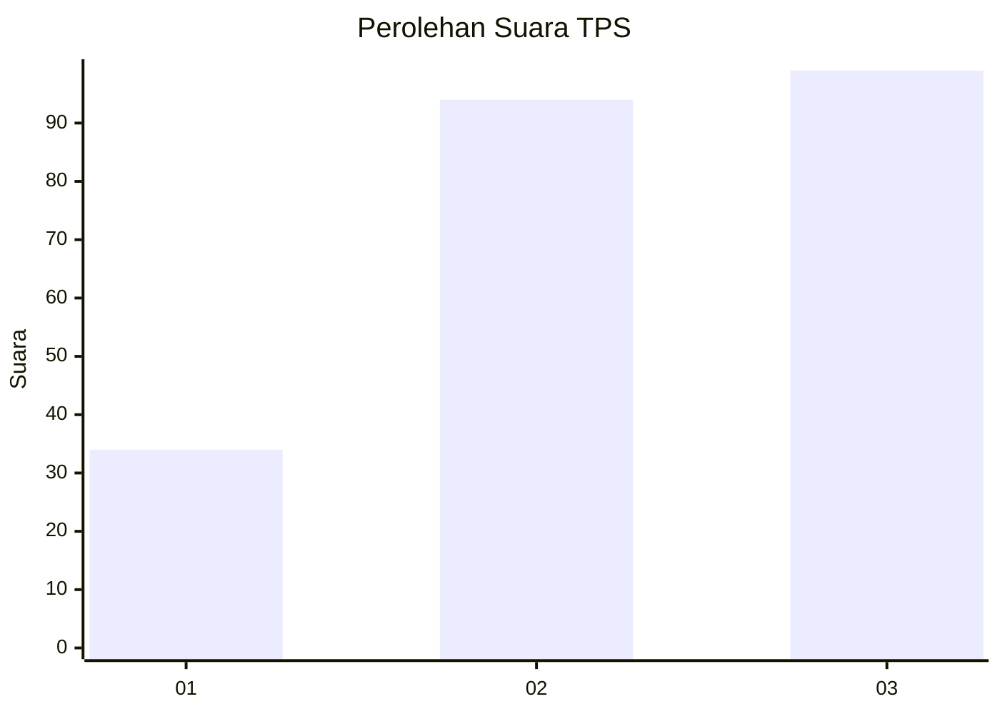
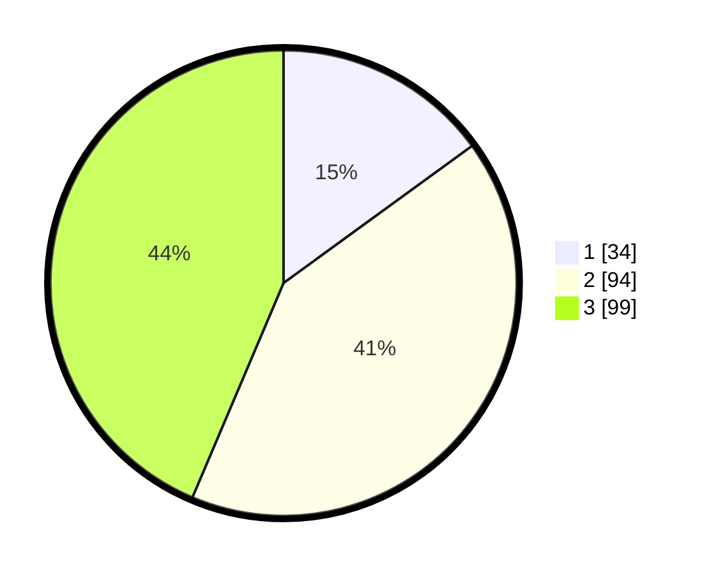

# Hasil

## Grafik

## Tabel

| No. | Nama Paslon    | Suara | Suara (raw) | Persentase |
|:--- |:-------------- | -----:| -----------:| ----------:|
| 1   | ANIES MUHAIMIN | 34    | [34][p-1]   | 14,98      |
| 2   | PRABOWO GIBRAN | 94    | [94][p-2]   | 41,41      |
| 3   | GANJAR MAHFUD  | 99    | [99][p-3]   | 43,61      |

[p-1]: https://github.com/gigit-pemilu/pemilu-2024-33-jawa-tengah/blob/main/pilpres/hitung-suara/sub/33-jawa-tengah/sub/02-banyumas/sub/14-ajibarang/sub/2011-ajibarang-kulon/sub/002-tps/sub/paslon-1.txt
[p-2]: https://github.com/gigit-pemilu/pemilu-2024-33-jawa-tengah/blob/main/pilpres/hitung-suara/sub/33-jawa-tengah/sub/02-banyumas/sub/14-ajibarang/sub/2011-ajibarang-kulon/sub/002-tps/sub/paslon-2.txt
[p-3]: https://github.com/gigit-pemilu/pemilu-2024-33-jawa-tengah/blob/main/pilpres/hitung-suara/sub/33-jawa-tengah/sub/02-banyumas/sub/14-ajibarang/sub/2011-ajibarang-kulon/sub/002-tps/sub/paslon-3.txt

## Foto C Plano

https://sirekap-obj-formc.kpu.go.id/3628/pemilu/ppwp/33/02/14/20/11/3302142011002-20240215-005140--7ac4fd9c-3f03-4906-8709-89029d494f73.jpg

https://sirekap-obj-formc.kpu.go.id/3628/pemilu/ppwp/33/02/14/20/11/3302142011002-20240214-232840--f0853e3e-0fb8-4117-bef3-465b7fd7d1f4.jpg

https://sirekap-obj-formc.kpu.go.id/3628/pemilu/ppwp/33/02/14/20/11/3302142011002-20240215-005340--37d3b72b-763d-4875-b0cc-418853aaa1f4.jpg

## Metadata

| Key        | Value               |
| ---------- | ------------------- |
| Time Stamp | 2024-02-24 22:31:28 |

