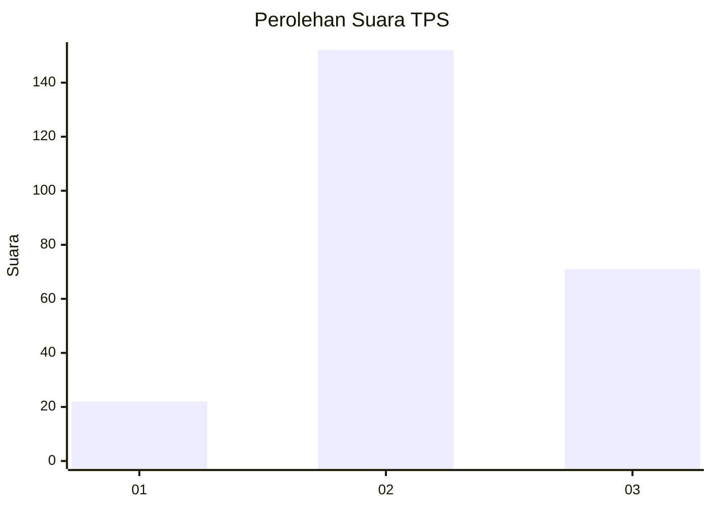
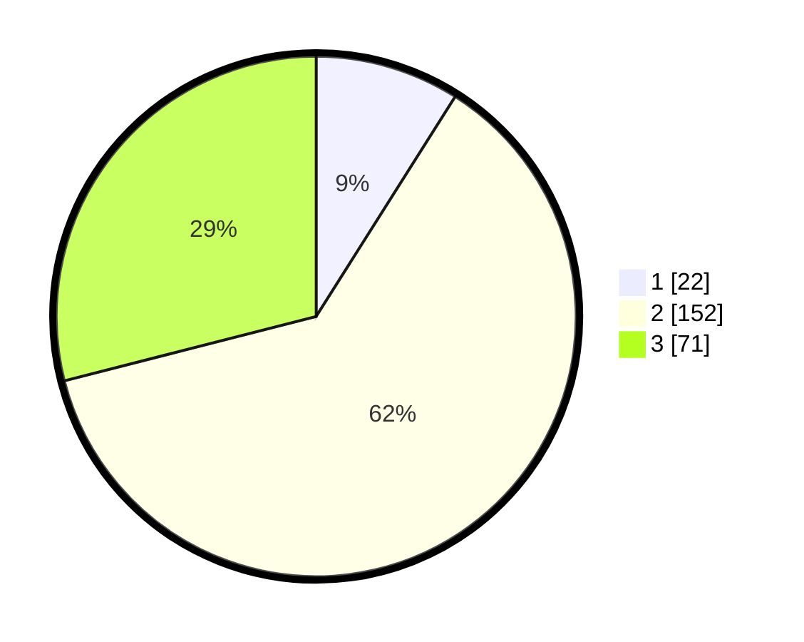

# Hasil

## Grafik

## Tabel

| No. | Nama Paslon    | Suara | Suara (raw) | Persentase |
|:--- |:-------------- | -----:| -----------:| ----------:|
| 1   | ANIES MUHAIMIN | 22    | [22][p-1]   | 8,98       |
| 2   | PRABOWO GIBRAN | 152   | [152][p-2]  | 62,04      |
| 3   | GANJAR MAHFUD  | 71    | [71][p-3]   | 28,98      |

[p-1]: https://github.com/gigit-pemilu/pemilu-2024-33-jawa-tengah/blob/main/pilpres/hitung-suara/sub/33-jawa-tengah/sub/02-banyumas/sub/14-ajibarang/sub/2011-ajibarang-kulon/sub/005-tps/sub/paslon-1.txt
[p-2]: https://github.com/gigit-pemilu/pemilu-2024-33-jawa-tengah/blob/main/pilpres/hitung-suara/sub/33-jawa-tengah/sub/02-banyumas/sub/14-ajibarang/sub/2011-ajibarang-kulon/sub/005-tps/sub/paslon-2.txt
[p-3]: https://github.com/gigit-pemilu/pemilu-2024-33-jawa-tengah/blob/main/pilpres/hitung-suara/sub/33-jawa-tengah/sub/02-banyumas/sub/14-ajibarang/sub/2011-ajibarang-kulon/sub/005-tps/sub/paslon-3.txt

## Foto C Plano

https://sirekap-obj-formc.kpu.go.id/2f76/pemilu/ppwp/33/02/14/20/11/3302142011005-20240215-053414--d87cd087-975a-479e-8f43-2ae4cf11bfdf.jpg

https://sirekap-obj-formc.kpu.go.id/2f76/pemilu/ppwp/33/02/14/20/11/3302142011005-20240214-213529--3279080b-7760-4d64-a3cf-398d08217494.jpg

https://sirekap-obj-formc.kpu.go.id/2f76/pemilu/ppwp/33/02/14/20/11/3302142011005-20240214-213708--8c036292-6de3-4f9d-8c2a-a683d94033e2.jpg

## Metadata

| Key        | Value               |
| ---------- | ------------------- |
| Time Stamp | 2024-02-16 22:01:00 |

