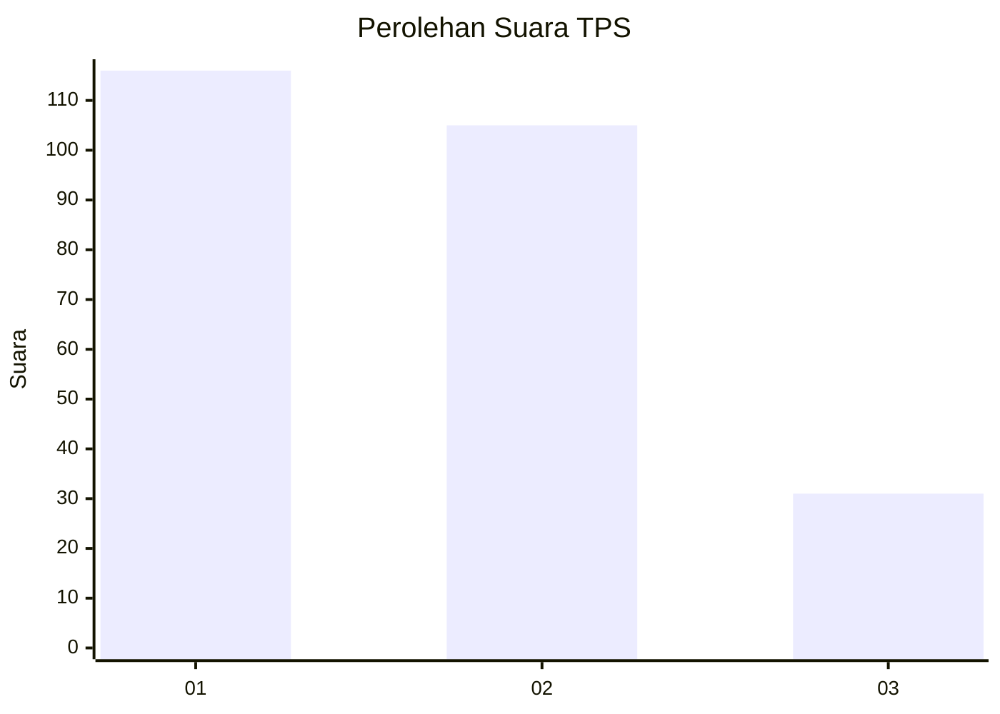
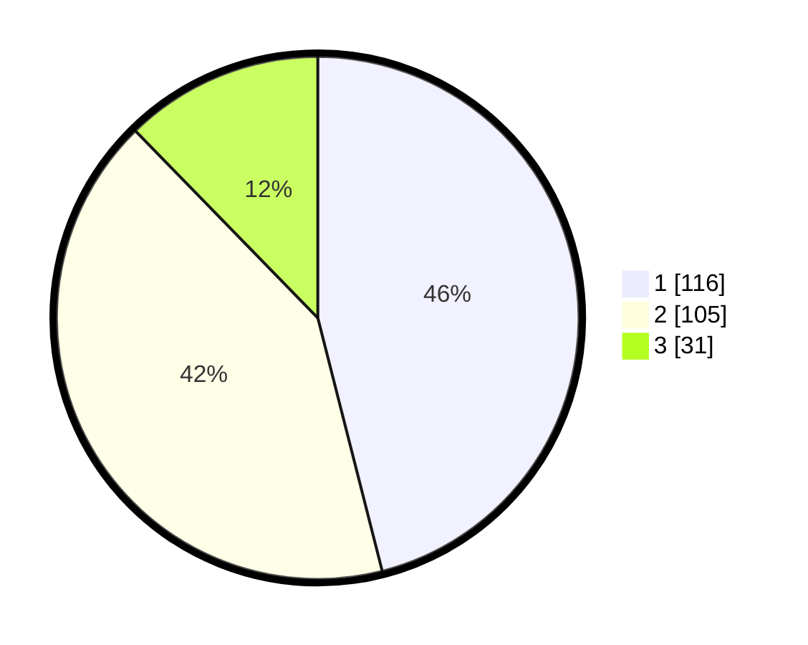

# Hasil

## Grafik

## Tabel

| No. | Nama Paslon    | Suara | Suara (raw) | Persentase |
|:--- |:-------------- | -----:| -----------:| ----------:|
| 1   | ANIES MUHAIMIN | 116   | [116][p-1]  | 46,03      |
| 2   | PRABOWO GIBRAN | 105   | [105][p-2]  | 41,67      |
| 3   | GANJAR MAHFUD  | 31    | [31][p-3]   | 12,30      |

[p-1]: https://github.com/gigit-pemilu/pemilu-2024-33-jawa-tengah/blob/main/pilpres/hitung-suara/sub/33-jawa-tengah/sub/02-banyumas/sub/14-ajibarang/sub/2011-ajibarang-kulon/sub/021-tps/sub/paslon-1.txt
[p-2]: https://github.com/gigit-pemilu/pemilu-2024-33-jawa-tengah/blob/main/pilpres/hitung-suara/sub/33-jawa-tengah/sub/02-banyumas/sub/14-ajibarang/sub/2011-ajibarang-kulon/sub/021-tps/sub/paslon-2.txt
[p-3]: https://github.com/gigit-pemilu/pemilu-2024-33-jawa-tengah/blob/main/pilpres/hitung-suara/sub/33-jawa-tengah/sub/02-banyumas/sub/14-ajibarang/sub/2011-ajibarang-kulon/sub/021-tps/sub/paslon-3.txt

## Foto C Plano

https://sirekap-obj-formc.kpu.go.id/3b54/pemilu/ppwp/33/02/14/20/11/3302142011021-20240214-231433--268185f8-8d2b-472e-bf05-cf60b4c68c5e.jpg

https://sirekap-obj-formc.kpu.go.id/3b54/pemilu/ppwp/33/02/14/20/11/3302142011021-20240214-231814--1bf03b77-42cc-4326-b094-5eb18b137d50.jpg

https://sirekap-obj-formc.kpu.go.id/3b54/pemilu/ppwp/33/02/14/20/11/3302142011021-20240214-232044--cc6a8ef8-4e20-450d-83f8-5157afbe516d.jpg

## Metadata

| Key        | Value               |
| ---------- | ------------------- |
| Time Stamp | 2024-02-15 12:00:28 |

