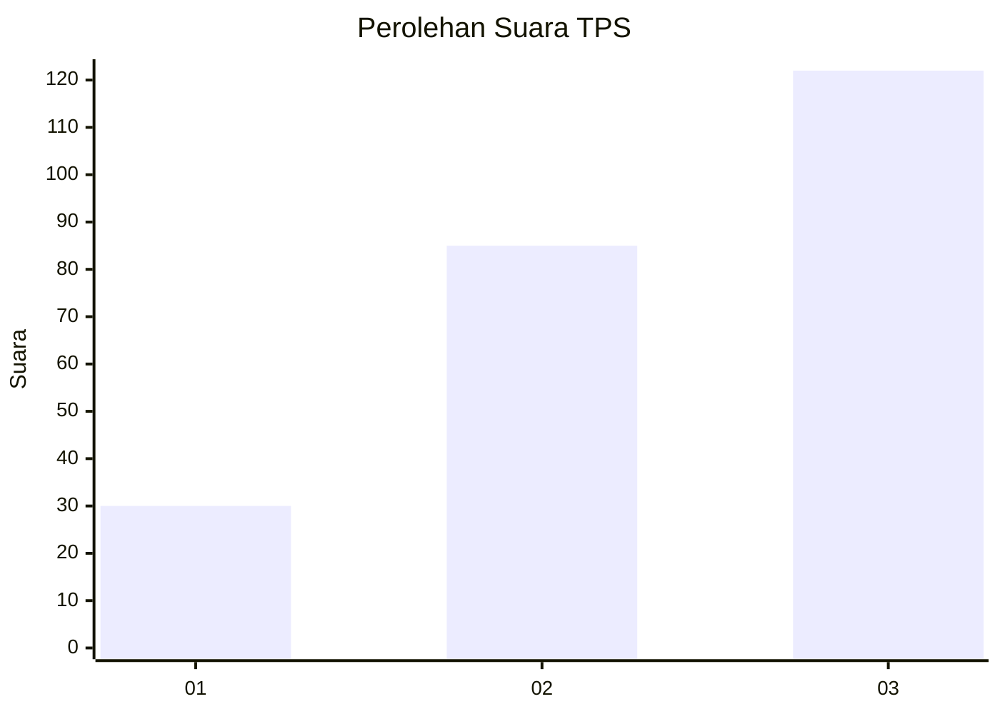
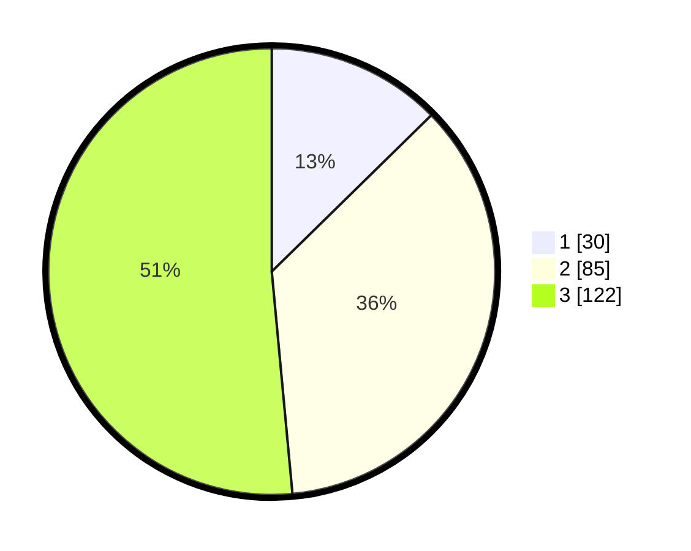

# Hasil

## Grafik

## Tabel

| No. | Nama Paslon    | Suara | Suara (raw) | Persentase |
|:--- |:-------------- | -----:| -----------:| ----------:|
| 1   | ANIES MUHAIMIN | 30    | [30][p-1]   | 12,66      |
| 2   | PRABOWO GIBRAN | 85    | [85][p-2]   | 35,86      |
| 3   | GANJAR MAHFUD  | 122   | [122][p-3]  | 51,48      |

[p-1]: https://github.com/gigit-pemilu/pemilu-2024/blob/main/pilpres/hitung-suara/sub/33-jawa-tengah/sub/02-banyumas/sub/14-ajibarang/sub/2012-ajibarang-wetan/sub/006-tps/sub/paslon-1.txt
[p-2]: https://github.com/gigit-pemilu/pemilu-2024/blob/main/pilpres/hitung-suara/sub/33-jawa-tengah/sub/02-banyumas/sub/14-ajibarang/sub/2012-ajibarang-wetan/sub/006-tps/sub/paslon-2.txt
[p-3]: https://github.com/gigit-pemilu/pemilu-2024/blob/main/pilpres/hitung-suara/sub/33-jawa-tengah/sub/02-banyumas/sub/14-ajibarang/sub/2012-ajibarang-wetan/sub/006-tps/sub/paslon-3.txt

## Foto C Plano

https://sirekap-obj-formc.kpu.go.id/5401/pemilu/ppwp/33/02/14/20/12/3302142012006-20240215-021639--a878b59a-4f72-4595-88a5-f379c9f428ca.jpg

https://sirekap-obj-formc.kpu.go.id/5401/pemilu/ppwp/33/02/14/20/12/3302142012006-20240215-021722--4a60082d-20e2-4f5b-b176-1b37f65cdf28.jpg

https://sirekap-obj-formc.kpu.go.id/5401/pemilu/ppwp/33/02/14/20/12/3302142012006-20240215-021802--90d0d7b7-aae1-4a28-9e7a-29486e978eec.jpg

## Metadata

| Key        | Value               |
| ---------- | ------------------- |
| Time Stamp | 2024-02-25 12:00:00 |

