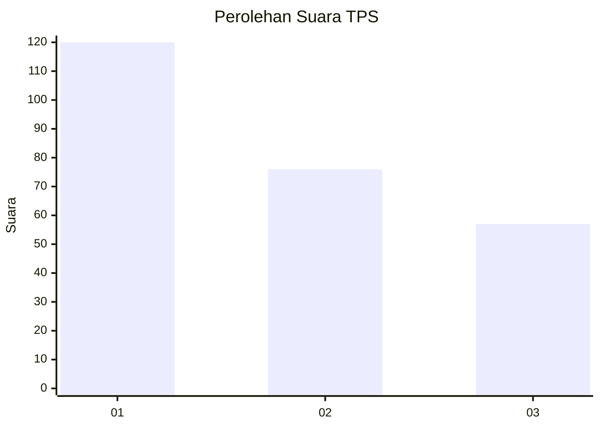
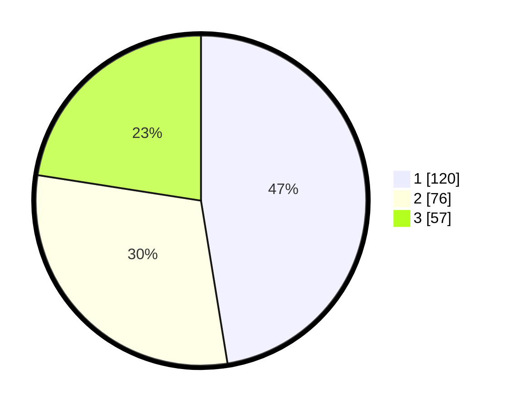

# Hasil

## Grafik

## Tabel

| No. | Nama Paslon    | Suara | Suara (raw) | Persentase |
|:--- |:-------------- | -----:| -----------:| ----------:|
| 1   | ANIES MUHAIMIN | 120   | [120][p-1]  | 47,43      |
| 2   | PRABOWO GIBRAN | 76    | [76][p-2]   | 30,04      |
| 3   | GANJAR MAHFUD  | 57    | [57][p-3]   | 22,53      |

[p-1]: https://github.com/gigit-pemilu/pemilu-2024-33-jawa-tengah/blob/main/pilpres/hitung-suara/sub/33-jawa-tengah/sub/02-banyumas/sub/14-ajibarang/sub/2013-lesmana/sub/007-tps/sub/paslon-1.txt
[p-2]: https://github.com/gigit-pemilu/pemilu-2024-33-jawa-tengah/blob/main/pilpres/hitung-suara/sub/33-jawa-tengah/sub/02-banyumas/sub/14-ajibarang/sub/2013-lesmana/sub/007-tps/sub/paslon-2.txt
[p-3]: https://github.com/gigit-pemilu/pemilu-2024-33-jawa-tengah/blob/main/pilpres/hitung-suara/sub/33-jawa-tengah/sub/02-banyumas/sub/14-ajibarang/sub/2013-lesmana/sub/007-tps/sub/paslon-3.txt

## Foto C Plano

https://sirekap-obj-formc.kpu.go.id/4b9d/pemilu/ppwp/33/02/14/20/13/3302142013007-20240214-200314--a0b863f5-204c-437f-9869-444ee117662c.jpg

https://sirekap-obj-formc.kpu.go.id/4b9d/pemilu/ppwp/33/02/14/20/13/3302142013007-20240214-203054--ea89b5de-ffcd-4de2-bab9-a3d4c092aa82.jpg

https://sirekap-obj-formc.kpu.go.id/4b9d/pemilu/ppwp/33/02/14/20/13/3302142013007-20240214-213705--44bc5334-6c5b-4c7d-b080-d341b268969d.jpg

## Metadata

| Key        | Value               |
| ---------- | ------------------- |
| Time Stamp | 2024-02-16 22:01:00 |

