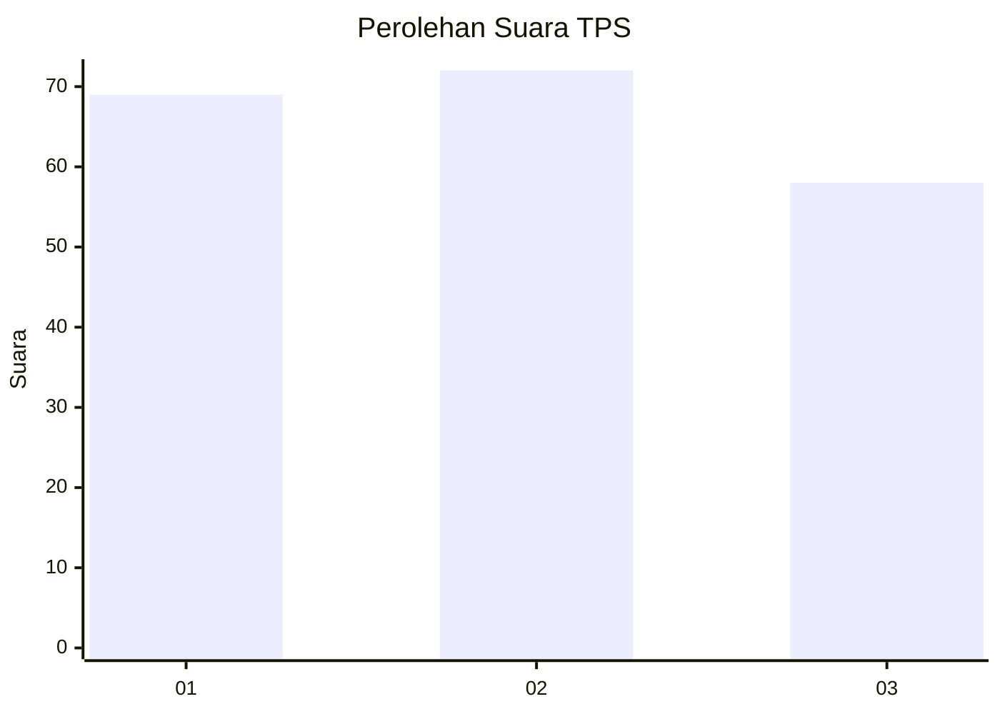
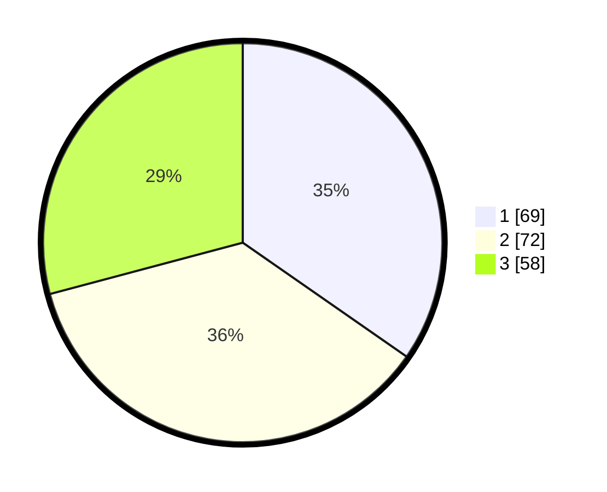

# Hasil

## Grafik

## Tabel

| No. | Nama Paslon    | Suara | Suara (raw) | Persentase |
|:--- |:-------------- | -----:| -----------:| ----------:|
| 1   | ANIES MUHAIMIN | 69    | [69][p-1]   | 34,67      |
| 2   | PRABOWO GIBRAN | 72    | [72][p-2]   | 36,18      |
| 3   | GANJAR MAHFUD  | 58    | [58][p-3]   | 29,15      |

[p-1]: https://github.com/gigit-pemilu/pemilu-2024-33-jawa-tengah/blob/main/pilpres/hitung-suara/sub/33-jawa-tengah/sub/02-banyumas/sub/14-ajibarang/sub/2014-pandansari/sub/003-tps/sub/paslon-1.txt
[p-2]: https://github.com/gigit-pemilu/pemilu-2024-33-jawa-tengah/blob/main/pilpres/hitung-suara/sub/33-jawa-tengah/sub/02-banyumas/sub/14-ajibarang/sub/2014-pandansari/sub/003-tps/sub/paslon-2.txt
[p-3]: https://github.com/gigit-pemilu/pemilu-2024-33-jawa-tengah/blob/main/pilpres/hitung-suara/sub/33-jawa-tengah/sub/02-banyumas/sub/14-ajibarang/sub/2014-pandansari/sub/003-tps/sub/paslon-3.txt

## Foto C Plano

https://sirekap-obj-formc.kpu.go.id/fcec/pemilu/ppwp/33/02/14/20/14/3302142014003-20240215-164226--02f4fe13-8ce7-4d45-a95d-eca826620c9c.jpg

https://sirekap-obj-formc.kpu.go.id/fcec/pemilu/ppwp/33/02/14/20/14/3302142014003-20240215-021156--3be01103-d9aa-4610-b315-021ed65ba33a.jpg

https://sirekap-obj-formc.kpu.go.id/fcec/pemilu/ppwp/33/02/14/20/14/3302142014003-20240215-021409--d02c0ff1-f945-442b-bb9e-5e4dd6643097.jpg

## Metadata

| Key        | Value               |
| ---------- | ------------------- |
| Time Stamp | 2024-02-24 22:31:28 |

