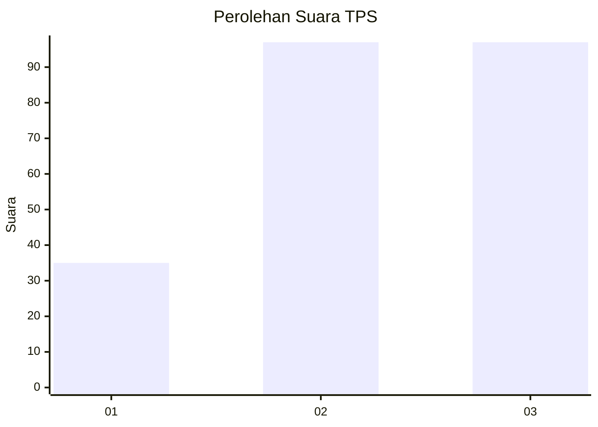
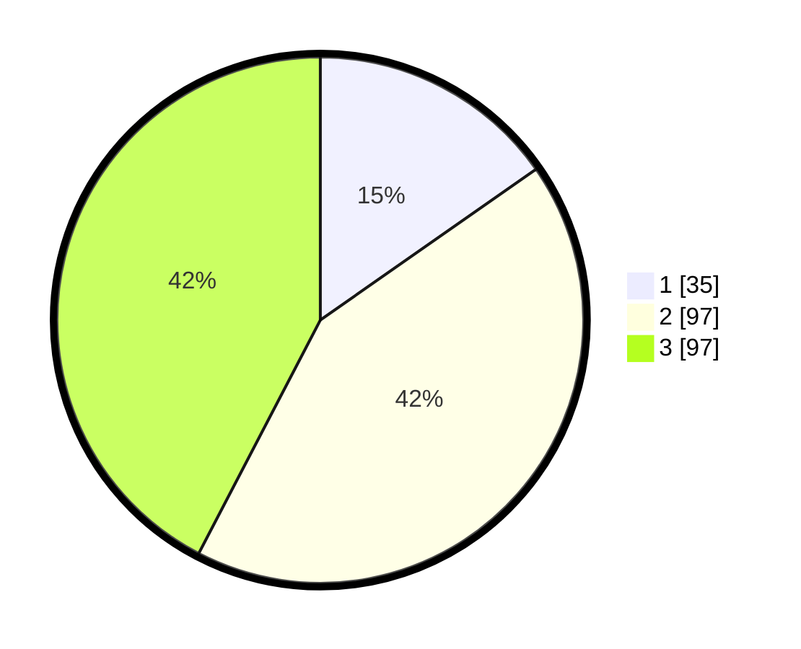

# Hasil

## Grafik

## Tabel

| No. | Nama Paslon    | Suara | Suara (raw) | Persentase |
|:--- |:-------------- | -----:| -----------:| ----------:|
| 1   | ANIES MUHAIMIN | 35    | [35][p-1]   | 15,28      |
| 2   | PRABOWO GIBRAN | 97    | [97][p-2]   | 42,36      |
| 3   | GANJAR MAHFUD  | 97    | [97][p-3]   | 42,36      |

[p-1]: https://github.com/gigit-pemilu/pemilu-2024/blob/main/pilpres/hitung-suara/sub/33-jawa-tengah/sub/02-banyumas/sub/14-ajibarang/sub/2014-pandansari/sub/008-tps/sub/paslon-1.txt
[p-2]: https://github.com/gigit-pemilu/pemilu-2024/blob/main/pilpres/hitung-suara/sub/33-jawa-tengah/sub/02-banyumas/sub/14-ajibarang/sub/2014-pandansari/sub/008-tps/sub/paslon-2.txt
[p-3]: https://github.com/gigit-pemilu/pemilu-2024/blob/main/pilpres/hitung-suara/sub/33-jawa-tengah/sub/02-banyumas/sub/14-ajibarang/sub/2014-pandansari/sub/008-tps/sub/paslon-3.txt

## Foto C Plano

https://sirekap-obj-formc.kpu.go.id/c193/pemilu/ppwp/33/02/14/20/14/3302142014008-20240214-235123--ec162314-4214-4888-b2ab-a2d6360a17b3.jpg

https://sirekap-obj-formc.kpu.go.id/c193/pemilu/ppwp/33/02/14/20/14/3302142014008-20240214-235407--04aca471-8ff7-460f-99e7-f095fe9091c0.jpg

https://sirekap-obj-formc.kpu.go.id/c193/pemilu/ppwp/33/02/14/20/14/3302142014008-20240214-235643--9fc09ffa-82f8-4316-adcd-657cc4d9d42c.jpg

## Metadata

| Key        | Value               |
| ---------- | ------------------- |
| Time Stamp | 2024-02-24 22:31:28 |

