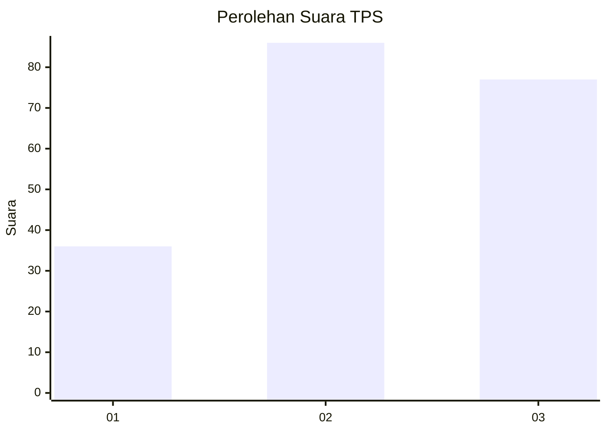
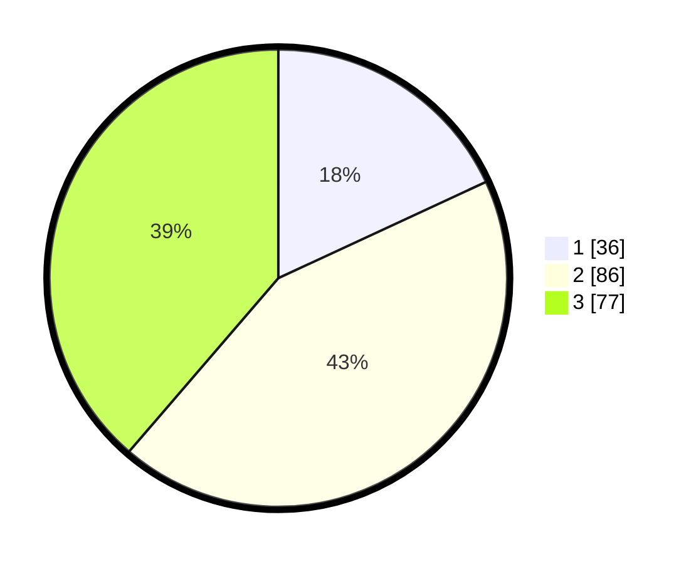

# Hasil

## Grafik

## Tabel

| No. | Nama Paslon    | Suara | Suara (raw) | Persentase |
|:--- |:-------------- | -----:| -----------:| ----------:|
| 1   | ANIES MUHAIMIN | 36    | [36][p-1]   | 18,09      |
| 2   | PRABOWO GIBRAN | 86    | [86][p-2]   | 43,22      |
| 3   | GANJAR MAHFUD  | 77    | [77][p-3]   | 38,69      |

[p-1]: https://github.com/gigit-pemilu/pemilu-2024/blob/main/pilpres/hitung-suara/sub/33-jawa-tengah/sub/02-banyumas/sub/15-gumelar/sub/2001-karangkemojing/sub/004-tps/sub/paslon-1.txt
[p-2]: https://github.com/gigit-pemilu/pemilu-2024/blob/main/pilpres/hitung-suara/sub/33-jawa-tengah/sub/02-banyumas/sub/15-gumelar/sub/2001-karangkemojing/sub/004-tps/sub/paslon-2.txt
[p-3]: https://github.com/gigit-pemilu/pemilu-2024/blob/main/pilpres/hitung-suara/sub/33-jawa-tengah/sub/02-banyumas/sub/15-gumelar/sub/2001-karangkemojing/sub/004-tps/sub/paslon-3.txt

## Foto C Plano

https://sirekap-obj-formc.kpu.go.id/b25f/pemilu/ppwp/33/02/15/20/01/3302152001004-20240215-004927--b72ed554-841d-4353-b03a-9a7aed685be6.jpg

https://sirekap-obj-formc.kpu.go.id/b25f/pemilu/ppwp/33/02/15/20/01/3302152001004-20240215-020001--3dbba773-c01b-4633-9ad8-f91b2d875dd5.jpg

https://sirekap-obj-formc.kpu.go.id/b25f/pemilu/ppwp/33/02/15/20/01/3302152001004-20240215-020914--7d6e9262-498c-4a01-9494-eb3a44c06e22.jpg

## Metadata

| Key        | Value               |
| ---------- | ------------------- |
| Time Stamp | 2024-02-16 23:00:00 |

