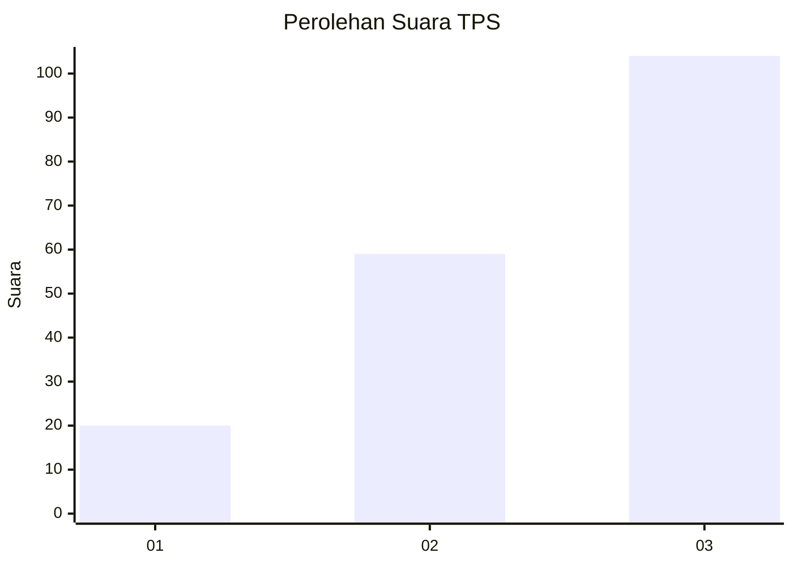
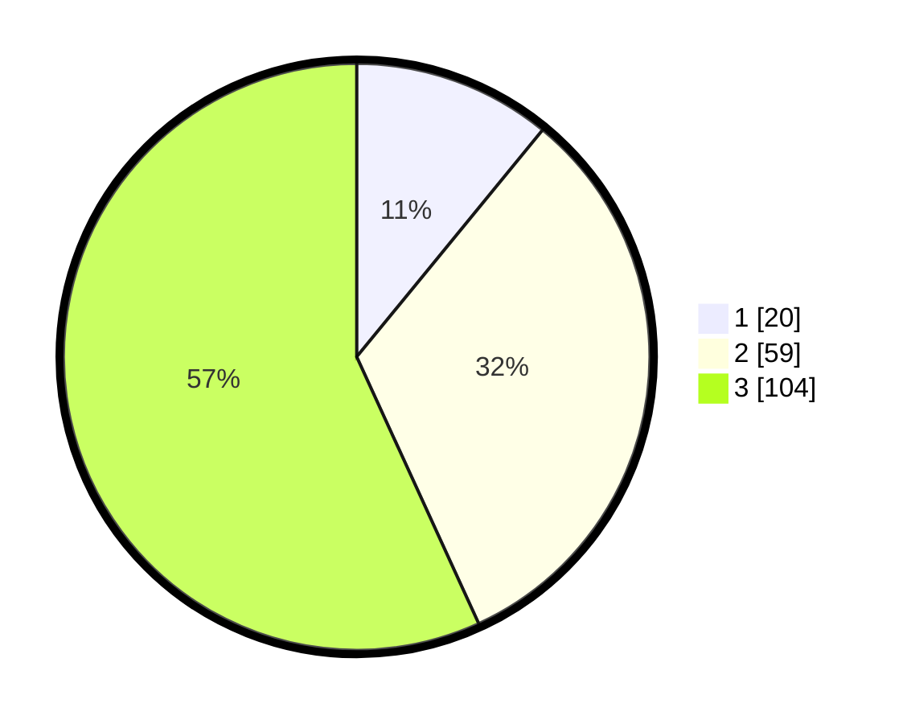

# Hasil

## Grafik

## Tabel

| No. | Nama Paslon    | Suara | Suara (raw) | Persentase |
|:--- |:-------------- | -----:| -----------:| ----------:|
| 1   | ANIES MUHAIMIN | 20    | [20][p-1]   | 10,93      |
| 2   | PRABOWO GIBRAN | 59    | [59][p-2]   | 32,24      |
| 3   | GANJAR MAHFUD  | 104   | [104][p-3]  | 56,83      |

[p-1]: https://github.com/gigit-pemilu/pemilu-2024/blob/main/pilpres/hitung-suara/sub/33-jawa-tengah/sub/02-banyumas/sub/15-gumelar/sub/2001-karangkemojing/sub/005-tps/sub/paslon-1.txt
[p-2]: https://github.com/gigit-pemilu/pemilu-2024/blob/main/pilpres/hitung-suara/sub/33-jawa-tengah/sub/02-banyumas/sub/15-gumelar/sub/2001-karangkemojing/sub/005-tps/sub/paslon-2.txt
[p-3]: https://github.com/gigit-pemilu/pemilu-2024/blob/main/pilpres/hitung-suara/sub/33-jawa-tengah/sub/02-banyumas/sub/15-gumelar/sub/2001-karangkemojing/sub/005-tps/sub/paslon-3.txt

## Foto C Plano

https://sirekap-obj-formc.kpu.go.id/82d3/pemilu/ppwp/33/02/15/20/01/3302152001005-20240215-002635--213b5b5d-74f3-48f4-955a-7d0e1d6d28f3.jpg

https://sirekap-obj-formc.kpu.go.id/82d3/pemilu/ppwp/33/02/15/20/01/3302152001005-20240215-004006--c57e2f64-0677-413e-8961-2f7b17688ad5.jpg

https://sirekap-obj-formc.kpu.go.id/82d3/pemilu/ppwp/33/02/15/20/01/3302152001005-20240215-004221--3f25f6db-951b-427a-aa76-187d092fd99d.jpg

## Metadata

| Key        | Value               |
| ---------- | ------------------- |
| Time Stamp | 2024-02-24 22:31:28 |

