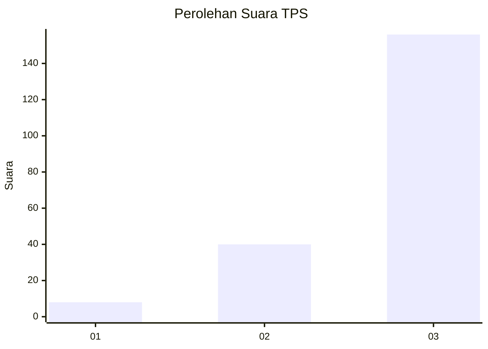
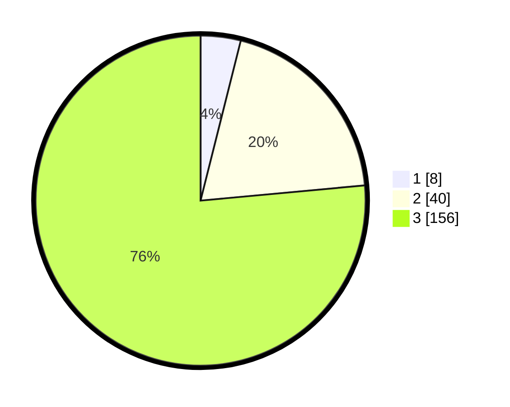

# Hasil

## Grafik

## Tabel

| No. | Nama Paslon    | Suara | Suara (raw) | Persentase |
|:--- |:-------------- | -----:| -----------:| ----------:|
| 1   | ANIES MUHAIMIN | 8     | [8][p-1]    | 3,92       |
| 2   | PRABOWO GIBRAN | 40    | [40][p-2]   | 19,61      |
| 3   | GANJAR MAHFUD  | 156   | [156][p-3]  | 76,47      |

[p-1]: https://github.com/gigit-pemilu/pemilu-2024-33-jawa-tengah/blob/main/pilpres/hitung-suara/sub/33-jawa-tengah/sub/02-banyumas/sub/15-gumelar/sub/2001-karangkemojing/sub/008-tps/sub/paslon-1.txt
[p-2]: https://github.com/gigit-pemilu/pemilu-2024-33-jawa-tengah/blob/main/pilpres/hitung-suara/sub/33-jawa-tengah/sub/02-banyumas/sub/15-gumelar/sub/2001-karangkemojing/sub/008-tps/sub/paslon-2.txt
[p-3]: https://github.com/gigit-pemilu/pemilu-2024-33-jawa-tengah/blob/main/pilpres/hitung-suara/sub/33-jawa-tengah/sub/02-banyumas/sub/15-gumelar/sub/2001-karangkemojing/sub/008-tps/sub/paslon-3.txt

## Foto C Plano

https://sirekap-obj-formc.kpu.go.id/d7e7/pemilu/ppwp/33/02/15/20/01/3302152001008-20240214-231511--122762bd-926d-4b5d-a90e-596f5d203eb3.jpg

https://sirekap-obj-formc.kpu.go.id/d7e7/pemilu/ppwp/33/02/15/20/01/3302152001008-20240214-231734--5115dd0a-e7ee-43e2-9778-0659f89dffe0.jpg

https://sirekap-obj-formc.kpu.go.id/d7e7/pemilu/ppwp/33/02/15/20/01/3302152001008-20240214-231919--cfb059d0-6404-49f7-8e79-38bf801c0c31.jpg

## Metadata

| Key        | Value               |
| ---------- | ------------------- |
| Time Stamp | 2024-02-16 23:00:00 |

