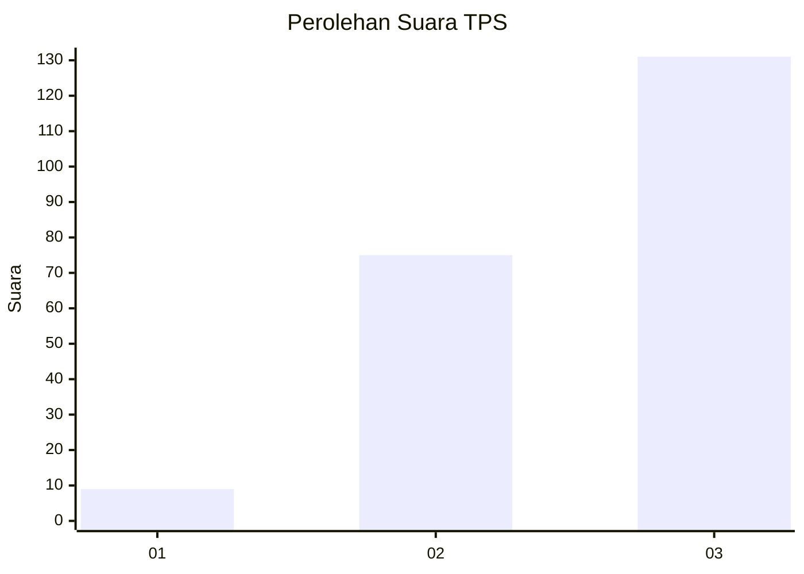
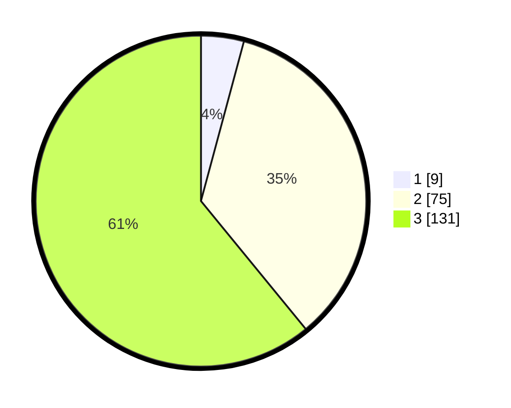

# Hasil

## Grafik

## Tabel

| No. | Nama Paslon    | Suara | Suara (raw) | Persentase |
|:--- |:-------------- | -----:| -----------:| ----------:|
| 1   | ANIES MUHAIMIN | 9     | [9][p-1]    | 4,19       |
| 2   | PRABOWO GIBRAN | 75    | [75][p-2]   | 34,88      |
| 3   | GANJAR MAHFUD  | 131   | [131][p-3]  | 60,93      |

[p-1]: https://github.com/gigit-pemilu/pemilu-2024-33-jawa-tengah/blob/main/pilpres/hitung-suara/sub/33-jawa-tengah/sub/02-banyumas/sub/15-gumelar/sub/2002-paningkaban/sub/006-tps/sub/paslon-1.txt
[p-2]: https://github.com/gigit-pemilu/pemilu-2024-33-jawa-tengah/blob/main/pilpres/hitung-suara/sub/33-jawa-tengah/sub/02-banyumas/sub/15-gumelar/sub/2002-paningkaban/sub/006-tps/sub/paslon-2.txt
[p-3]: https://github.com/gigit-pemilu/pemilu-2024-33-jawa-tengah/blob/main/pilpres/hitung-suara/sub/33-jawa-tengah/sub/02-banyumas/sub/15-gumelar/sub/2002-paningkaban/sub/006-tps/sub/paslon-3.txt

## Foto C Plano

https://sirekap-obj-formc.kpu.go.id/7564/pemilu/ppwp/33/02/15/20/02/3302152002006-20240215-020813--e94d4a5c-90a6-4022-9ab3-031e5b871c62.jpg

https://sirekap-obj-formc.kpu.go.id/7564/pemilu/ppwp/33/02/15/20/02/3302152002006-20240214-210019--f031175b-ac72-41ff-af8d-5c7ec80a22d9.jpg

https://sirekap-obj-formc.kpu.go.id/7564/pemilu/ppwp/33/02/15/20/02/3302152002006-20240214-210231--c032d4f5-685d-4325-a5aa-a35365d3e80e.jpg

## Metadata

| Key        | Value               |
| ---------- | ------------------- |
| Time Stamp | 2024-02-15 12:00:28 |

