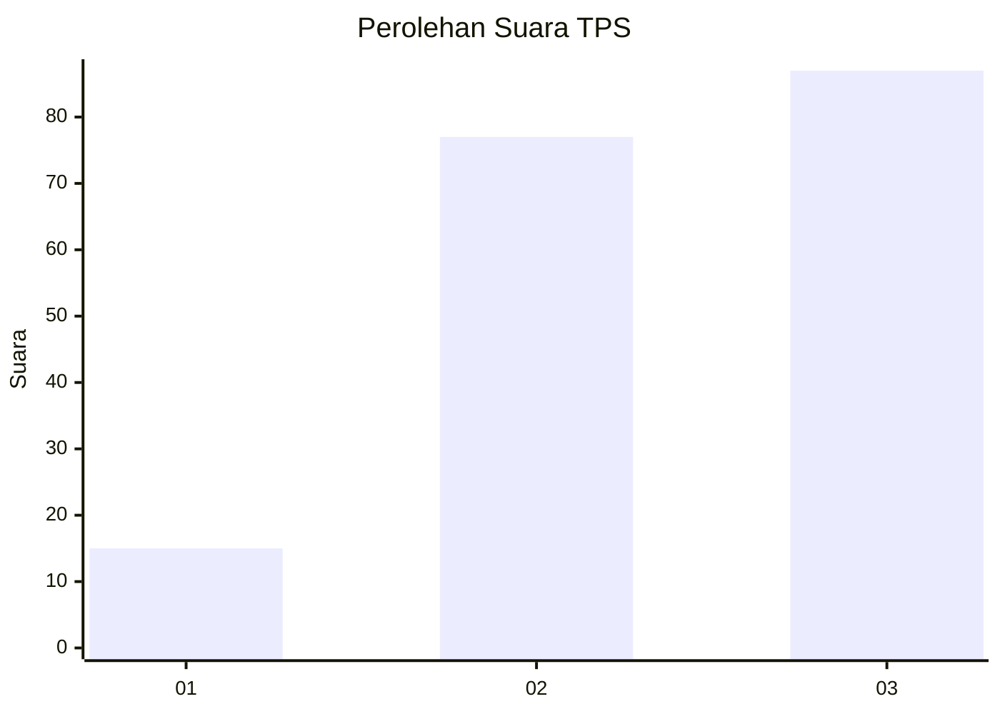
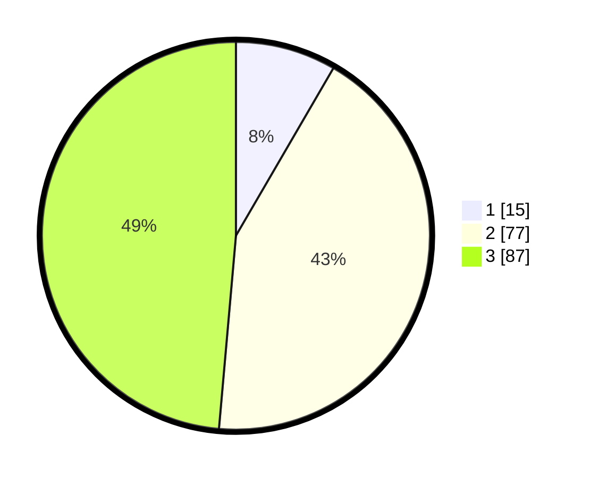

# Hasil

## Grafik

## Tabel

| No. | Nama Paslon    | Suara | Suara (raw) | Persentase |
|:--- |:-------------- | -----:| -----------:| ----------:|
| 1   | ANIES MUHAIMIN | 15    | [15][p-1]   | 8,38       |
| 2   | PRABOWO GIBRAN | 77    | [77][p-2]   | 43,02      |
| 3   | GANJAR MAHFUD  | 87    | [87][p-3]   | 48,60      |

[p-1]: https://github.com/gigit-pemilu/pemilu-2024/blob/main/pilpres/hitung-suara/sub/33-jawa-tengah/sub/02-banyumas/sub/15-gumelar/sub/2002-paningkaban/sub/010-tps/sub/paslon-1.txt
[p-2]: https://github.com/gigit-pemilu/pemilu-2024/blob/main/pilpres/hitung-suara/sub/33-jawa-tengah/sub/02-banyumas/sub/15-gumelar/sub/2002-paningkaban/sub/010-tps/sub/paslon-2.txt
[p-3]: https://github.com/gigit-pemilu/pemilu-2024/blob/main/pilpres/hitung-suara/sub/33-jawa-tengah/sub/02-banyumas/sub/15-gumelar/sub/2002-paningkaban/sub/010-tps/sub/paslon-3.txt

## Foto C Plano

https://sirekap-obj-formc.kpu.go.id/a705/pemilu/ppwp/33/02/15/20/02/3302152002010-20240215-011301--e40a534f-ea99-4d02-a350-b26761d120b9.jpg

https://sirekap-obj-formc.kpu.go.id/a705/pemilu/ppwp/33/02/15/20/02/3302152002010-20240215-011915--d1632a9a-5866-4fee-8d30-e8a34da1d0f0.jpg

https://sirekap-obj-formc.kpu.go.id/a705/pemilu/ppwp/33/02/15/20/02/3302152002010-20240215-012744--322d6239-4981-40db-8f06-9a1b6656b740.jpg

## Metadata

| Key        | Value               |
| ---------- | ------------------- |
| Time Stamp | 2024-02-16 23:30:00 |

