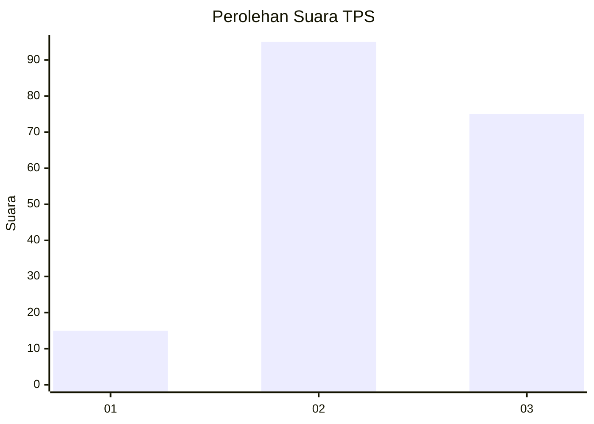
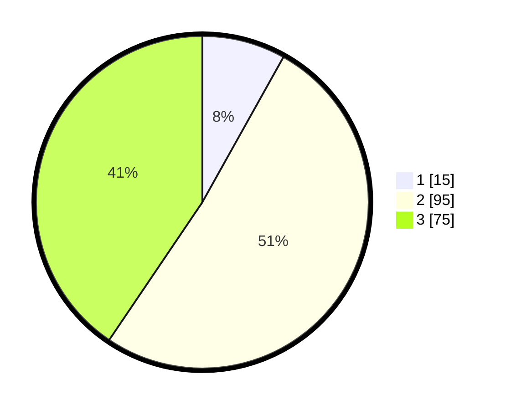

# Hasil

## Grafik

## Tabel

| No. | Nama Paslon    | Suara | Suara (raw) | Persentase |
|:--- |:-------------- | -----:| -----------:| ----------:|
| 1   | ANIES MUHAIMIN | 15    | [15][p-1]   | 8,11       |
| 2   | PRABOWO GIBRAN | 95    | [95][p-2]   | 51,35      |
| 3   | GANJAR MAHFUD  | 75    | [75][p-3]   | 40,54      |

[p-1]: https://github.com/gigit-pemilu/pemilu-2024-33-jawa-tengah/blob/main/pilpres/hitung-suara/sub/33-jawa-tengah/sub/02-banyumas/sub/15-gumelar/sub/2003-cihonje/sub/001-tps/sub/paslon-1.txt
[p-2]: https://github.com/gigit-pemilu/pemilu-2024-33-jawa-tengah/blob/main/pilpres/hitung-suara/sub/33-jawa-tengah/sub/02-banyumas/sub/15-gumelar/sub/2003-cihonje/sub/001-tps/sub/paslon-2.txt
[p-3]: https://github.com/gigit-pemilu/pemilu-2024-33-jawa-tengah/blob/main/pilpres/hitung-suara/sub/33-jawa-tengah/sub/02-banyumas/sub/15-gumelar/sub/2003-cihonje/sub/001-tps/sub/paslon-3.txt

## Foto C Plano

https://sirekap-obj-formc.kpu.go.id/48dd/pemilu/ppwp/33/02/15/20/03/3302152003001-20240214-225351--6b5f6ed3-d87c-497e-8d8f-e16676638385.jpg

https://sirekap-obj-formc.kpu.go.id/48dd/pemilu/ppwp/33/02/15/20/03/3302152003001-20240214-230034--88e890f4-afbc-45b8-8ca8-ec4ed68b1a52.jpg

https://sirekap-obj-formc.kpu.go.id/48dd/pemilu/ppwp/33/02/15/20/03/3302152003001-20240214-225951--d2b25aca-bd07-42be-aba9-fed71a8e7adc.jpg

## Metadata

| Key        | Value               |
| ---------- | ------------------- |
| Time Stamp | 2024-02-16 23:30:00 |

