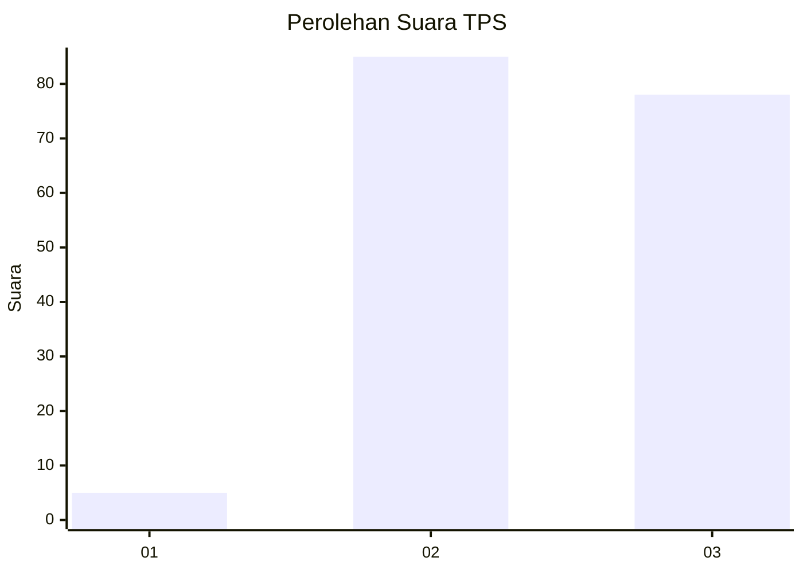
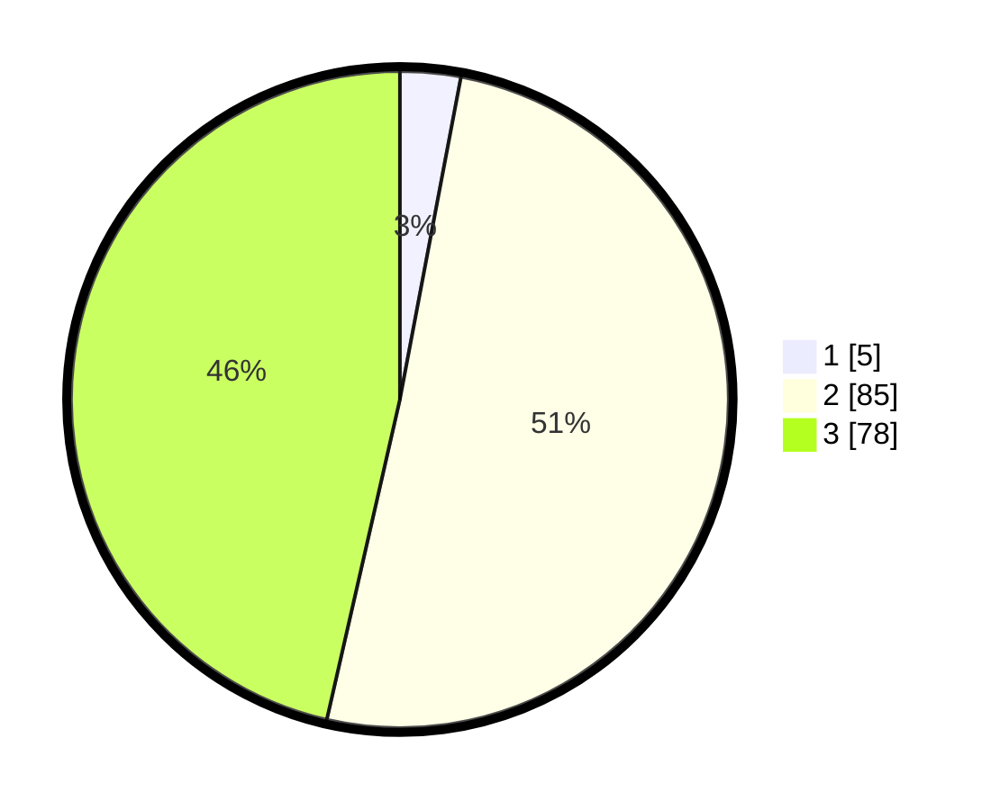

# Hasil

## Grafik

## Tabel

| No. | Nama Paslon    | Suara | Suara (raw) | Persentase |
|:--- |:-------------- | -----:| -----------:| ----------:|
| 1   | ANIES MUHAIMIN | 5     | [5][p-1]    | 2,98       |
| 2   | PRABOWO GIBRAN | 85    | [85][p-2]   | 50,60      |
| 3   | GANJAR MAHFUD  | 78    | [78][p-3]   | 46,43      |

[p-1]: https://github.com/gigit-pemilu/pemilu-2024-33-jawa-tengah/blob/main/pilpres/hitung-suara/sub/33-jawa-tengah/sub/02-banyumas/sub/15-gumelar/sub/2003-cihonje/sub/002-tps/sub/paslon-1.txt
[p-2]: https://github.com/gigit-pemilu/pemilu-2024-33-jawa-tengah/blob/main/pilpres/hitung-suara/sub/33-jawa-tengah/sub/02-banyumas/sub/15-gumelar/sub/2003-cihonje/sub/002-tps/sub/paslon-2.txt
[p-3]: https://github.com/gigit-pemilu/pemilu-2024-33-jawa-tengah/blob/main/pilpres/hitung-suara/sub/33-jawa-tengah/sub/02-banyumas/sub/15-gumelar/sub/2003-cihonje/sub/002-tps/sub/paslon-3.txt

## Foto C Plano

https://sirekap-obj-formc.kpu.go.id/0ad2/pemilu/ppwp/33/02/15/20/03/3302152003002-20240215-010412--6246c766-6e64-4753-96a6-7dfc4e47e188.jpg

https://sirekap-obj-formc.kpu.go.id/0ad2/pemilu/ppwp/33/02/15/20/03/3302152003002-20240215-023148--ccc54fcf-7d26-47f9-921e-9d87a9caf00e.jpg

https://sirekap-obj-formc.kpu.go.id/0ad2/pemilu/ppwp/33/02/15/20/03/3302152003002-20240215-023328--58f91052-9095-40a9-8580-28f4ffd1c033.jpg

## Metadata

| Key        | Value               |
| ---------- | ------------------- |
| Time Stamp | 2024-02-16 23:30:00 |

