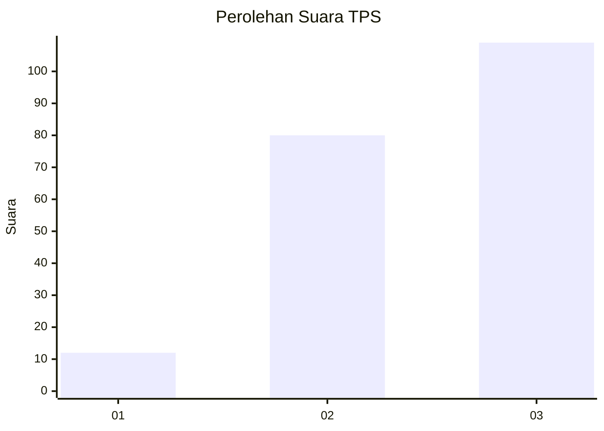
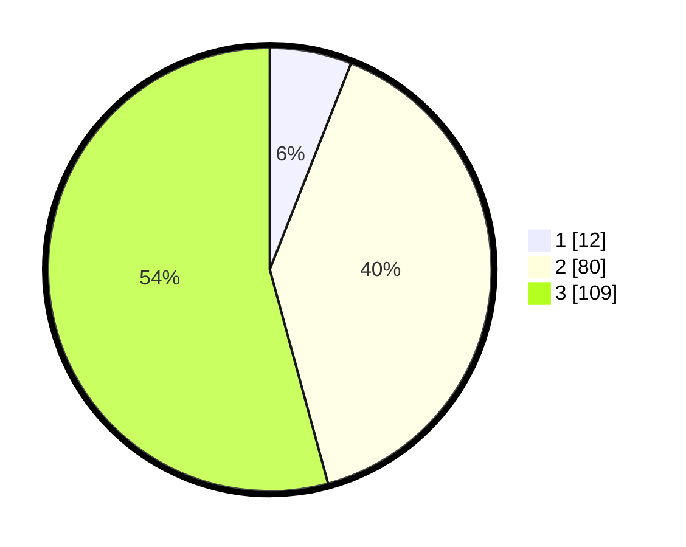

# Hasil

## Grafik

## Tabel

| No. | Nama Paslon    | Suara | Suara (raw) | Persentase |
|:--- |:-------------- | -----:| -----------:| ----------:|
| 1   | ANIES MUHAIMIN | 12    | [12][p-1]   | 5,97       |
| 2   | PRABOWO GIBRAN | 80    | [80][p-2]   | 39,80      |
| 3   | GANJAR MAHFUD  | 109   | [109][p-3]  | 54,23      |

[p-1]: https://github.com/gigit-pemilu/pemilu-2024/blob/main/pilpres/hitung-suara/sub/33-jawa-tengah/sub/02-banyumas/sub/15-gumelar/sub/2003-cihonje/sub/021-tps/sub/paslon-1.txt
[p-2]: https://github.com/gigit-pemilu/pemilu-2024/blob/main/pilpres/hitung-suara/sub/33-jawa-tengah/sub/02-banyumas/sub/15-gumelar/sub/2003-cihonje/sub/021-tps/sub/paslon-2.txt
[p-3]: https://github.com/gigit-pemilu/pemilu-2024/blob/main/pilpres/hitung-suara/sub/33-jawa-tengah/sub/02-banyumas/sub/15-gumelar/sub/2003-cihonje/sub/021-tps/sub/paslon-3.txt

## Foto C Plano

https://sirekap-obj-formc.kpu.go.id/3f6c/pemilu/ppwp/33/02/15/20/03/3302152003021-20240214-231708--26a4d654-b1b2-478e-8b1c-66cd5e8151c0.jpg

https://sirekap-obj-formc.kpu.go.id/3f6c/pemilu/ppwp/33/02/15/20/03/3302152003021-20240214-232319--2fad50aa-b380-4a99-8728-f07c18e97b79.jpg

https://sirekap-obj-formc.kpu.go.id/3f6c/pemilu/ppwp/33/02/15/20/03/3302152003021-20240214-232440--1aa7168a-e93c-4b43-8f0d-da1608aa3e6a.jpg

## Metadata

| Key        | Value               |
| ---------- | ------------------- |
| Time Stamp | 2024-02-15 23:29:50 |

