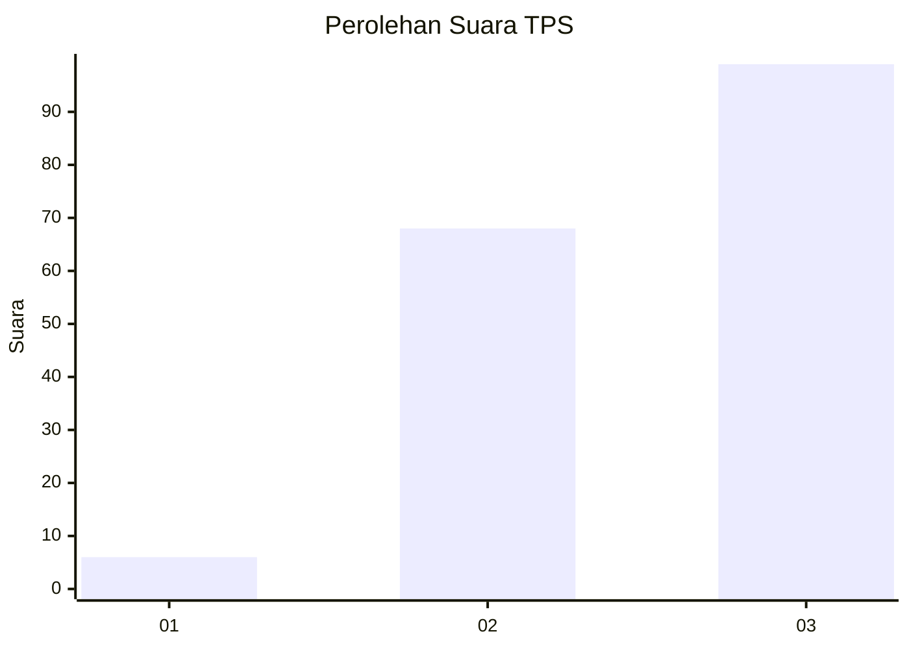
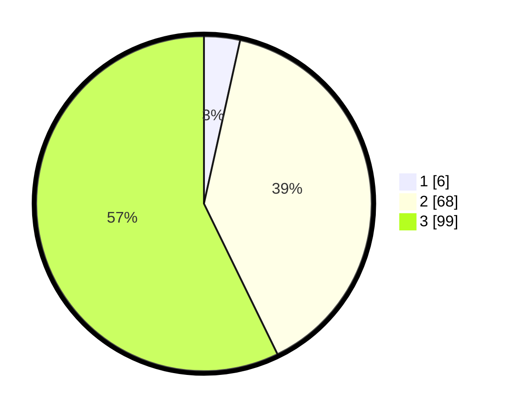

# Hasil

## Grafik

## Tabel

| No. | Nama Paslon    | Suara | Suara (raw) | Persentase |
|:--- |:-------------- | -----:| -----------:| ----------:|
| 1   | ANIES MUHAIMIN | 6     | [6][p-1]    | 3,47       |
| 2   | PRABOWO GIBRAN | 68    | [68][p-2]   | 39,31      |
| 3   | GANJAR MAHFUD  | 99    | [99][p-3]   | 57,23      |

[p-1]: https://github.com/gigit-pemilu/pemilu-2024-33-jawa-tengah/blob/main/pilpres/hitung-suara/sub/33-jawa-tengah/sub/02-banyumas/sub/15-gumelar/sub/2003-cihonje/sub/023-tps/sub/paslon-1.txt
[p-2]: https://github.com/gigit-pemilu/pemilu-2024-33-jawa-tengah/blob/main/pilpres/hitung-suara/sub/33-jawa-tengah/sub/02-banyumas/sub/15-gumelar/sub/2003-cihonje/sub/023-tps/sub/paslon-2.txt
[p-3]: https://github.com/gigit-pemilu/pemilu-2024-33-jawa-tengah/blob/main/pilpres/hitung-suara/sub/33-jawa-tengah/sub/02-banyumas/sub/15-gumelar/sub/2003-cihonje/sub/023-tps/sub/paslon-3.txt

## Foto C Plano

https://sirekap-obj-formc.kpu.go.id/cf01/pemilu/ppwp/33/02/15/20/03/3302152003023-20240215-003324--27fc7f62-9473-4f25-9c34-e4230c4f71ca.jpg

https://sirekap-obj-formc.kpu.go.id/cf01/pemilu/ppwp/33/02/15/20/03/3302152003023-20240215-003544--63c3e1fe-7fdc-454c-bbd0-240279852e7f.jpg

https://sirekap-obj-formc.kpu.go.id/cf01/pemilu/ppwp/33/02/15/20/03/3302152003023-20240215-003725--51982413-fd92-4b3a-baf8-e2c62803b04f.jpg

## Metadata

| Key        | Value               |
| ---------- | ------------------- |
| Time Stamp | 2024-02-25 22:00:00 |

