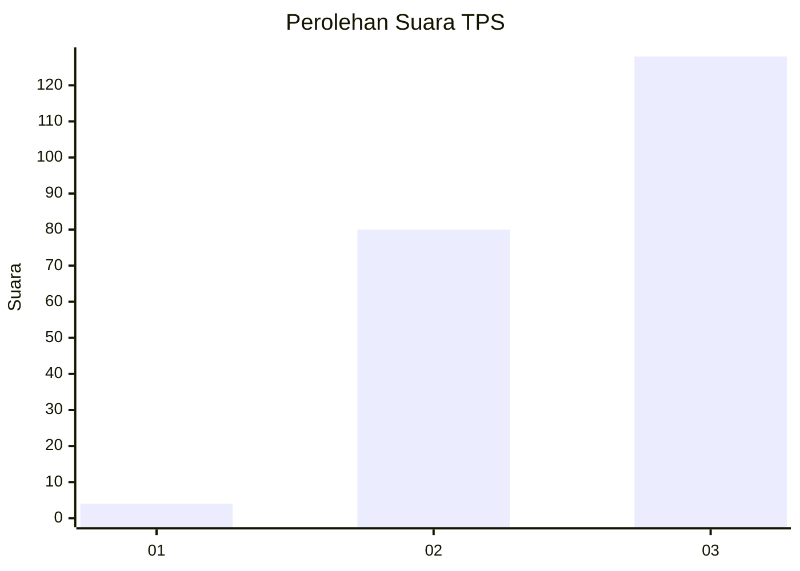
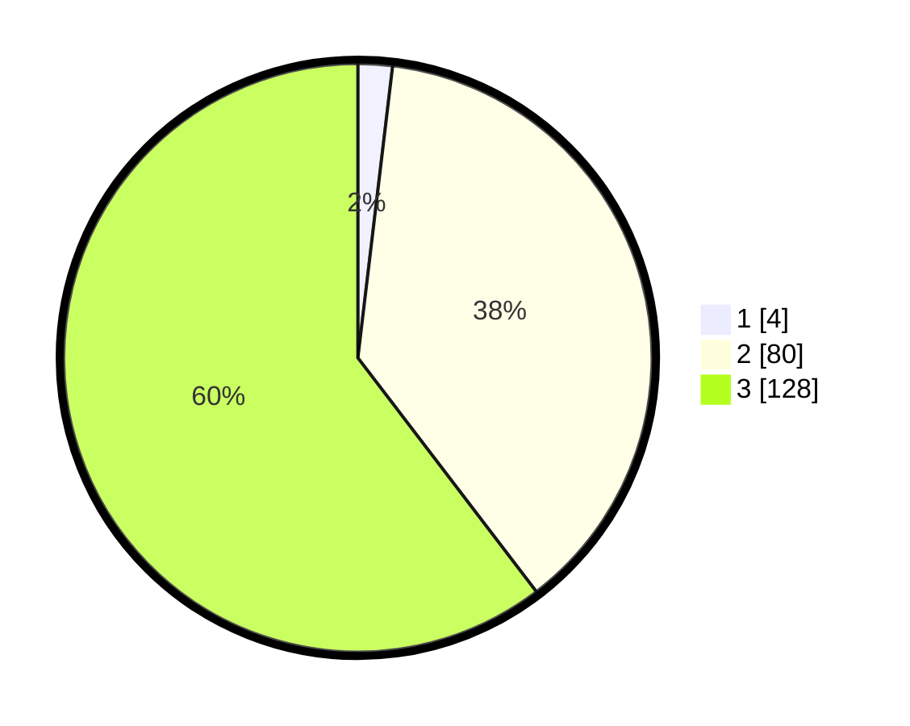

# Hasil

## Grafik

## Tabel

| No. | Nama Paslon    | Suara | Suara (raw) | Persentase |
|:--- |:-------------- | -----:| -----------:| ----------:|
| 1   | ANIES MUHAIMIN | 4     | [4][p-1]    | 1,89       |
| 2   | PRABOWO GIBRAN | 80    | [80][p-2]   | 37,74      |
| 3   | GANJAR MAHFUD  | 128   | [128][p-3]  | 60,38      |

[p-1]: https://github.com/gigit-pemilu/pemilu-2024-33-jawa-tengah/blob/main/pilpres/hitung-suara/sub/33-jawa-tengah/sub/02-banyumas/sub/15-gumelar/sub/2005-kedungurang/sub/009-tps/sub/paslon-1.txt
[p-2]: https://github.com/gigit-pemilu/pemilu-2024-33-jawa-tengah/blob/main/pilpres/hitung-suara/sub/33-jawa-tengah/sub/02-banyumas/sub/15-gumelar/sub/2005-kedungurang/sub/009-tps/sub/paslon-2.txt
[p-3]: https://github.com/gigit-pemilu/pemilu-2024-33-jawa-tengah/blob/main/pilpres/hitung-suara/sub/33-jawa-tengah/sub/02-banyumas/sub/15-gumelar/sub/2005-kedungurang/sub/009-tps/sub/paslon-3.txt

## Foto C Plano

https://sirekap-obj-formc.kpu.go.id/003a/pemilu/ppwp/33/02/15/20/05/3302152005009-20240217-204933--5fc9b849-56be-4dc6-9d14-e68236f50374.jpg

https://sirekap-obj-formc.kpu.go.id/003a/pemilu/ppwp/33/02/15/20/05/3302152005009-20240215-014846--59c90934-3fae-41da-9295-b466c6df14c3.jpg

https://sirekap-obj-formc.kpu.go.id/003a/pemilu/ppwp/33/02/15/20/05/3302152005009-20240215-015050--53bea7ff-193d-4fc3-8b1f-7230826a3c90.jpg

## Metadata

| Key        | Value               |
| ---------- | ------------------- |
| Time Stamp | 2024-02-19 06:16:00 |

