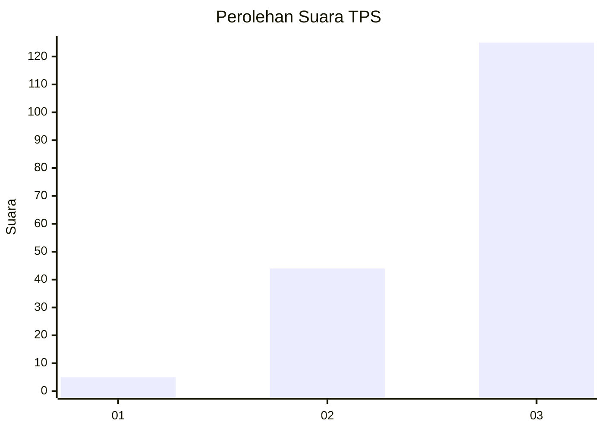
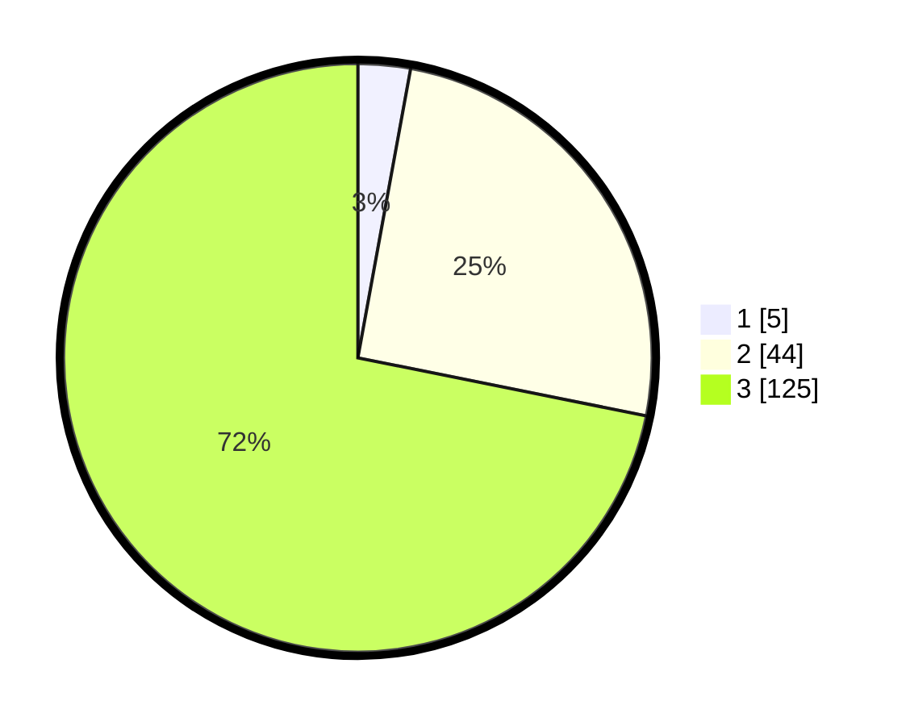

# Hasil

## Grafik

## Tabel

| No. | Nama Paslon    | Suara | Suara (raw) | Persentase |
|:--- |:-------------- | -----:| -----------:| ----------:|
| 1   | ANIES MUHAIMIN | 5     | [5][p-1]    | 2,87       |
| 2   | PRABOWO GIBRAN | 44    | [44][p-2]   | 25,29      |
| 3   | GANJAR MAHFUD  | 125   | [125][p-3]  | 71,84      |

[p-1]: https://github.com/gigit-pemilu/pemilu-2024/blob/main/pilpres/hitung-suara/sub/33-jawa-tengah/sub/02-banyumas/sub/15-gumelar/sub/2006-gumelar/sub/008-tps/sub/paslon-1.txt
[p-2]: https://github.com/gigit-pemilu/pemilu-2024/blob/main/pilpres/hitung-suara/sub/33-jawa-tengah/sub/02-banyumas/sub/15-gumelar/sub/2006-gumelar/sub/008-tps/sub/paslon-2.txt
[p-3]: https://github.com/gigit-pemilu/pemilu-2024/blob/main/pilpres/hitung-suara/sub/33-jawa-tengah/sub/02-banyumas/sub/15-gumelar/sub/2006-gumelar/sub/008-tps/sub/paslon-3.txt

## Foto C Plano

https://sirekap-obj-formc.kpu.go.id/a363/pemilu/ppwp/33/02/15/20/06/3302152006008-20240214-141435--b75875f5-8ee2-4bd5-84e7-d12fa0c49b76.jpg

https://sirekap-obj-formc.kpu.go.id/a363/pemilu/ppwp/33/02/15/20/06/3302152006008-20240214-141800--b959f6bb-0509-4131-b418-e2e8711f7219.jpg

https://sirekap-obj-formc.kpu.go.id/a363/pemilu/ppwp/33/02/15/20/06/3302152006008-20240214-141657--ddeda765-8262-47c8-bef6-bb9bc69cbd15.jpg

## Metadata

| Key        | Value               |
| ---------- | ------------------- |
| Time Stamp | 2024-02-25 12:00:00 |

