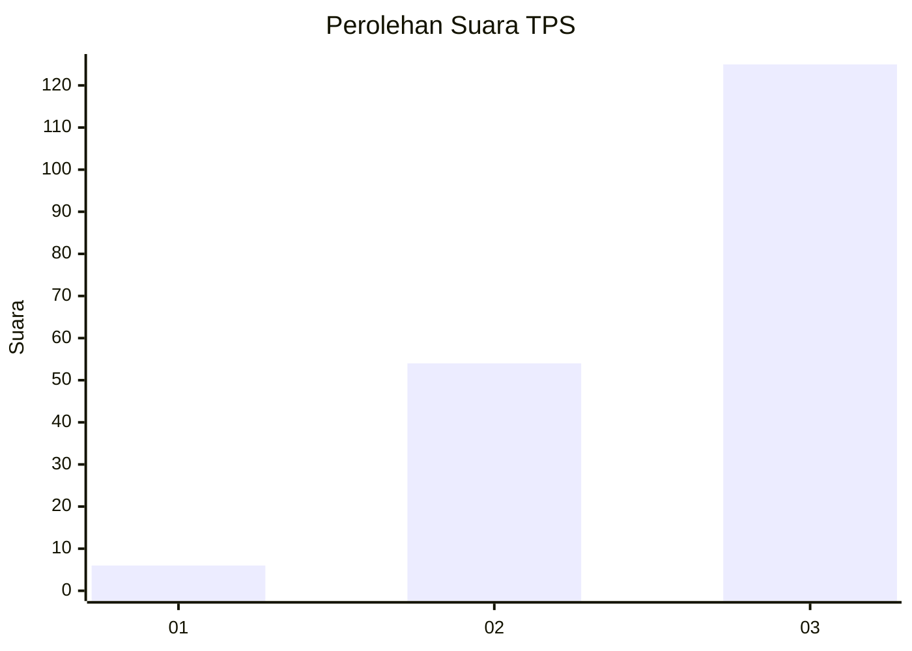
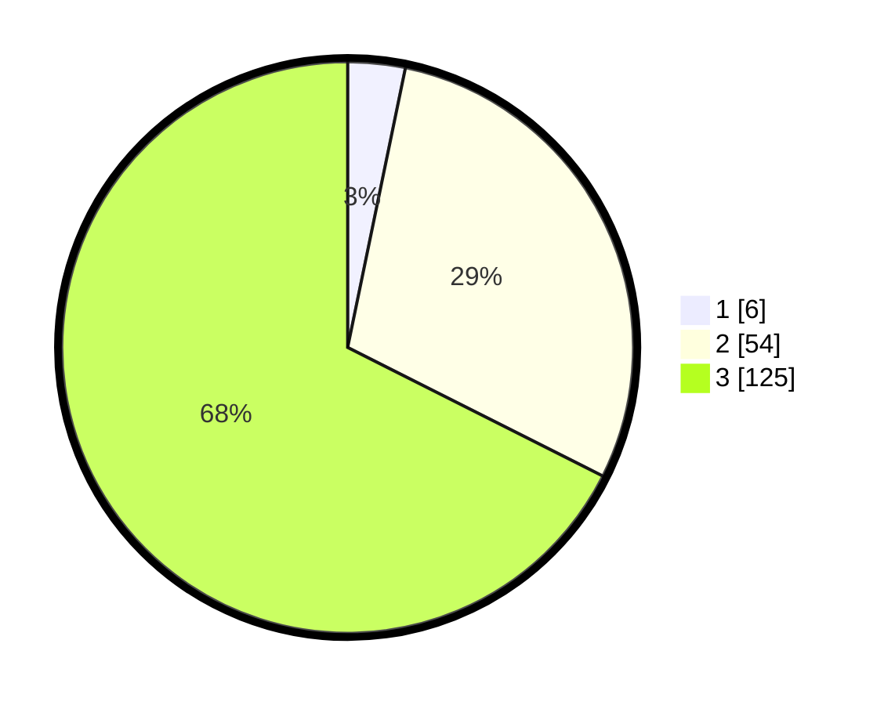

# Hasil

## Grafik

## Tabel

| No. | Nama Paslon    | Suara | Suara (raw) | Persentase |
|:--- |:-------------- | -----:| -----------:| ----------:|
| 1   | ANIES MUHAIMIN | 6     | [6][p-1]    | 3,24       |
| 2   | PRABOWO GIBRAN | 54    | [54][p-2]   | 29,19      |
| 3   | GANJAR MAHFUD  | 125   | [125][p-3]  | 67,57      |

[p-1]: https://github.com/gigit-pemilu/pemilu-2024/blob/main/pilpres/hitung-suara/sub/33-jawa-tengah/sub/02-banyumas/sub/15-gumelar/sub/2006-gumelar/sub/012-tps/sub/paslon-1.txt
[p-2]: https://github.com/gigit-pemilu/pemilu-2024/blob/main/pilpres/hitung-suara/sub/33-jawa-tengah/sub/02-banyumas/sub/15-gumelar/sub/2006-gumelar/sub/012-tps/sub/paslon-2.txt
[p-3]: https://github.com/gigit-pemilu/pemilu-2024/blob/main/pilpres/hitung-suara/sub/33-jawa-tengah/sub/02-banyumas/sub/15-gumelar/sub/2006-gumelar/sub/012-tps/sub/paslon-3.txt

## Foto C Plano

https://sirekap-obj-formc.kpu.go.id/f963/pemilu/ppwp/33/02/15/20/06/3302152006012-20240214-233844--de007457-4b27-4a54-b7da-d34570fb0652.jpg

https://sirekap-obj-formc.kpu.go.id/f963/pemilu/ppwp/33/02/15/20/06/3302152006012-20240214-234154--3006b91b-0e29-4991-a032-5bf0ba6fdcb0.jpg

https://sirekap-obj-formc.kpu.go.id/f963/pemilu/ppwp/33/02/15/20/06/3302152006012-20240214-234341--09ffaf8d-3439-4863-b0cf-14ac44ac2d0f.jpg

## Metadata

| Key        | Value               |
| ---------- | ------------------- |
| Time Stamp | 2024-02-16 23:30:00 |

