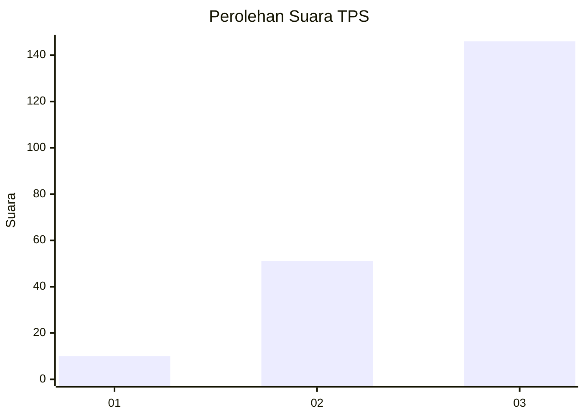
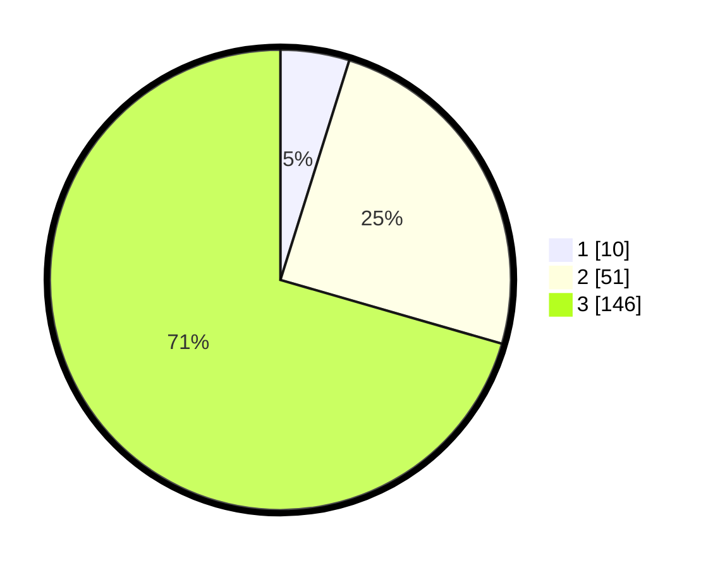

# Hasil

## Grafik

## Tabel

| No. | Nama Paslon    | Suara | Suara (raw) | Persentase |
|:--- |:-------------- | -----:| -----------:| ----------:|
| 1   | ANIES MUHAIMIN | 10    | [10][p-1]   | 4,83       |
| 2   | PRABOWO GIBRAN | 51    | [51][p-2]   | 24,64      |
| 3   | GANJAR MAHFUD  | 146   | [146][p-3]  | 70,53      |

[p-1]: https://github.com/gigit-pemilu/pemilu-2024-33-jawa-tengah/blob/main/pilpres/hitung-suara/sub/33-jawa-tengah/sub/02-banyumas/sub/15-gumelar/sub/2007-cilangkap/sub/010-tps/sub/paslon-1.txt
[p-2]: https://github.com/gigit-pemilu/pemilu-2024-33-jawa-tengah/blob/main/pilpres/hitung-suara/sub/33-jawa-tengah/sub/02-banyumas/sub/15-gumelar/sub/2007-cilangkap/sub/010-tps/sub/paslon-2.txt
[p-3]: https://github.com/gigit-pemilu/pemilu-2024-33-jawa-tengah/blob/main/pilpres/hitung-suara/sub/33-jawa-tengah/sub/02-banyumas/sub/15-gumelar/sub/2007-cilangkap/sub/010-tps/sub/paslon-3.txt

## Foto C Plano

https://sirekap-obj-formc.kpu.go.id/7b93/pemilu/ppwp/33/02/15/20/07/3302152007010-20240214-234243--18fdc573-6faa-42fc-bf41-511fe2e2594b.jpg

https://sirekap-obj-formc.kpu.go.id/7b93/pemilu/ppwp/33/02/15/20/07/3302152007010-20240215-000133--06b1a2db-c952-44bd-a019-26dcb609bcc0.jpg

https://sirekap-obj-formc.kpu.go.id/7b93/pemilu/ppwp/33/02/15/20/07/3302152007010-20240215-000240--1c492030-d125-4c78-aa8d-73e43696af5d.jpg

## Metadata

| Key        | Value               |
| ---------- | ------------------- |
| Time Stamp | 2024-02-16 23:30:00 |

