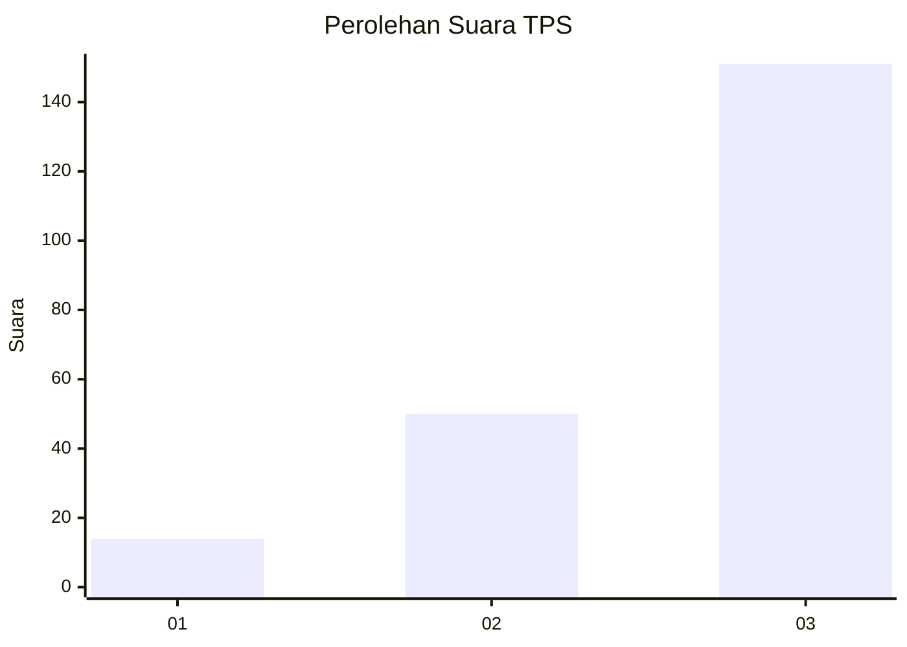
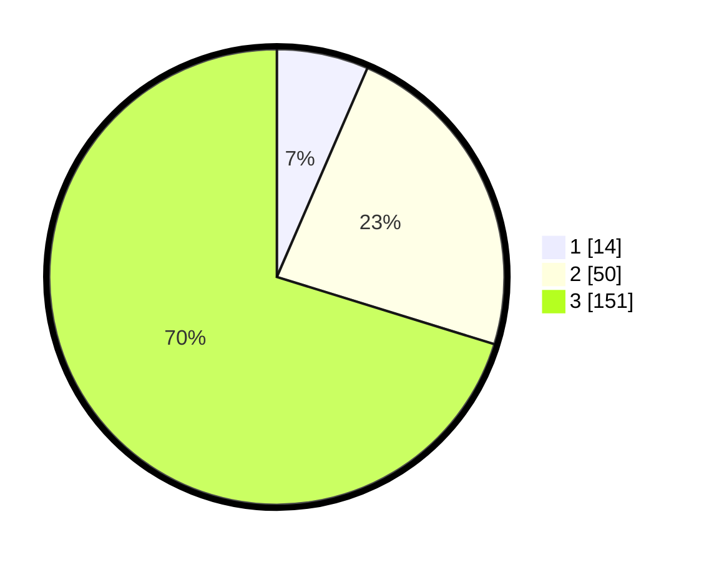

# Hasil

## Grafik

## Tabel

| No. | Nama Paslon    | Suara | Suara (raw) | Persentase |
|:--- |:-------------- | -----:| -----------:| ----------:|
| 1   | ANIES MUHAIMIN | 14    | [14][p-1]   | 6,51       |
| 2   | PRABOWO GIBRAN | 50    | [50][p-2]   | 23,26      |
| 3   | GANJAR MAHFUD  | 151   | [151][p-3]  | 70,23      |

[p-1]: https://github.com/gigit-pemilu/pemilu-2024/blob/main/pilpres/hitung-suara/sub/33-jawa-tengah/sub/02-banyumas/sub/15-gumelar/sub/2007-cilangkap/sub/012-tps/sub/paslon-1.txt
[p-2]: https://github.com/gigit-pemilu/pemilu-2024/blob/main/pilpres/hitung-suara/sub/33-jawa-tengah/sub/02-banyumas/sub/15-gumelar/sub/2007-cilangkap/sub/012-tps/sub/paslon-2.txt
[p-3]: https://github.com/gigit-pemilu/pemilu-2024/blob/main/pilpres/hitung-suara/sub/33-jawa-tengah/sub/02-banyumas/sub/15-gumelar/sub/2007-cilangkap/sub/012-tps/sub/paslon-3.txt

## Foto C Plano

https://sirekap-obj-formc.kpu.go.id/a12e/pemilu/ppwp/33/02/15/20/07/3302152007012-20240215-050943--8b5bdbde-52d6-4600-b37c-c94946762806.jpg

https://sirekap-obj-formc.kpu.go.id/a12e/pemilu/ppwp/33/02/15/20/07/3302152007012-20240215-051553--d89fbc0f-b767-45a4-93ae-a2438af08d20.jpg

https://sirekap-obj-formc.kpu.go.id/a12e/pemilu/ppwp/33/02/15/20/07/3302152007012-20240215-051748--dcac4a20-d333-49ca-bc53-eb78e0fa87c0.jpg

## Metadata

| Key        | Value               |
| ---------- | ------------------- |
| Time Stamp | 2024-02-25 12:00:00 |

