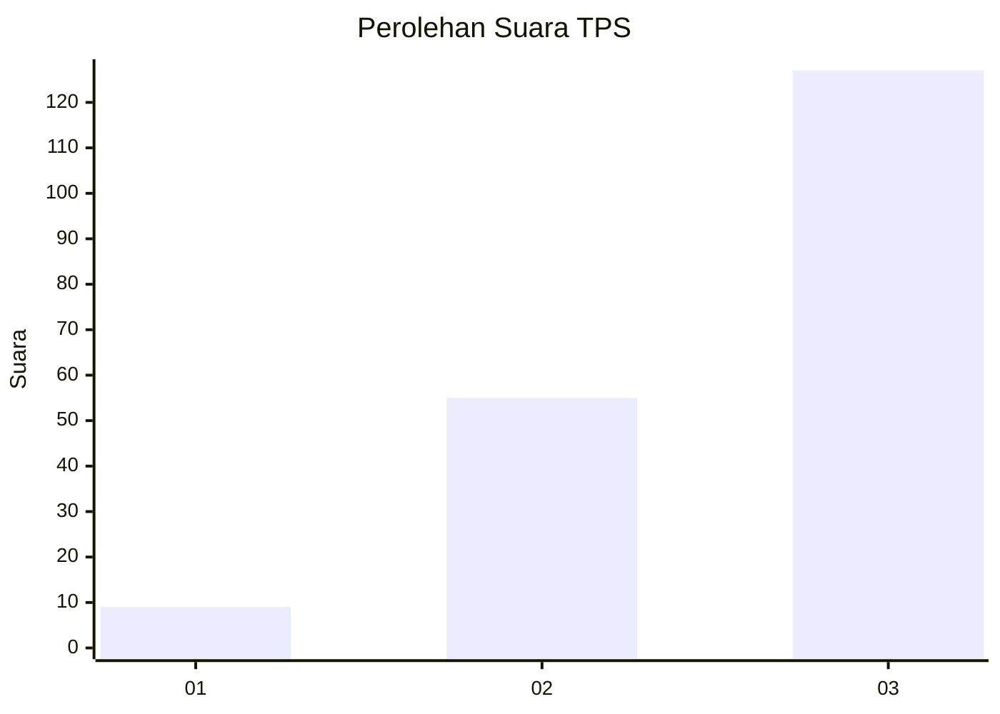
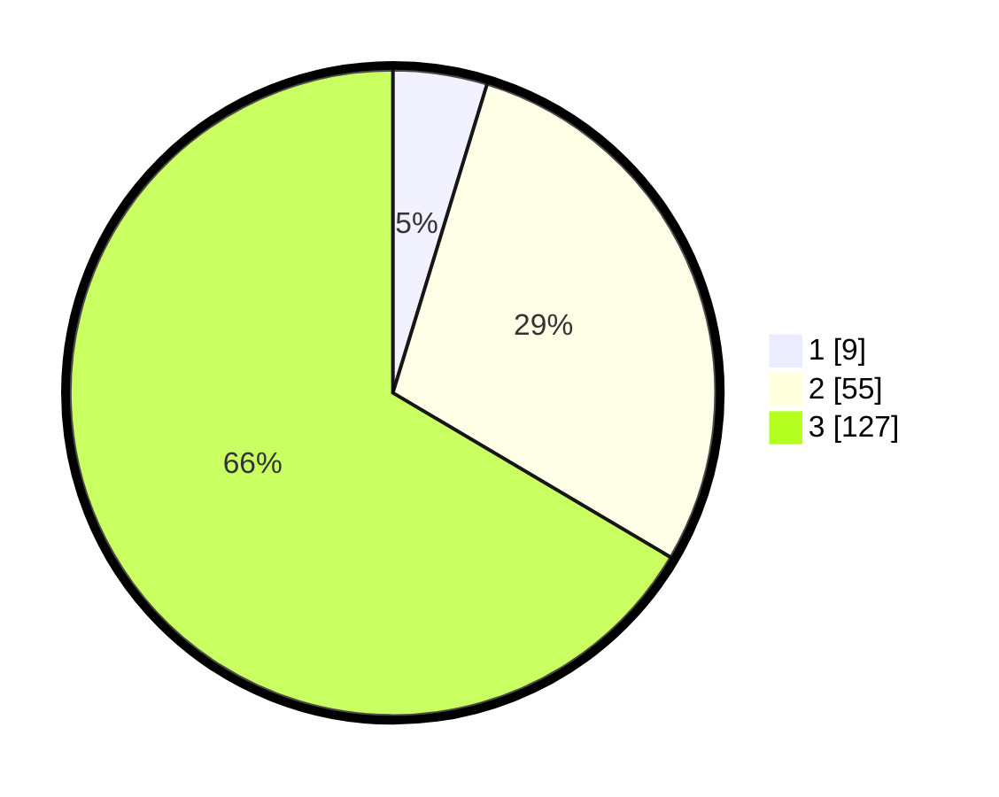

# Hasil

## Grafik

## Tabel

| No. | Nama Paslon    | Suara | Suara (raw) | Persentase |
|:--- |:-------------- | -----:| -----------:| ----------:|
| 1   | ANIES MUHAIMIN | 9     | [9][p-1]    | 4,71       |
| 2   | PRABOWO GIBRAN | 55    | [55][p-2]   | 28,80      |
| 3   | GANJAR MAHFUD  | 127   | [127][p-3]  | 66,49      |

[p-1]: https://github.com/gigit-pemilu/pemilu-2024-33-jawa-tengah/blob/main/pilpres/hitung-suara/sub/33-jawa-tengah/sub/02-banyumas/sub/15-gumelar/sub/2007-cilangkap/sub/014-tps/sub/paslon-1.txt
[p-2]: https://github.com/gigit-pemilu/pemilu-2024-33-jawa-tengah/blob/main/pilpres/hitung-suara/sub/33-jawa-tengah/sub/02-banyumas/sub/15-gumelar/sub/2007-cilangkap/sub/014-tps/sub/paslon-2.txt
[p-3]: https://github.com/gigit-pemilu/pemilu-2024-33-jawa-tengah/blob/main/pilpres/hitung-suara/sub/33-jawa-tengah/sub/02-banyumas/sub/15-gumelar/sub/2007-cilangkap/sub/014-tps/sub/paslon-3.txt

## Foto C Plano

https://sirekap-obj-formc.kpu.go.id/8263/pemilu/ppwp/33/02/15/20/07/3302152007014-20240215-063639--0d87a62d-4cc0-4170-8376-7967f47d3237.jpg

https://sirekap-obj-formc.kpu.go.id/8263/pemilu/ppwp/33/02/15/20/07/3302152007014-20240215-063741--f3e44a92-d458-43c7-b0ba-da546bed02ba.jpg

https://sirekap-obj-formc.kpu.go.id/8263/pemilu/ppwp/33/02/15/20/07/3302152007014-20240215-063823--8fc48537-c16c-455e-898c-f15b29720f85.jpg

## Metadata

| Key        | Value               |
| ---------- | ------------------- |
| Time Stamp | 2024-02-16 23:30:00 |

