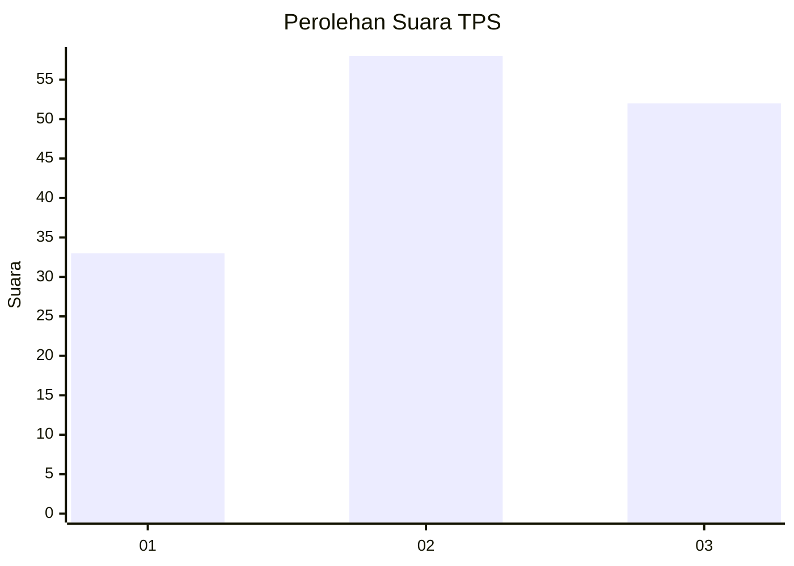
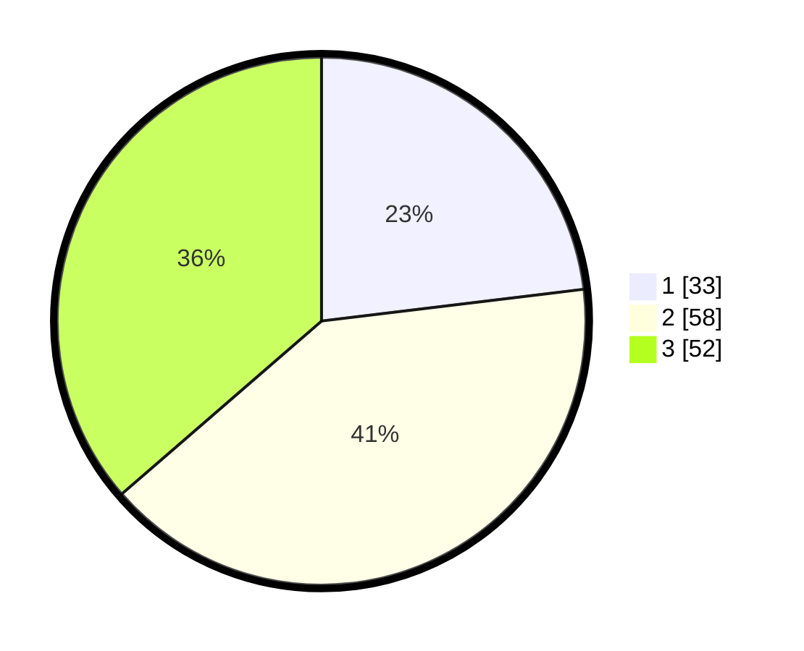

# Hasil

## Grafik

## Tabel

| No. | Nama Paslon    | Suara | Suara (raw) | Persentase |
|:--- |:-------------- | -----:| -----------:| ----------:|
| 1   | ANIES MUHAIMIN | 33    | [33][p-1]   | 23,08      |
| 2   | PRABOWO GIBRAN | 58    | [58][p-2]   | 40,56      |
| 3   | GANJAR MAHFUD  | 52    | [52][p-3]   | 36,36      |

[p-1]: https://github.com/gigit-pemilu/pemilu-2024/blob/main/pilpres/hitung-suara/sub/33-jawa-tengah/sub/02-banyumas/sub/15-gumelar/sub/2009-samudra/sub/008-tps/sub/paslon-1.txt
[p-2]: https://github.com/gigit-pemilu/pemilu-2024/blob/main/pilpres/hitung-suara/sub/33-jawa-tengah/sub/02-banyumas/sub/15-gumelar/sub/2009-samudra/sub/008-tps/sub/paslon-2.txt
[p-3]: https://github.com/gigit-pemilu/pemilu-2024/blob/main/pilpres/hitung-suara/sub/33-jawa-tengah/sub/02-banyumas/sub/15-gumelar/sub/2009-samudra/sub/008-tps/sub/paslon-3.txt

## Foto C Plano

https://sirekap-obj-formc.kpu.go.id/fa25/pemilu/ppwp/33/02/15/20/09/3302152009008-20240214-193015--01663ad1-285f-4f42-b4b1-de3ca611b6d4.jpg

https://sirekap-obj-formc.kpu.go.id/fa25/pemilu/ppwp/33/02/15/20/09/3302152009008-20240214-141909--eb00fecd-5bf7-4bb0-916e-4d44a3e96851.jpg

https://sirekap-obj-formc.kpu.go.id/fa25/pemilu/ppwp/33/02/15/20/09/3302152009008-20240214-213230--fa7e9a33-65f4-450c-b049-13806191009f.jpg

## Metadata

| Key        | Value               |
| ---------- | ------------------- |
| Time Stamp | 2024-02-16 23:30:00 |

