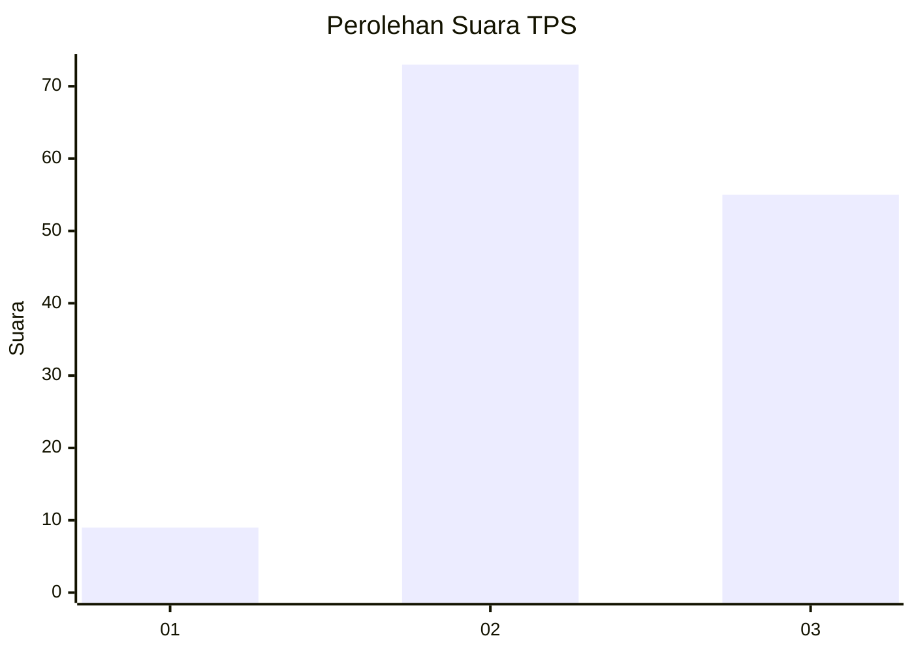
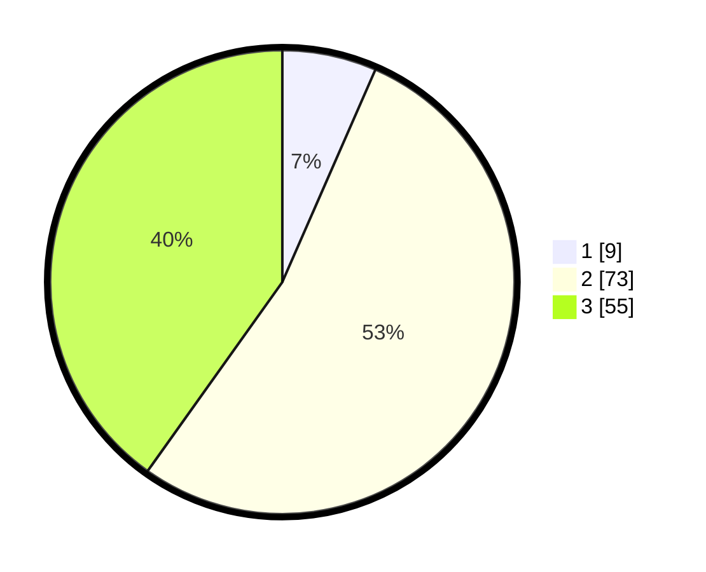

# Hasil

## Grafik

## Tabel

| No. | Nama Paslon    | Suara | Suara (raw) | Persentase |
|:--- |:-------------- | -----:| -----------:| ----------:|
| 1   | ANIES MUHAIMIN | 9     | [9][p-1]    | 6,57       |
| 2   | PRABOWO GIBRAN | 73    | [73][p-2]   | 53,28      |
| 3   | GANJAR MAHFUD  | 55    | [55][p-3]   | 40,15      |

[p-1]: https://github.com/gigit-pemilu/pemilu-2024-33-jawa-tengah/blob/main/pilpres/hitung-suara/sub/33-jawa-tengah/sub/02-banyumas/sub/15-gumelar/sub/2009-samudra/sub/013-tps/sub/paslon-1.txt
[p-2]: https://github.com/gigit-pemilu/pemilu-2024-33-jawa-tengah/blob/main/pilpres/hitung-suara/sub/33-jawa-tengah/sub/02-banyumas/sub/15-gumelar/sub/2009-samudra/sub/013-tps/sub/paslon-2.txt
[p-3]: https://github.com/gigit-pemilu/pemilu-2024-33-jawa-tengah/blob/main/pilpres/hitung-suara/sub/33-jawa-tengah/sub/02-banyumas/sub/15-gumelar/sub/2009-samudra/sub/013-tps/sub/paslon-3.txt

## Foto C Plano

https://sirekap-obj-formc.kpu.go.id/a04a/pemilu/ppwp/33/02/15/20/09/3302152009013-20240215-005402--9eb1362f-446f-439f-ac37-772a47e2c63a.jpg

https://sirekap-obj-formc.kpu.go.id/a04a/pemilu/ppwp/33/02/15/20/09/3302152009013-20240215-005759--e2b9ae9f-59a9-4e7c-b0ed-b872f099e89f.jpg

https://sirekap-obj-formc.kpu.go.id/a04a/pemilu/ppwp/33/02/15/20/09/3302152009013-20240215-011142--c456e32f-09ac-484d-98b5-fe23a8b0ba8c.jpg

## Metadata

| Key        | Value               |
| ---------- | ------------------- |
| Time Stamp | 2024-02-16 23:30:00 |

