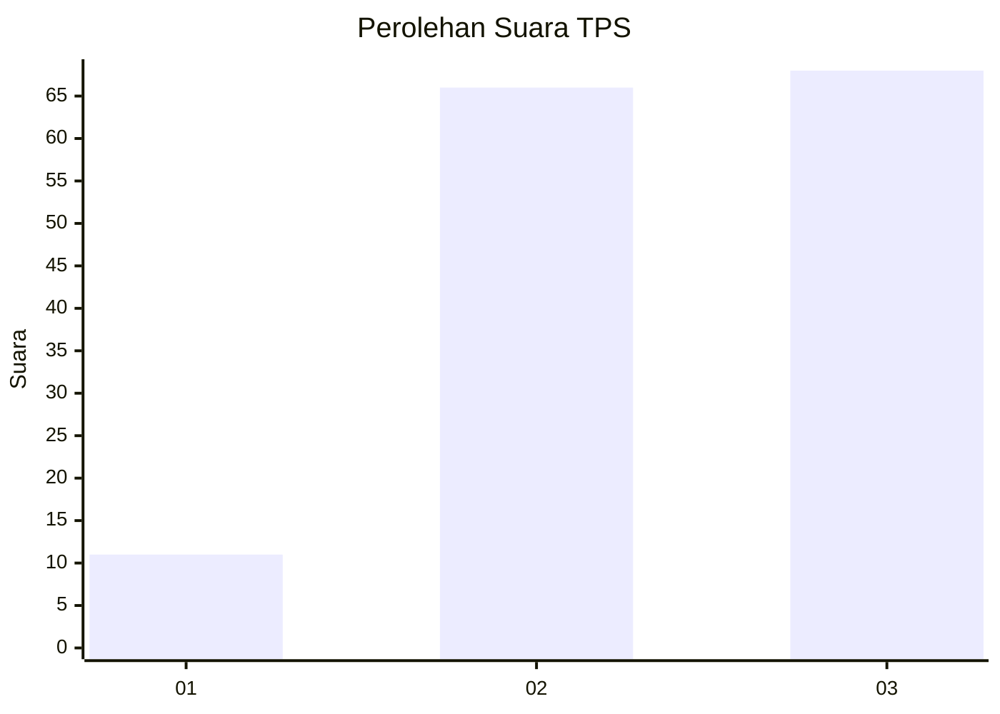
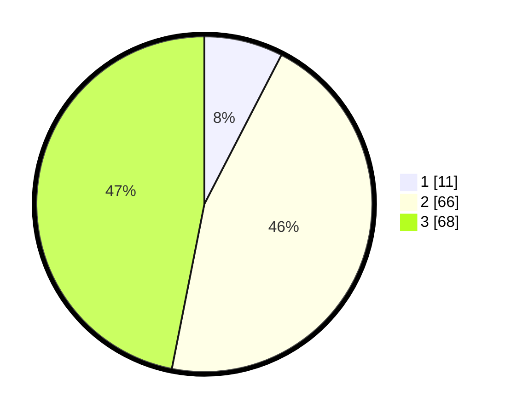

# Hasil

## Grafik

## Tabel

| No. | Nama Paslon    | Suara | Suara (raw) | Persentase |
|:--- |:-------------- | -----:| -----------:| ----------:|
| 1   | ANIES MUHAIMIN | 11    | [11][p-1]   | 7,59       |
| 2   | PRABOWO GIBRAN | 66    | [66][p-2]   | 45,52      |
| 3   | GANJAR MAHFUD  | 68    | [68][p-3]   | 46,90      |

[p-1]: https://github.com/gigit-pemilu/pemilu-2024/blob/main/pilpres/hitung-suara/sub/33-jawa-tengah/sub/02-banyumas/sub/15-gumelar/sub/2009-samudra/sub/016-tps/sub/paslon-1.txt
[p-2]: https://github.com/gigit-pemilu/pemilu-2024/blob/main/pilpres/hitung-suara/sub/33-jawa-tengah/sub/02-banyumas/sub/15-gumelar/sub/2009-samudra/sub/016-tps/sub/paslon-2.txt
[p-3]: https://github.com/gigit-pemilu/pemilu-2024/blob/main/pilpres/hitung-suara/sub/33-jawa-tengah/sub/02-banyumas/sub/15-gumelar/sub/2009-samudra/sub/016-tps/sub/paslon-3.txt

## Foto C Plano

https://sirekap-obj-formc.kpu.go.id/d81a/pemilu/ppwp/33/02/15/20/09/3302152009016-20240214-223705--8d520eb4-d602-461e-a37b-f51348c029b8.jpg

https://sirekap-obj-formc.kpu.go.id/d81a/pemilu/ppwp/33/02/15/20/09/3302152009016-20240214-223852--46a020a2-f7b4-4b16-ae87-a3a869f62d70.jpg

https://sirekap-obj-formc.kpu.go.id/d81a/pemilu/ppwp/33/02/15/20/09/3302152009016-20240214-230149--3f174d3f-6b47-4540-aa24-52ea96852fa3.jpg

## Metadata

| Key        | Value               |
| ---------- | ------------------- |
| Time Stamp | 2024-02-16 23:30:00 |

