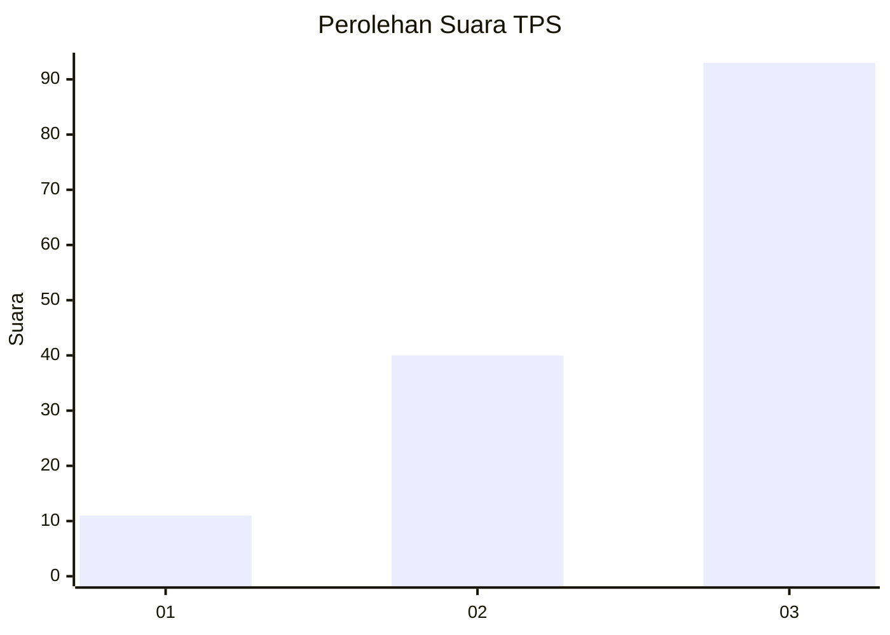
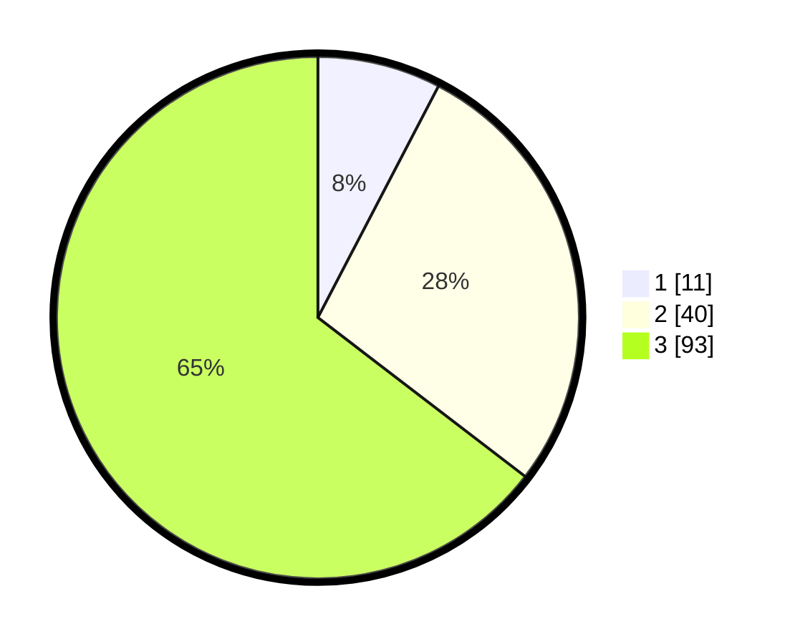

# Hasil

## Grafik

## Tabel

| No. | Nama Paslon    | Suara | Suara (raw) | Persentase |
|:--- |:-------------- | -----:| -----------:| ----------:|
| 1   | ANIES MUHAIMIN | 11    | [11][p-1]   | 7,64       |
| 2   | PRABOWO GIBRAN | 40    | [40][p-2]   | 27,78      |
| 3   | GANJAR MAHFUD  | 93    | [93][p-3]   | 64,58      |

[p-1]: https://github.com/gigit-pemilu/pemilu-2024-33-jawa-tengah/blob/main/pilpres/hitung-suara/sub/33-jawa-tengah/sub/02-banyumas/sub/15-gumelar/sub/2009-samudra/sub/017-tps/sub/paslon-1.txt
[p-2]: https://github.com/gigit-pemilu/pemilu-2024-33-jawa-tengah/blob/main/pilpres/hitung-suara/sub/33-jawa-tengah/sub/02-banyumas/sub/15-gumelar/sub/2009-samudra/sub/017-tps/sub/paslon-2.txt
[p-3]: https://github.com/gigit-pemilu/pemilu-2024-33-jawa-tengah/blob/main/pilpres/hitung-suara/sub/33-jawa-tengah/sub/02-banyumas/sub/15-gumelar/sub/2009-samudra/sub/017-tps/sub/paslon-3.txt

## Foto C Plano

https://sirekap-obj-formc.kpu.go.id/30e4/pemilu/ppwp/33/02/15/20/09/3302152009017-20240214-231011--32763e53-8e24-4996-bbd5-e802c2d76d94.jpg

https://sirekap-obj-formc.kpu.go.id/30e4/pemilu/ppwp/33/02/15/20/09/3302152009017-20240214-231107--0253daf6-6d2b-434b-9d16-75d7a9577205.jpg

https://sirekap-obj-formc.kpu.go.id/30e4/pemilu/ppwp/33/02/15/20/09/3302152009017-20240214-231203--0723d5db-798e-4f20-8db6-cb8756caf221.jpg

## Metadata

| Key        | Value               |
| ---------- | ------------------- |
| Time Stamp | 2024-02-16 23:30:00 |

