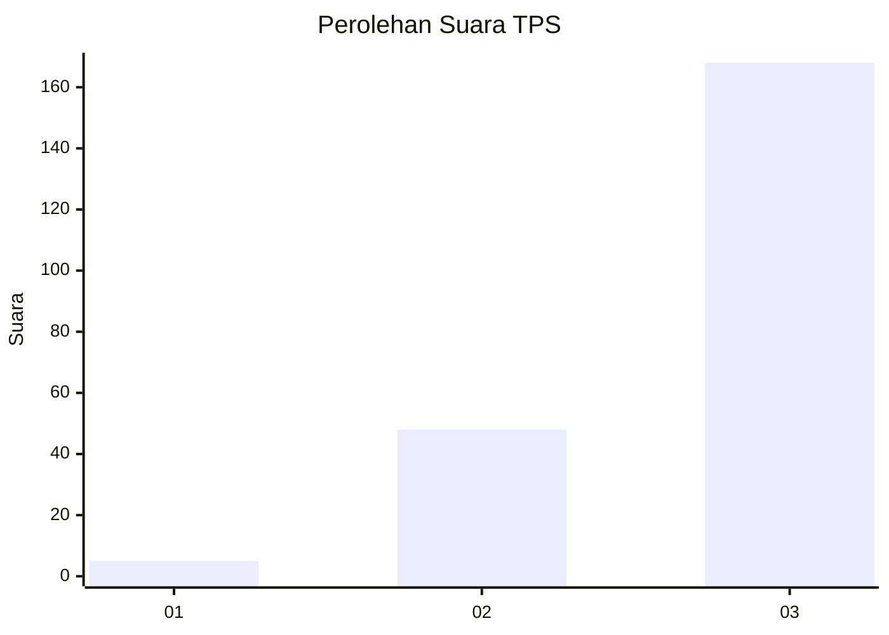
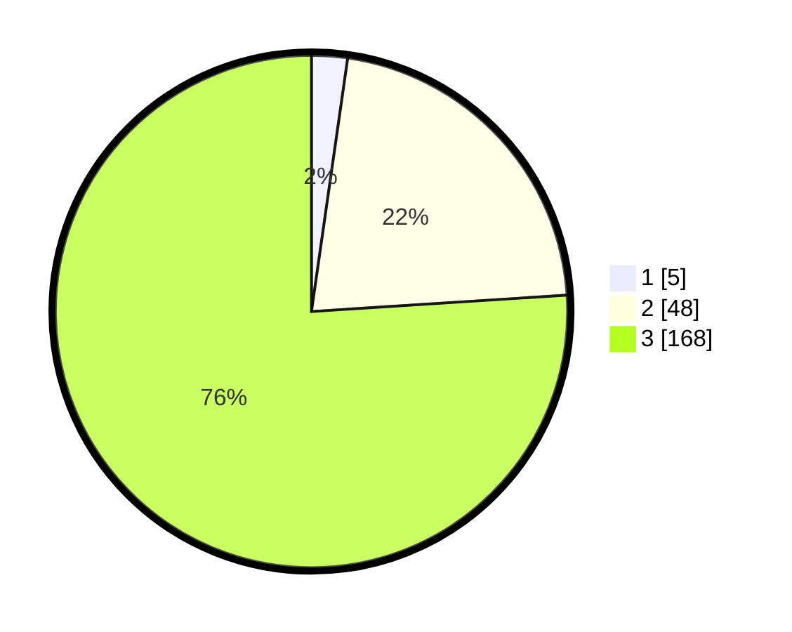

# Hasil

## Grafik

## Tabel

| No. | Nama Paslon    | Suara | Suara (raw) | Persentase |
|:--- |:-------------- | -----:| -----------:| ----------:|
| 1   | ANIES MUHAIMIN | 5     | [5][p-1]    | 2,26       |
| 2   | PRABOWO GIBRAN | 48    | [48][p-2]   | 21,72      |
| 3   | GANJAR MAHFUD  | 168   | [168][p-3]  | 76,02      |

[p-1]: https://github.com/gigit-pemilu/pemilu-2024-33-jawa-tengah/blob/main/pilpres/hitung-suara/sub/33-jawa-tengah/sub/02-banyumas/sub/15-gumelar/sub/2009-samudra/sub/021-tps/sub/paslon-1.txt
[p-2]: https://github.com/gigit-pemilu/pemilu-2024-33-jawa-tengah/blob/main/pilpres/hitung-suara/sub/33-jawa-tengah/sub/02-banyumas/sub/15-gumelar/sub/2009-samudra/sub/021-tps/sub/paslon-2.txt
[p-3]: https://github.com/gigit-pemilu/pemilu-2024-33-jawa-tengah/blob/main/pilpres/hitung-suara/sub/33-jawa-tengah/sub/02-banyumas/sub/15-gumelar/sub/2009-samudra/sub/021-tps/sub/paslon-3.txt

## Foto C Plano

https://sirekap-obj-formc.kpu.go.id/d8c9/pemilu/ppwp/33/02/15/20/09/3302152009021-20240215-011242--a2d18bc8-91f7-4df4-9995-1f52a5f6445a.jpg

https://sirekap-obj-formc.kpu.go.id/d8c9/pemilu/ppwp/33/02/15/20/09/3302152009021-20240215-011405--5c461fb5-ccfa-4cb2-a439-328072f25e8b.jpg

https://sirekap-obj-formc.kpu.go.id/d8c9/pemilu/ppwp/33/02/15/20/09/3302152009021-20240215-011441--58ba6839-5c98-4f87-9183-46b2020e2cb8.jpg

## Metadata

| Key        | Value               |
| ---------- | ------------------- |
| Time Stamp | 2024-02-24 22:31:28 |

