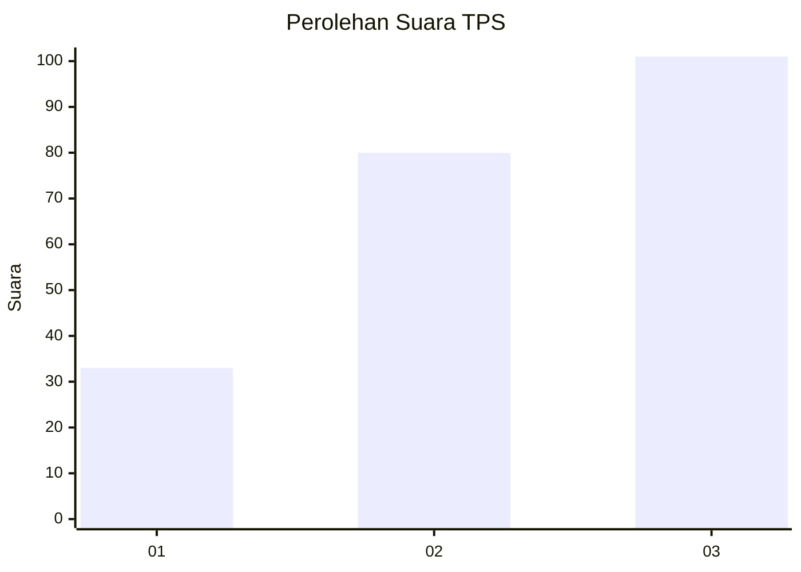
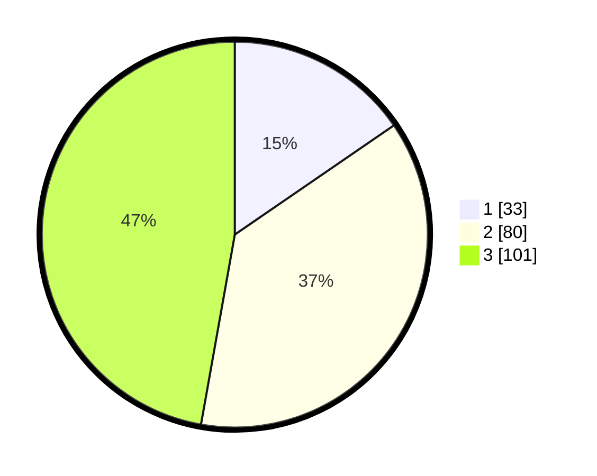

# Hasil

## Grafik

## Tabel

| No. | Nama Paslon    | Suara | Suara (raw) | Persentase |
|:--- |:-------------- | -----:| -----------:| ----------:|
| 1   | ANIES MUHAIMIN | 33    | [33][p-1]   | 15,42      |
| 2   | PRABOWO GIBRAN | 80    | [80][p-2]   | 37,38      |
| 3   | GANJAR MAHFUD  | 101   | [101][p-3]  | 47,20      |

[p-1]: https://github.com/gigit-pemilu/pemilu-2024/blob/main/pilpres/hitung-suara/sub/33-jawa-tengah/sub/02-banyumas/sub/15-gumelar/sub/2010-samudra-kulon/sub/002-tps/sub/paslon-1.txt
[p-2]: https://github.com/gigit-pemilu/pemilu-2024/blob/main/pilpres/hitung-suara/sub/33-jawa-tengah/sub/02-banyumas/sub/15-gumelar/sub/2010-samudra-kulon/sub/002-tps/sub/paslon-2.txt
[p-3]: https://github.com/gigit-pemilu/pemilu-2024/blob/main/pilpres/hitung-suara/sub/33-jawa-tengah/sub/02-banyumas/sub/15-gumelar/sub/2010-samudra-kulon/sub/002-tps/sub/paslon-3.txt

## Foto C Plano

https://sirekap-obj-formc.kpu.go.id/bad9/pemilu/ppwp/33/02/15/20/10/3302152010002-20240215-025345--c4b870ca-4d12-4b63-8885-0cef7f61307b.jpg

https://sirekap-obj-formc.kpu.go.id/bad9/pemilu/ppwp/33/02/15/20/10/3302152010002-20240215-025614--1452e625-c588-455a-908f-a30d70ec678d.jpg

https://sirekap-obj-formc.kpu.go.id/bad9/pemilu/ppwp/33/02/15/20/10/3302152010002-20240215-025457--e087ae2c-6ad7-473f-b14a-dff0406ec46d.jpg

## Metadata

| Key        | Value               |
| ---------- | ------------------- |
| Time Stamp | 2024-02-16 05:00:26 |

