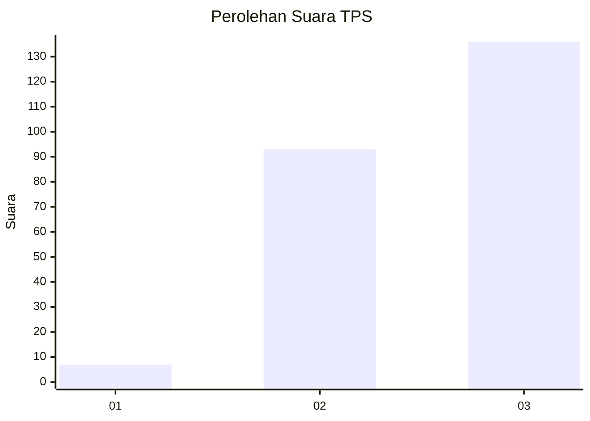
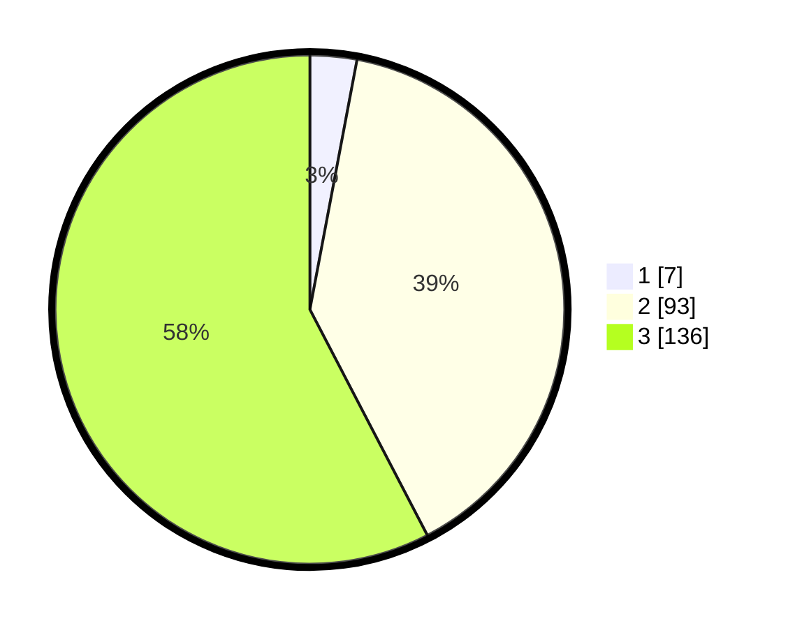

# Hasil

## Grafik

## Tabel

| No. | Nama Paslon    | Suara | Suara (raw) | Persentase |
|:--- |:-------------- | -----:| -----------:| ----------:|
| 1   | ANIES MUHAIMIN | 7     | [7][p-1]    | 2,97       |
| 2   | PRABOWO GIBRAN | 93    | [93][p-2]   | 39,41      |
| 3   | GANJAR MAHFUD  | 136   | [136][p-3]  | 57,63      |

[p-1]: https://github.com/gigit-pemilu/pemilu-2024/blob/main/pilpres/hitung-suara/sub/33-jawa-tengah/sub/02-banyumas/sub/16-pekuncen/sub/2001-cikembulan/sub/008-tps/sub/paslon-1.txt
[p-2]: https://github.com/gigit-pemilu/pemilu-2024/blob/main/pilpres/hitung-suara/sub/33-jawa-tengah/sub/02-banyumas/sub/16-pekuncen/sub/2001-cikembulan/sub/008-tps/sub/paslon-2.txt
[p-3]: https://github.com/gigit-pemilu/pemilu-2024/blob/main/pilpres/hitung-suara/sub/33-jawa-tengah/sub/02-banyumas/sub/16-pekuncen/sub/2001-cikembulan/sub/008-tps/sub/paslon-3.txt

## Foto C Plano

https://sirekap-obj-formc.kpu.go.id/a1d0/pemilu/ppwp/33/02/16/20/01/3302162001008-20240214-232642--2fd1a0d6-2f6a-4db3-8081-9b033a7fe9c6.jpg

https://sirekap-obj-formc.kpu.go.id/a1d0/pemilu/ppwp/33/02/16/20/01/3302162001008-20240214-233305--e5f5fa9e-fe93-4be4-baf9-de6b800db70e.jpg

https://sirekap-obj-formc.kpu.go.id/a1d0/pemilu/ppwp/33/02/16/20/01/3302162001008-20240214-233521--34cf2d7e-44c3-449e-9748-8d70888251e7.jpg

## Metadata

| Key        | Value               |
| ---------- | ------------------- |
| Time Stamp | 2024-02-15 03:06:03 |

