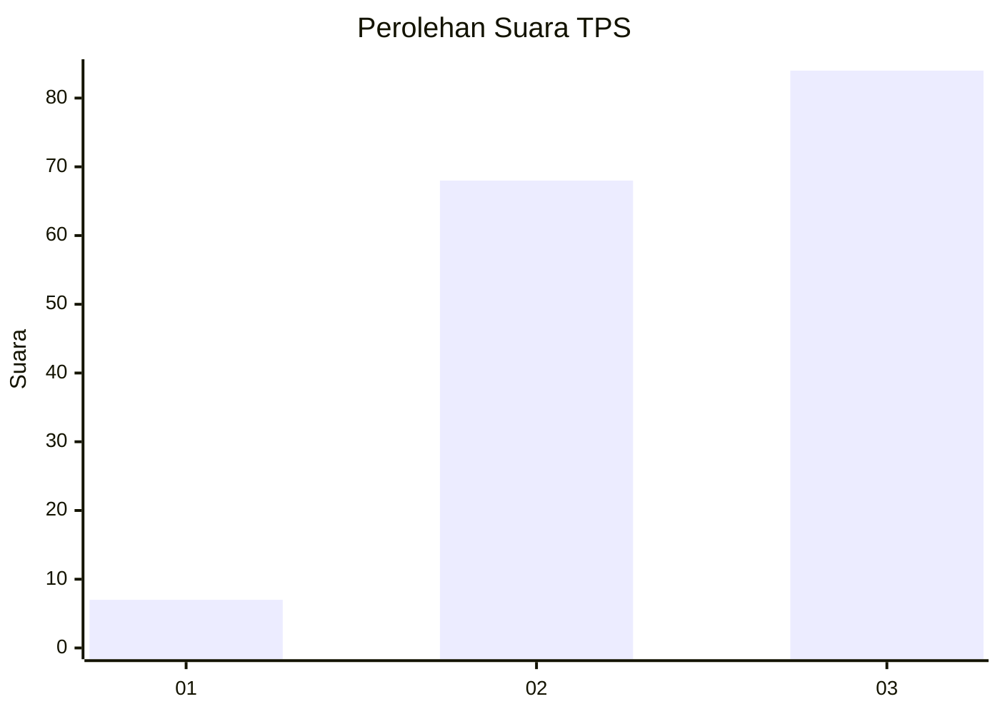
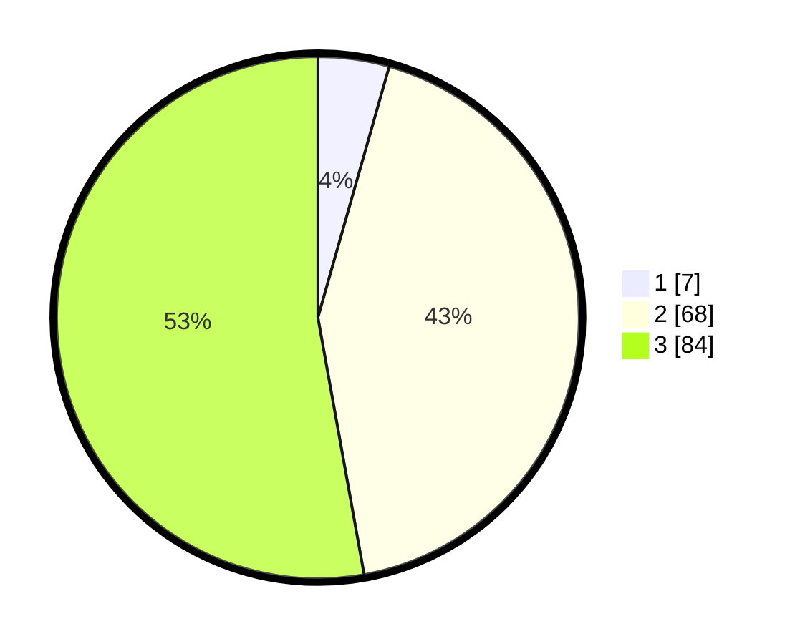

# Hasil

## Grafik

## Tabel

| No. | Nama Paslon    | Suara | Suara (raw) | Persentase |
|:--- |:-------------- | -----:| -----------:| ----------:|
| 1   | ANIES MUHAIMIN | 7     | [7][p-1]    | 4,40       |
| 2   | PRABOWO GIBRAN | 68    | [68][p-2]   | 42,77      |
| 3   | GANJAR MAHFUD  | 84    | [84][p-3]   | 52,83      |

[p-1]: https://github.com/gigit-pemilu/pemilu-2024-33-jawa-tengah/blob/main/pilpres/hitung-suara/sub/33-jawa-tengah/sub/02-banyumas/sub/16-pekuncen/sub/2003-karangklesem/sub/011-tps/sub/paslon-1.txt
[p-2]: https://github.com/gigit-pemilu/pemilu-2024-33-jawa-tengah/blob/main/pilpres/hitung-suara/sub/33-jawa-tengah/sub/02-banyumas/sub/16-pekuncen/sub/2003-karangklesem/sub/011-tps/sub/paslon-2.txt
[p-3]: https://github.com/gigit-pemilu/pemilu-2024-33-jawa-tengah/blob/main/pilpres/hitung-suara/sub/33-jawa-tengah/sub/02-banyumas/sub/16-pekuncen/sub/2003-karangklesem/sub/011-tps/sub/paslon-3.txt

## Foto C Plano

https://sirekap-obj-formc.kpu.go.id/b242/pemilu/ppwp/33/02/16/20/03/3302162003011-20240215-011828--0af391e7-9943-458c-bbe8-d17dbef9454a.jpg

https://sirekap-obj-formc.kpu.go.id/b242/pemilu/ppwp/33/02/16/20/03/3302162003011-20240215-011659--dfe84be1-c197-49b4-9463-4abc352c8156.jpg

https://sirekap-obj-formc.kpu.go.id/b242/pemilu/ppwp/33/02/16/20/03/3302162003011-20240215-011736--dfb2dc1c-62e7-4621-818d-06225deafd17.jpg

## Metadata

| Key        | Value               |
| ---------- | ------------------- |
| Time Stamp | 2024-02-16 21:01:00 |

